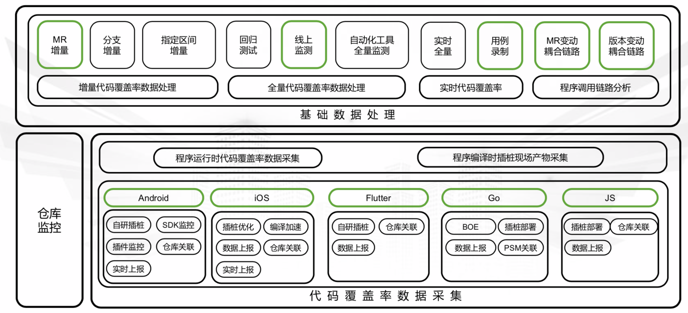

- 文章整理
	- 精准测试技术十年发展漫谈
		- 来源：https://mp.weixin.qq.com/s/UUrOD5qi1r2TBTdYXhXsog
		- 公司：星云
		- 内容
		  collapsed:: true
			- 精准测试的定义
				- 精准测试一句话概括就是：测试用例和代码之间的追溯，这是它最本质的东西。
				- 精准测试建立起了用例和代码的关系，相当于把黑盒和白盒关联起来，做黑盒测试时获取到白盒数据。
				- 另外一个层面，精准测试最本质就是线程覆盖测试。它跟白盒最大的区别是覆盖率是线程级的，也就是说我们要追溯到用例这个级别。
			- 精准测试技术发展
				- 建立一些基础理念，主要建立用例和代码相互追溯的基本技术方向和框架。
				- 用例和代码追溯、软件示波器、回归用例自动选取基本已经成型
				- SABI SASI
				- 覆盖率 MC/DC
				- 各种领域的数据采集（Java、C++、linux kernel、DSP芯片、安卓的Framework操作系统）
			- 精准测试的一分一合
				- “一分”指的是：精准测试不仅仅去统计（大范围的整体）代码覆盖率，而是要精确到用例级。
					- 比如回归用例选取、测试用例聚类分析、智能缺陷定位、开发测试的协同，所有的数据都可关联到用例级，精准测试的作用和范围就变得很大。
					- 用例级就能有高精准度的测试分析，传统的白盒并没有这种测试分析。
				- “一合”指的是：我们这个覆盖率已经不再是单元级的。
					- 以前白盒测只能用在单元，现在我们精准测试可以把它用到系统级，也就是功能测试阶段。星云可以在系统全速运转、数据量非常大的时候实时采集数据，并确保对原有系统不要进行干扰。
					- 实际应用中，还是可以继续延用黑盒测试的操作方法，动态执行用例后，可以得到大大超于白盒单元测试的多种测试数据及其分析结果，用起来十分方便。
				- 灰盒测试
					- 但它并不是让我们的测试工程师马上就懂代码开发、懂脚本开发、懂单元测试，它是非常自然的去把用例跟代码进行追溯分析，因为星云有一套静态逻辑分析，可以把测试使用难度大大降低
				- 精准测试可以给黑盒充分赋能
					- 精准测试是针对IT系统非常好的数字化、可量化、可评估、可考核、可度量、很精确的一种技术方法。
			- 精准测试体系
				- 运行架构图
					- 
				- 流程
					- 它首先会对源码进行一个编译和分析，把代码结构静态分析好后，将静态信息上传到后台对应项目版本中进行存储。
					- 再根据块的位置和类型信息进行插装，装点只有编号信息。
					- 代码插装好以后，放到被测系统里面直接动态去跑，测试人员用软件示波器点用例开始结束，就会自动把每个用例和代码的正向和反向追溯关系建立起来了。
				- 正反向追溯有两个主体功能，
					- 一个是能够让测试整体量化，使之看到所有的测试过程。
						- 测试工程师没有跑用例，就没有关联关系的数据；如果乱跑，我们分析一看功能完全不对，跑的功能和设计功能不应该聚类到一块但却聚类到一块，就认为是瞎跑的，跑的不对。什么都可以看得非常细致。
					- 另外，星云提供测试智能分析的一些算法
						- 如测试用例最小级、回归用例选取、测试用例的聚类分析、智能缺陷定位等
							- 例如回归用例选取这技术，它底层数据提取特别难，需要花费大量的时间去研究如何去真正落地实现。
								- 比如我们碰到的一些场景：给安卓的Framework代码插桩，然后拍张照片，照片渲染出来以后，整个安卓的驱动层代码到底怎么走？一瞬间就要驱动计算并且展示出来整体逻辑的运行情况，这个复杂度相当高。实现了这种技术，就可以用精准测试帮助手机厂商去节省CTS测试的时间。
				- 本质上，我们做测试就不应该忽视计算机的软件代码和功能间本质上的强关联性。
			- 商用精准测试的无损技术
				- 开源工具的困难点根源在于：它的分析和插桩全部在字节码上，但实际覆盖率的观测点却在源码上。 这就产生了一个严重的信息脱节，因为字节码是有损耗的。
					- 开源工具它能够看到你的条件覆盖百分比，但它根本不知道每个条件真和假，由于在字节码阶段，它的条件和真正的源码上的条件已经发生了变化，已经没人能搞得清上面和下边对应关系了。
				- 星云精准测试的SABI（字节码插装）和SASI（源码插装），可以实现真正的无损测试技术。
					- SABI，SouceCode Analyzer ByteCode Intrumentation，即源码分析字节码插装。就是说在源码上直接分析，观测点也还是在源码上。这个就能够完整实现无损的插桩，覆盖率100%精确规范。
						- SABI是依赖非常全面的源码静态分析后，经过校正后的数据往字节码插，而不是直接在字节码分析，往字节码插。SABI字节码技术可以满足国际规范的CDC的覆盖要求。
					- SASI（源码插装），是传统白盒最基础的技术，直接在源码插装，主要应用在对于覆盖率标准要求更高的领域。
						- 源码插装以后，经过高级语言、高级编译器的编译，直接生成最后发布包。这种是完全无损的，可以随时反查插装点，不会引起语法错误、功能错误等，可靠性更高。
			- 商用精准和开源精准的区别
				- 商用系统级精准测试有前置精准的静态分析过程。
				- 。。。
	- 【星云测试】精准测试白皮书2020版
		- 来源：https://mp.weixin.qq.com/s/ew5MXm4i3ASEhWMJvGUTDg
		- 公司：星云
		- 内容
		  collapsed:: true
			- 精准测试的基础架构介绍
				- 精准测试的技术架构
					- 流程：
						- 第一层：利用先进的前置编译器，为客户做源码静态结构分析（在客户的实际环境中，根据客户的需求进行相关的技术配合）；
						- 第二层：将处理好的系统程序放入测试环境运行，测试工程师通过人工或程序自动化的形式，开始执行用例（人工执行用例可以和测试管理平台或者Excel表格方式进行对接)，精准测试的 “软件示波器”采集运行数据并进行高速智能运算，获取精确的测试数据；
						- 第三层：根据采集的代码与对应的测试用例，在星云精准测试平台中实现用例与源码的互相追溯；
						- 第四层：通过精准测试的分析平台，可以对测试数据进行缺陷定位、用例聚类分析、回归测试用例和最小测试用例集等功能的计算，用户还可以根据需求，批量生成相应的测试报告，或进行测试数据高级分析。
					- 精准测试的双向追溯
						- 双向追溯技术正向追溯
							- 将测试用例和代码执行信息自动关联，可追溯到函数级别及代码块级别；
							- 通过正向追溯可直接把BUG定位到故障和缺陷逻辑相应的代码，并提供最后运行的时序数据；
							- 通过正向追溯自动记录产生功能对应的详细设计实现，辅助软件解耦和架构分析。
						- 双向追溯技术反向追溯
							- 将代码执行、函数、代码块级别和测试用例执行信息自动关联；
							- 通过反向追溯可直接观察代码变动所影响的测试范围；
							- 协助开发，进行代码修改后影响功能的范围评估；
							- 协助测试人员对代码修改部分所影响的测试用例进行评估。
						- 数据追溯技术-追溯测试用例的全景调用
							- 精准测试通过正向追溯把测试用例运行的代码执行进行了全景绘制，在全景图中，测试人员可以有效的观察到函数之间的整体的调用与走向，观察出被测模块与上层之间的调用关系。
				- 精准测试的核心组件与功能
					- 风险控制
						- 七种测试覆盖率
							- SC0语句块覆盖率、True覆盖率、Both覆盖率、CDC覆盖率、Branch覆盖率、MC/DC覆盖率。
						- 新增代码覆盖率
							- 敏捷模式下，因迭代频繁其存量的代码量很大，通常更关注增量覆盖度量。
							- 精准测试可以在程序新版本发布后，自动计算新增（变更）代码的范围，给出新增代码的覆盖率。覆盖率的分母中的函数都是变更和新增的函数。
							- 与此同时，基于**反向追溯**的功能，我们还可以给出新增代码对应的测试用例名称。当某个新增函数没有达到很高覆盖率的时候，我们通过反向追溯的用例，可以判定因为哪些功能范围的用例设计不充分，导致了新增代码覆盖率不高。
						- 测试覆盖率范围筛选与再统计
							- 在做精准测试或统计覆盖率时，往往测试管理者、开发人员、测试人员为了保证测试覆盖率的正确性，会对某个方法、类进行查看或在统计中把代码中一些废弃的函数、某些特殊情况下无法测试到的代码进行移除（至少是做相应备注），从而让测试代码覆盖统计率达到更加准确。
							- 星云精准测试在设计中，通过多种搜索、方法、类、模块过滤等功能，把需要统计的范围进行缩小、不需要统计的去除。根据用户的选择，进行覆盖率再统计展示。
					- 工作协同
						- 缺陷最后执行时序分析
						- 智能缺陷定位
					- 精准测试对敏捷迭代的支持
						- 敏捷迭代下多版本白盒测试数据的聚合
							- 在敏捷环境下由于版本迭代速度很快，每个不用的代码版本上通常只能采集到少量的覆盖率。一旦发布新版本，就意味着代码发生了变化，覆盖率数据就需要重新采集，但是每个版本采集的少量覆盖率，从分析层面上并没有多大的意义。
							- 针对以上问题，精准测试给出了“累计覆盖率”的计算方法。它将一系列迭代版本的覆盖率，在最新的程序版本上进行投影累加。
						- 聚类分析
						- 最小测试用例集
							- 精准测试也可以对用例集进行优化。比如用户有大量用例的情况下，尤其是自动化用例集含有长期维护的冗余用例。精准测试平台可以对很多重复用例的逻辑进行筛选和过滤，优化出满足当前总体覆盖的最小用例集。
				- 精准测试企业级方案
					- 星云测试插桩编译流程与CI集成
				- 知识库累积
					- 精准测试数据的价值
						- 星云测试采集的测试数据和插装后分析到的静态结构信息，将作为大型企业系统大数据分析的基础数据。
					- 精准测试智能回归测试用例智能选取
						- 精准测试在记录了所有用例对应的代码逻辑的基础上，在新版本发布的时候通过分析用例执行的代码路径的变更范围，就可以自动计算出来回归用例的范围。
						- 它的算法逻辑和人的分析非常相似，但可以进一步提供非常高效率、海量数据的稳定分析输出，相当于把人的脑力算力转换成了计算机算力。
			-
	- 精准测试二三谈
		- 来源：https://mp.weixin.qq.com/s/WLqDVQdI1bSv8VnYCx6eIg
		- 公司：Thoughtworks
		- 内容
		  collapsed:: true
			- 最近我发现几个客户在质量问题，存在一些共性，这些基于黑盒测试的项目在测试过程中存在以下几个共同的问题：
				- 大量的黑盒测试用例
					- 有的项目甚至用例数超过5w，测试工作大都是手工为主，受主观人为因素影响太大
					- 每次版本发布，QA全凭个人经验来确定改动对系统影响范围，通常情况，要么测试范围定小了，造成漏测，要么测试范围过大，付出的代价过高，造成项目不能如期按时交付。
				- 代码与测试没有数据可衡量
					- 没有单元测试，其他类型测试对代码覆盖程度，质量高低，没有数据能够衡量，
						- 例如我们说api测试覆盖率是100%，这个数据大多都是根据用例业务场景估算出的。
					- QA只能增加更多的黑盒测试，而实际功能测试覆盖率随着时间和用例增多，便会触达覆盖率的天花板，更多的是重复的无效测试。
				- 自动化测试无法发挥作用
					- 对于web/api或app 后端服务系统，测试人员对除手工测试外，我们将大量的时间与精力投放在api接口测试的实现上，随着项目的迭代，自动化用例积累越来越多
						- 整个测试ROI并不是随着用例数增多而上升，反而维护和排查问题成为QA日常工作的重担，疲于应付，没有精力将时间投入到更有用的探索性测试和分析工作中，进而造成bug频出，整个团队便对自动化失去信任，直至废弃，这也是很多传统行业无法规模化实施敏捷测试原因之一。
			- 先来谈谈什么是精准测试
				- 定义：利用技术手段对测试过程产生的数据进行采集存储，计算，汇总，可视化最终帮助团队提升软件测试的效率、并对项目整体质量进行改进和优化的这一系列操作。
				- 通俗点讲：核心基于源代码变更分析，结合分析算法，确定影响范围，提升测试效率。
				- 精准测试并没有改变传统的软件测试方法论，只不过是帮助我们将测试用例与程序代码之间的逻辑映射关系建立起来，
					- 而这个过程则是通过算法和工具去采集测试过程执行的代码逻辑及测试数据，在测试过程加入采集过程，形成正向和逆向的追溯。
						- 正向追溯，开发人员可以看到QA执行用例的代码细节，例如用例执行过程中，调用具体方法与实现类，方便进行缺陷的修复与定位。
						- 逆向追溯，测试人员通过release前的增量代码快速确定测试用例的范围，极大减少回归测试的盲目性和工作量，提升ROI，达到测试覆盖率最大化。
			- 精准测试原理
				- 运行架构图
					- 
					- 
				-
				- 这套精准测试架构既可以用作手工测试，也可用在任意自动化测试上。
				- 整个架构分为以下几部分：
					- 建立用例与代码覆盖率之间的映射关系
						- 目前建立用例与代码之间的关系通过统计调用产生的覆盖率与路径进行关联。
							- 对功能测试用例，
								- 我们可以通过执行单个用例，经过上述步骤后拿到该条用例影响代码的覆盖率与执行路径。在通过关联服务，将具体用例的ID与生成的覆盖率信息（类，方法，行等）建立映射关系，最后将关联数据存到数据库中保存。
								- 流程：
								  collapsed:: true
									- 
							- 自动化测试关联方案
							  collapsed:: true
								- 
					- 影响面评估，分析识别增量与变更代码
						- 我们有了代码与用例直接的关系的映射，我们需要将之用在开发流程中，首先我们需要得知我们的改动是什么，
							- 最直接的是通过 git diff 得知具体改动代码，但过于繁重，且太多干扰例如注释，空行等，最好的方法是实现比对算法，经过降噪处理，消除干扰，进而拿到处理后变更数据。
							- 流程：
							  collapsed:: true
								- 
					- 测试范围评估，用例筛选，链路分析
						- 我们有了用例与代码之间的关系映射，有了提交增量代码差异记录，就可以实现逆向回溯。
						- 利用代码的差异，通过查询服务就可以在上面提到关联关系数据库中反推影响的用例，以及上层的业务。这样可以帮助QA快速划分测试范围，减少过度测试。
						- 流程：
						  collapsed:: true
							- 
			- 总结精准测试的优点
				- 这种代码与用例，业务之间的关联关系，能够加深我们对被测系统及架构的了解，在不断的版本迭代过程中，能够实时了解任何类型测试对于当前版本的覆盖率，是否有遗漏的场景等，帮助团队更好的建立信心，使质量真正走上可持续化道路。
				- 精准测试在项目的中后期不在不依赖个人能力以及业务熟悉度等特点，大幅降低了团队测试的成本，使得团队QA能够有大量的时间做探索性测试以及质量度量上，提高QA对于团队的ROI，带给团队更清晰的质量数据。
			- 精准测试存在的问题
				- 基于手工测试的精准测试建立映射关系繁杂，如果需求改变频繁，用例维护以及之间的关系维护需要耗费大量时间精力。
				- 精准测试需要一定的自动化测试的覆盖，这样做起来更有意义，例如api自动化测试，如果本身用例过少，与代码之间关联关系不多时，变更代码后可能不会得出什么结果。
				- 最好有对应的用例管理系统，能够方便的帮助我们建立与代码之间的关系。
				- 需要投入开发能力强的QA或者测试开发建立整套系统环境，但长远考虑，将精准测试嵌入整个公司的质量平台中，不管对于新项目还说维护项目来说都是一种提升。
				- 项目生命周期需要较长，短期项目花费巨大精力开发和维护整套精准测试系统得不偿失。短期项目可以利用精准测试以api测试覆盖率作为衡量标准。不去建立繁杂的关系，只监控UI API测试覆盖率迭代时的变更来达到目的。
			-
	- 字节跳动精准测试实践，SmartEye背后的设计逻辑
		- 来源：https://mp.weixin.qq.com/s/wUrm8gycgLHhCSHbpG8Hkw#at
		- 公司：字节跳动
		- 内容
		  collapsed:: true
			- 工作流程
				- 字节跳动研发团队比较常见的研发流程
					- 
				- 精准测试发生的区间主要在自测、功能验收测试和回归测试阶段。
					- 
					- 其中，自测用例和功能测试推荐用例用于验证代码变动是否引起存量功能异常，将功能缺陷发现时机前置，为研发团队争取更多的修复时间。
					- 回归测试用例推荐用来精简回归测试人力，帮助业务节省回归测试人效。
			- 用例知识库
				- 我们前期先建设了基础代码覆盖率监测平台，收集程序运行时的动态代码覆盖率数据，以此为基础来构建用例知识库。
					- 
				- 用例录制
					- 客户端手工用例
						- 人工用例录制，利用内嵌到客户端的SDK，提供UI界面供用户进行录制操作，同时由SDK内部保障录制过程中数据清理，采集，上报。
						- 用例录制结束后由SDK对当次录制数据进行上报，服务端实时解析，落盘用例知识库，供后续数据分析推荐，并及时给予用户录制反馈。
						- 流程：
							- 
					- 客户端自动化用例
						- 自动化用例录制全流程无人工干预，录制时需要以单个用例为分割，记录单条用例的代码覆盖率数据和用例的关联关系。
						- SmartEye结合客户端高级调试模式SDK，使用公司基础长链接服务控制自动机架的指定设备进行用例数据的录制/停止，全流程自动化，可以以很小的成本，批量录制客户端自动化用例。
						- 流程：
							- 
				- 用例结构化信息
					- 
				- 用例索引
					- 利用当前变动信息、调用链信息、覆盖率信息等基础能力，建设代码-用例的映射数据集，以索引形式存储海量用例，为测试用例推荐等上层服务产品提供数据基础。
						- 基于用例的关联方法、关联代码块、上下游调用链路以及对应覆盖率等信息，建设不同粒度不同版本的调用信息-CaseIDs倒排索引服务，直接支撑推荐引擎的用例召回功能；
						- 此外，服务适配用例录制接口，实现了用例录制->用例信息解析->用例信息入库->索引生成的全流程自动化处理，并支持双端、人工&&自动化用例的多维度用例独立存储。
						- 
			- 推荐引擎
				- 代码影响域分析
					- 准确定位MR的代码变动信息及其代码调用上下游影响域，能够帮助后续精准测试准确分析与之关联的测试用例，提升测试充分性与问题拦截率。
						- 我们利用公司CodeGraph平台的双端静态代码调用链分析能力与整体调用链路拓扑数据，完成基于MR的变动DIFF分析以及上下游调用链分析，并针对变动DIFF部分，完成代码变动率的统计。
						- 
						- 
						-
				- 关联用例召回与多样性平衡
					- 基于改动影响的边界范围，召回对应方法、代码块、调用链路关联的用例集合，聚合去重后生成用例召回集合；
					- 用例召回集合中，存在大量冗余用例。为实现向线上高频调用模块的测试倾斜，增加多样性控制逻辑。
					- 基于对应方法&&代码块的关联用例数、用例覆盖率以及线上热度归一化指标，生成对应方法&&代码块的多样性控制因子，并最终将该因子作用在用例排序与推荐集生成阶段；
					- 
				- 推荐集生成
					- 模型层
						- 在用例排序阶段基于用例与变动影响域内各方法&&代码块的关联信息、用例后验指标、用例多样性控制因子等多维度信息，通过机器学习用例排序模型，计算用例与本次改动的相关性得分；
						- 基于相关性得分进行用例排序，并结合业务方指定的推荐用例数量，完成用例的筛选，生成用例筛选集。
					- 策略层
						- 针对底层代码关联大量测试用例、用例路径多样性不足等导致的测试冗余问题，通过向业务侧赋能，结合业务方的先验知识体系，利用用例定向投放、底层代码规避等策略，以更加贴近业务的策略形式，在保证测试质量的同时，进一步降低测试冗余，提升测试效率。
				- 整体方案
					- 
			- 使用效果
				- 该平台已在火山、抖音、西瓜等团队客户端迭代流程中落地，并取得了不错的效果。其中一个典型业务线利用精准测试，在保证100%拦截全量测试用例可发现问题的基础上，提升人效约40%，具体数据如下:
					- 
				- 💡个人想法：这里问题拦截是否成功的判断方式，可能有两种
					- 第一种，通过事后确认。
						- 即线上发现BUG后，拿全量用例跑，发现有部分用例没能跑通，但这些用例被过滤了。
					- 第二种，通过前期AB测试。
						- 在初期用例推荐刚上线时，测试人员依然跑之前的全量用例，然后统计发现BUG的用例，看看是否包含在被推荐的用例中。
			-
				-
				-
	- SmartEye-智能化精准测试(PPT)
		- 公司：字节跳动
		- 内容
		  collapsed:: true
			- 用例-代码覆盖率监测
				- 统一的度量指标
				- 便捷的代码走读调试工具
				- 代码覆盖盲区的风险前置
				- 用例设计与代码逻辑对齐
			- 演化
				- 多机增量覆盖率监测
					- 
					- 可以满足多人协作的用例场景
					- 做的比较粗糙
						- 需要业务方指定 起点commit、终点commit，平台去运算区间内研发团队提交了哪些增量代码，然后去捞这些区间内，有哪些编译产物经过测试，然后运算出一个增量的覆盖率检测
							- 问题：
								- 一个版本增量较大，运算比较后置
									- 一个版本增量会非常大，所有需求版本增量可能上万行
									- 这个运算比较后置，测试行为都发生完之后，我们再去提交这个起点到终点的增量检测的生成
									- 增量比较多，无法做到分钟级的任务，因为它是一个N方复杂度的运算
								- 如果我们对版本的覆盖率进行检测，整个版本的tag，有时也不太准确，这会造成我们运算的增量跟真实的可能有所偏差
								- 覆盖率计算，是批量去解析的，时延不太可控
				- 多业务多仓库增量覆盖率监测
					- 
					- 之前增量比较粗糙，解决方案
						- 增量监控 使用 事件监听
							- 背景：MR提代码，MR绑定需求
					- 数据解析时延不可控，解决方案
						- 上报触发
					- 多仓库的监控
						- 一些相关QA
							- 问题：IOS的框架是不支持跨包的解析，比如（包1为）编译版本A、（包2为）编译版本B。那么我在以MR为维度，那么我会有多个编译版本去验证整个需求。那么怎么解决多包编译的合并的问题。
							- 解答：我们会把所有的数据绑定到某个commit上，因为（包1的）commit与（包2的）commit之间是有行的映射关系的。那么我们建立了（包1的）commit与（包2的）commit之间的映射关系后，那么多包的数据就可以通过这个映射链路进行聚合。
								- 怎么建立（包1的）commit与（包2的）commit之间行的映射关系？
				- 多技术栈增量覆盖率监测
					- 
					- MR增量
						- MR关联需求，需求级别的代码千行级别，相对可控
				- 多技术栈覆盖率监测
					- {:height 417, :width 454}
			- 数据能力
				- 数据能力:调用链路数据
					- 
					- 
					- CodeGraph平台，可以展示一个版本，全量的链路关系
				- 数据能力:客户端Case录制
					- 
					- 客户端 与 web端的长连接，都可以启动录制、结束录制
				- 数据能力:内测数据采集
					- 
					- 线上用户覆盖率 与 核心用例覆盖率 有比较大的DIFF
					- 时延要求不高，天级导入Hive，天级的数据处理即可。
			- 用例推荐
				- 用例知识库
					- 
				- 用例知识库——衍生产品
					- 
				- 用例推荐引擎
					- 要点
						- 用例召回
							- MR改动关联测试用例召回
							- 基于MR的测试自动生成
						- 用例多样性
							- 平衡测试用例分布
								- 背景
									- 在用例录制的过程，难免遇到部分模块、部分类、部分方法被覆盖的测试用例非常多，而有一些类、方法，没有什么测试用例被覆盖到
							- 综合代码热度信息
						- 用例排序
							- 用例特征+MR特征&&模型排序
							- 筛选高覆盖&&高相关测试用例
						- 策略层
							- 底层公用模块规避
							- 多仓推荐集合聚合
					- 关键字
						- 
					- 用例推荐引擎升级（来自MTSC的PPT）
						- 
						-
					- 流程
						- 
					- 能力与效果
						- 
					- 业务收益
						- 
					- 用例推荐引擎升级
						- 
					- 整体架构
						- 
				- SmartEye 具体应用
					- 
				- 智能化的精准测试推荐
					- 
				-
			-
	- AI技术在手工测试回归用例推荐领域的应用（PPT）
		- 公司：百度
		- 内容
		  collapsed:: true
			- 基于相关性的用例推荐
				- 影响面评估
					- 第一步:通过代码diff获取变更函数
						- 
						-
					- 第二步:根据知识库对比获取变更影响的相关用例
						- 
						- 💡个人想法：知识库的建立方式，可以是用例录制，代码插桩覆盖率收集
					- 推荐结果指标:推荐比 (推荐用例数/总用例数)
					- 相关性关联 用例推荐比 过高，大约 在60%- 90%之间
				- 静态用例裁剪
					- 配置化固定裁剪（黑名单）
						- 
						-
					- 基于方法相似程度的裁剪
						- 
						- 改动范围不固定，推荐比浮动较大
					- 动态用例裁剪
						- 公共方法推荐策略
							- 
						- 推荐比大约在 30%左右浮动
				- 。。TODO
			-
	- 基于知识图谱的调用链分析精准化测试平台(PPT)
		- 公司：哔哩哔哩
		- 内容
		  collapsed:: true
			- 精准化测试平台
				- 静动结合
					- 静
						- 静态扫描
						- 准确评估
						- 测试范围
					- 动
						- 动态追踪
						- 测试用例集
						- 智能推荐
				- 技术选型
					- 
				- 静态扫描—评估测试范围
					- 
				- 动态追踪—用例集推荐
					- 
				- 测试范围评估
					- 流程
						- 
					- 代码静态扫描—基础调用链
						- 
					- 代码静态扫描—AST
						- 
					- 原数据解析
						- 
					- 调用链存储
						- 在获取项目调用链原数据后，再深度遍历每一条调用链路采集每个包、文件、函数的对应关系，以及路径、所处位置、出参入参、注释等信息，同时剔除所有三方包的调用。
						- 
					- 测试范围获取
						- 
					- 测试范围降噪
						- 
				- 用例智能推荐
					- 测试用例集推荐
						- 
					- 链路追踪—获取“用例-调用链”权重
						- 
					- 链路追踪—获取调用链权重
						- 
						- 文本相似度加权的用途猜测
							- 通过聚类的方式，分析用例所属的场景、模块，然后对场景、模块进行权重赋予。
					- Diff改动范围—推荐结果
						- 
				- 迭代周期
					- 
				- 测试用例集推荐
					- 
				-
	- 走出回归测试困境，爱奇艺精准测试体系建设
		- 来源
		  collapsed:: true
			- https://mp.weixin.qq.com/s/QJjdAp-yeXN5ICdWai0HTg
			- https://mp.weixin.qq.com/s?__biz=MzI0MjczMjM2NA==&mid=2247494492&idx=3&sn=2834db77f9819214eb1705a827c4b948&chksm=e975777fde02fe690b4bb9e8b09a1f6453d26988b742d61072be9fead36a3d21a7140028ba32&scene=178&cur_album_id=1999285263524528131#rd
		- 公司：爱奇艺
		- 内容
			- 爱奇艺精准测试体系建设
				- 爱奇艺精准测试体系主要有以下三个特点：
					- 从使用场景上看，
						- 支持客户端和服务端多端使用，支持手工和自动化测试场景，和爱奇艺内部的多个平台联动，打通了整体使用流程；
					- 从实现层面看，
						- 可以准确捕获单个用例的代码覆盖。服务端能做到系统级串联，客户端则能实现多组件整合；
					- 从精准度方面看，
						- 已实现用例和代码分支或代码块级别的关联。
				- 下图是爱奇艺精准测试体系整体架构图
					- 
			- 精准测试实现方案与关键问题解决
				- 精准测试的实现方案主要有两个关键步骤
					- 第一步是在用例执行过程中采集用例和代码的映射关系，建立知识库。
					- 第二步是当代码发生变更时，通过查询知识库，进行测试范围的精准推荐。
				- 1.用例代码关系采集实现方案及关键问题解决
					-
				-
				-
		-