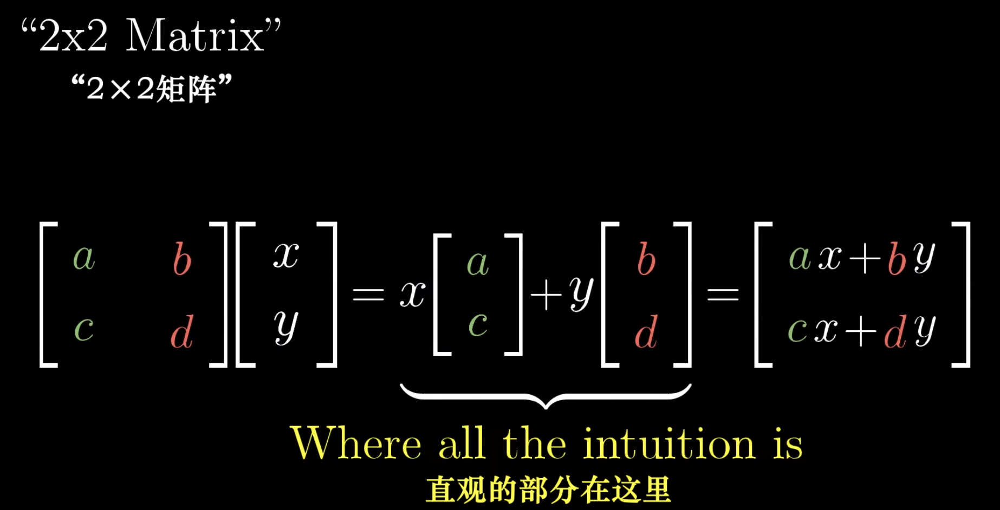
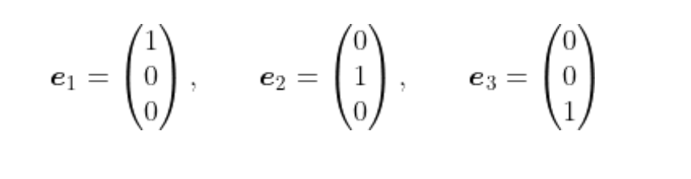
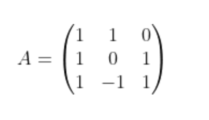
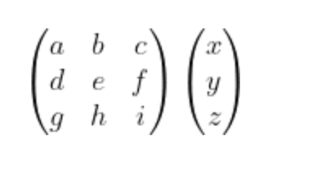
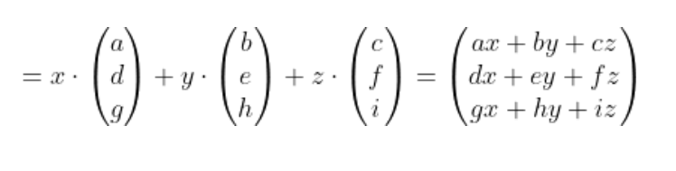
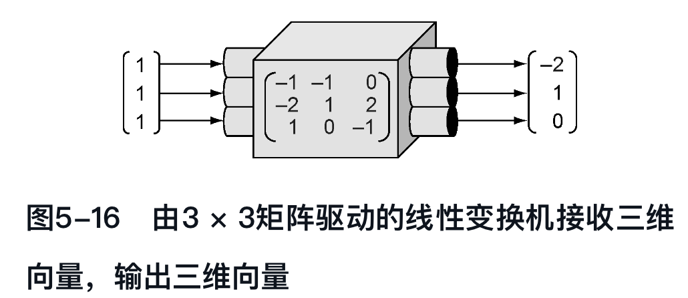
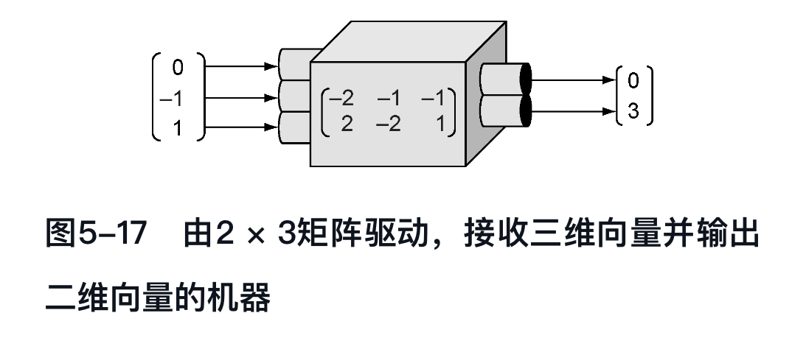
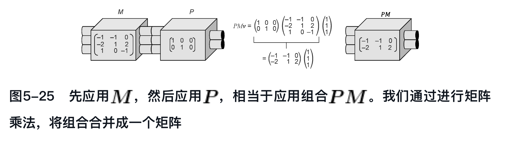

- 向量运算
	- 向量的首尾加法
		- 向量和表示在平面上移动的整体距离和方向
			- {:height 218, :width 459}
	- 向量的分量和长度
	  id:: 64172d1d-c8bf-42a4-800a-3b62690e9dcc
		- 向量的长度（length）就是代表它的箭头的长度，等价于从原点到它表示的点的距离。
	- 向量与数相乘
		- 将向量乘以数的运算称为标量乘法。处理向量时，普通的数通常被称为标量（scalar）。
			- scalar这个名字非常贴切，因为运算的效果是将目标向量按给定的系数进行缩放（scale）。
	- 减法、位移和距离
- 角度和三角学
	- 从角度到分量
		- 正弦函数和余弦函数给出了向量的垂直距离、水平距离和整体距离之间的关系
			- {:height 86, :width 452}
		- 将极坐标转换为对应的笛卡儿坐标的一般方法。
			- {:height 283, :width 439}
	- 从分量到角度
		- 反正弦（asin），反余弦（acos）
- 点积：测量向量对齐
	- 点积（也叫内积）是对两个向量的运算，返回一个标量。
		- 换句话说，给定两个向量u和v，那么u·v的结果是实数。
		- 它可以被看作测量输入向量对的“对齐程度”。
			- {:height 286, :width 453}
			- {:height 256, :width 405}
			- {:height 275, :width 394}
				- 这就是点积最重要的应用之一：在不做任何三角运算的情况下，计算两个向量是否垂直。
		- 用点积测量角度
			- {:height 84, :width 373}
			- {:height 119, :width 339}
- 向量积：测量定向区域
	- 向量积以两个三维向量作为输入，其输出是另一个三维向量
		- 它与点积的相似之处在于，输入向量的长度和相对方向决定了输出；
		- 但不同之处在于，它的输出不仅有大小，还有方向。
	- 在三维空间中确定自己的朝向
		- 右手规则
			- 如果右手食指指向x轴正方向，中指、无名指和小指向y轴正方向弯曲，那么你的拇指就会指明z轴的正方向。
				- {:height 315, :width 449}
		- 找到向量积的方向
			- 向量积总是返回垂直于两个输入的向量
			- 右手规则告诉我们向量积指向哪个垂直方向
				- {:height 299, :width 439}
			- 当输入向量位于两个坐标轴上时，不难找到它们的向量积指向的确切方向：它指向剩余坐标轴的一个方向。
			- 一般来说，如果不计算它们的向量积，就很难描述垂直于两个向量的方向。我们一旦知道如何计算它，就掌握了一个非常有用的特征。
		- 求向量积的长度
			- 和点积一样，向量积的长度也是一个数，它提供了关于输入向量的相对位置的信息。
			- 它测量的并不是两个向量的对齐程度，而更像是“它们的垂直程度”。
				- 更准确地说，它告诉我们两个输入之间的面积有多大
					- {:height 231, :width 445}
					- {:height 195, :width 433}
- 线性变换
	- 向量运算的不变性
		- 线性变换是保持向量和与标量乘积的向量变换T
			- 也就是说，对于任意输入向量u和v，有：
				- 
			- 而对于任意一对标量s和向量v，有：
				- {:height 81, :width 477}
		- 从几何角度看，线性变换也可以说是
			- 保持这两点性质
				- 直线在变换后，仍然保持为直线，不能有所弯曲
					- 直线包括x，y轴平行的线，也包括对角线等直线
				- 原点必须保持固定
			- 总的来说，可以把“线性变换”看作是“保持网格线平行且等距分布”的变换
			- 如何用数值表示
				- 只需要记录两个基向量i帽与j帽变换后的位置，其他向量都会随之而动
					- 
				- 矩阵向量乘法是计算线性变换作用于给定向量的一种途径
					- 每当我们看到一个矩阵时，都可以把它解读为空间的一种特定变换
- 用矩阵表示线性变换
	- 矩阵是由数组成的矩形网格，其形状诠释了这个概念。例如，可以将一个由单列数组成的矩阵称为向量，其项是从上到下排列的坐标。在这种形式下，这些向量被称为列向量。
		- 例如，可以将三维的标准基写成这样的三列向量。
			- {:height 123, :width 464}
		- 表示线性变换A的矩阵由这些向量并排挤在一起构成
			- {:height 171, :width 308}
	- 矩阵与向量相乘
		- {:height 130, :width 239}
		- {:height 101, :width 383}
	- 用矩阵乘法组合线性变换
		- 如果想组合线性变换来构建新的线性变换，矩阵是最好的工具。
- 不同形状矩阵的含义
	- 将方阵和非方阵视为向量函数
		- {:height 186, :width 412}
		- {:height 173, :width 411}
	- 组合线性映射
		- {:height 131, :width 436}
- 高维泛化
	- 坐标向量空间被表示为R^n，其中n代表维度，即坐标数量
	- 数学函数其实可以被当作向量，特别是接收一个实数并返回一个实数的数学函数。
	-
	-
	-
	-