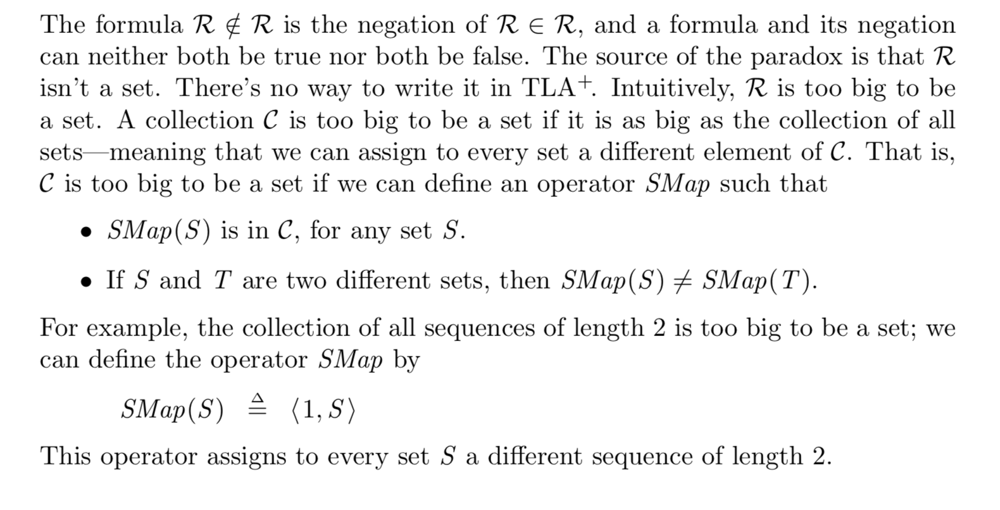

- Russell’s paradox
	- Let R be the set of all sets S such that S ∈/ S. The definition of R implies that R ∈ R is true iff R ∈/ R is true.
	- 令R是所有不属于它们自己的集合的集合。如果R不是它自己的成员，那么它的定义就意味着它是它自己的成员；如果它是自身的成员，那么它就不是自身的成员，因为它是所有不属于自身的集合的集合。由此产生的矛盾就是罗素悖论。
	- 解法
		- ZF公理系统
			- [[ZFC]]
		- NBG系统
			- 
-
- 罗素悖论（Russell's Paradox）是由英国数学家和哲学家伯特兰·罗素（Bertrand Russell）在1901年提出的一种逻辑悖论。它在集合论的基础研究中起到了关键作用，尤其是在指出了当时普遍接受的朴素集合论中存在的问题。
- ### 悖论的表述
	- 罗素悖论涉及一个特别的集合，即包含 所有不包含自身作为元素的集合。罗素问道：
		- 定义一个集合 R，其中包含所有不将自身作为元素的集合。
			- 换句话说，如果某个集合 X 不将自己作为一个元素，那么 X 就是 R 的一个元素
		- 如果 R 包含自己作为一个元素，根据定义，它只包括那些不包含自己的集合，所以 R 不应该包含自己。
		- 如果 R 不包含自己，根据定义，它应该包含所有不包含自己的集合，所以 R 应该包含自己。
	- 这就产生了一个矛盾，因为 R 既不可能包含自己，也不可能不包含自己。
- ### 悖论的影响
	- 罗素悖论揭示了朴素集合论中关于集合可以任意定义的假设的问题。这一悖论迫使数学家重新审视集合论的基础，并导致了公理化集合论的发展。
- ### 解决方法
	- 为了解决罗素悖论以及其他相关的悖论，数学家们提出了多种集合论的公理系统。最著名的是由哲罗姆·弗兰克尔（Zermelo）、阿布拉罕·弗兰克尔（Fraenkel）以及恩斯特·策梅洛（Ernst Zermelo）提出的ZF公理系统，以及后来加入选择公理（AC）的[[ZFC]]公理系统。
-
- 要提供一个更形式化的证明罗素悖论，我们首先需要定义一个集合 R，其中包括所有不包含自己作为元素的集合。然后，我们将通过逻辑推理来证明假设 R 包含自己或不包含自己都会导致矛盾。这个证明过程将使用基本的逻辑运算。
- ### 定义集合 R
  
  设 R 是一个集合，定义为：
  \[ R = \{ x \mid x \notin x \} \]
  这个定义说的是，集合 R 包含所有那些不包含自身作为元素的集合 x。
- ### 探讨集合 R 是否包含自身
  
  我们需要检查两种情况，即 R 包含自己 (R ∈ R) 和 R 不包含自己 (R ∉ R)。
- #### 情况 1: 假设 R ∈ R
  
  如果 R ∈ R，根据集合 R 的定义，所有 R 的元素都不应该包含自身。因此，如果 R ∈ R，那么 R 必须满足 R ∉ R。这是一个矛盾。
- #### 情况 2: 假设 R ∉ R
  
  如果 R ∉ R，根据集合 R 的定义，R 应该包含所有不包含自身的集合。因此，如果 R ∉ R，那么 R 必须满足 R ∈ R。这同样是一个矛盾。
- ### 形式化的逻辑表示
  
  我们可以将以上推理更形式化地表示如下：
  
  1. **定义**: \( R = \{ x \mid x \notin x \} \)
  2. **检查 R ∈ R**:
	- **假设**: \( R \in R \)
	- **推论**: 如果 \( R \in R \)，按定义 \( x \notin x \) 对所有 \( x \in R \)，因此 \( R \notin R \)。
	- **结果**: 矛盾。
	  3. **检查 R ∉ R**:
	- **假设**: \( R \notin R \)
	- **推论**: 如果 \( R \notin R \)，按定义 \( x \notin x \) 对所有 \( x \notin R \) 不成立，所以 \( R \in R \)。
	- **结果**: 矛盾。
- ### 结论
  
  由于无论是假设 R ∈ R 还是 R ∉ R 都导致逻辑上的矛盾，我们可以得出结论：在朴素集合论中，不能存在一个集合 R，使得 \( R = \{ x \mid x \notin x \} \)。这个悖论表明朴素集合论的定义方式存在内在的问题，需要通过制定更严格的公理系统来解决。