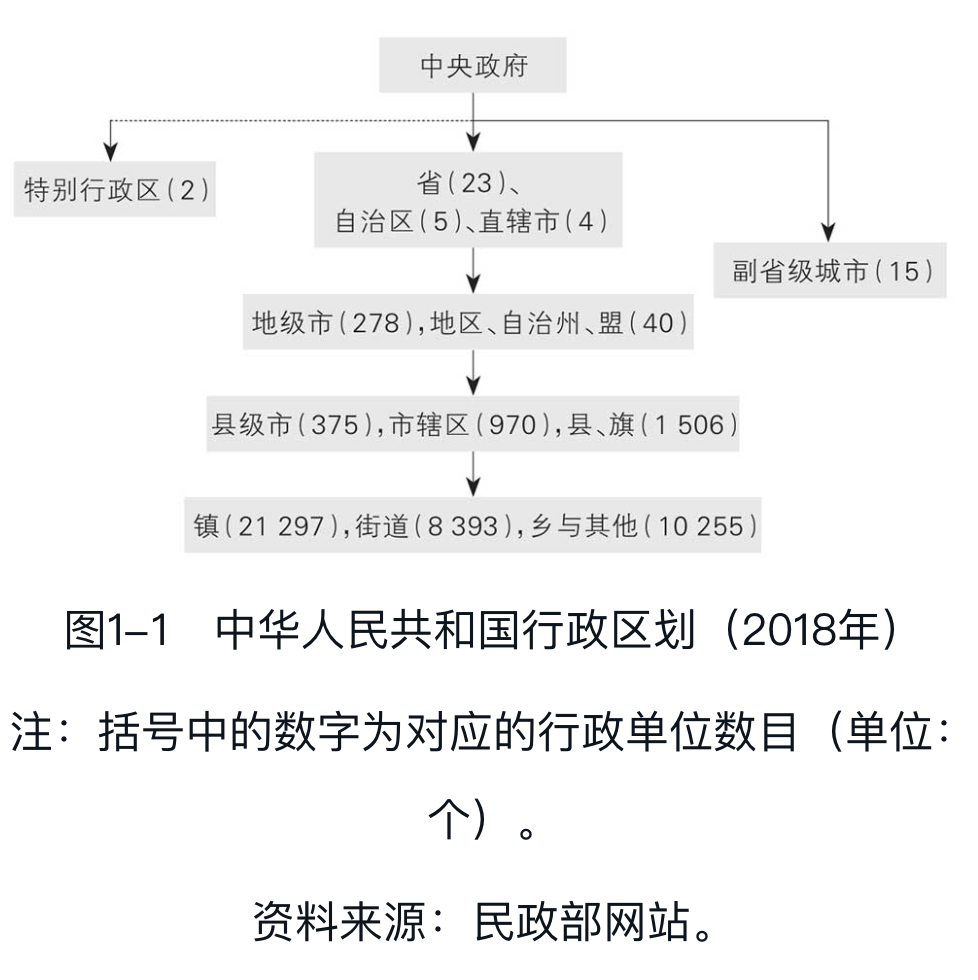

- 本书注重描述现实，注重解释“是什么”和“为什么”。当不可避免涉及“怎么办”的时候，则注重解释当下正在实施的政策和改革。
	- 对读者来说，了解政府认为应该怎么办，比了解“我”认为应该怎么办，重要得多。
- 微观机制
	- 地方政府的权力与事务
		- 要理解政府治理和运作的模式，首先要了解权力和资源在政府体系中的分布规则，既包括上下级政府间的纵向分布，也包括同级政府间的横向分布
		- 政府治理的特点
			- 图1-1描绘了中国的五级政府管理体系：中央—省—市—县区—乡镇。这一体系从历史上的“中央—省—郡县”三级体系演变而来。
				- {:height 342, :width 379}
			-
		-