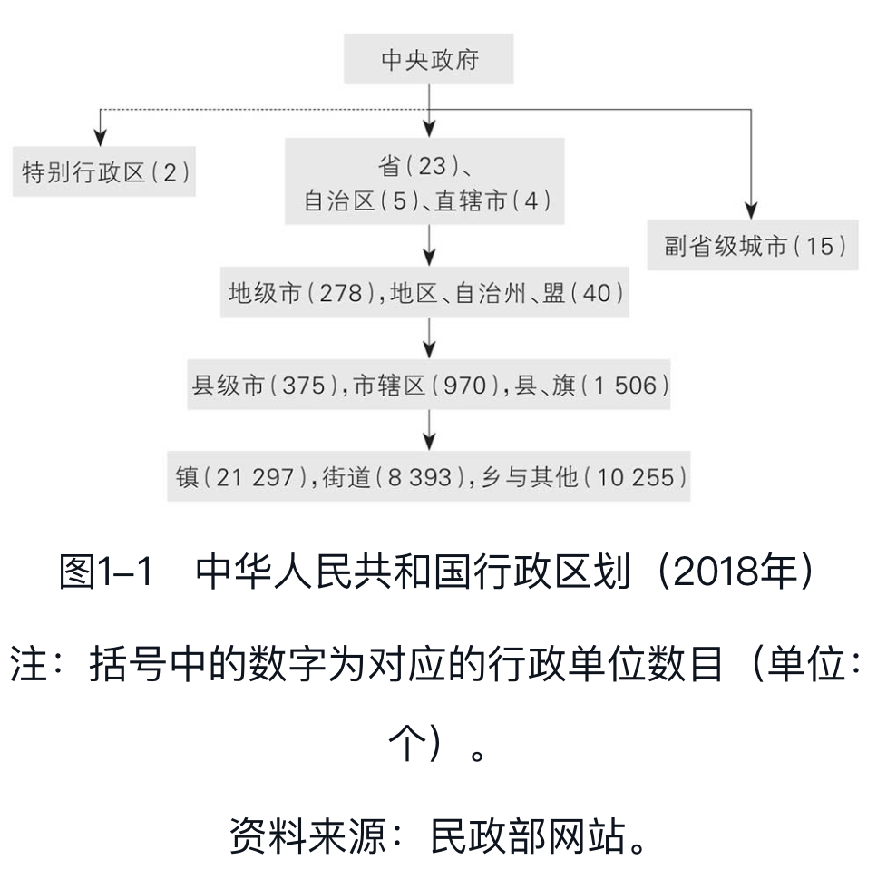

- 本书注重描述现实，注重解释“是什么”和“为什么”。当不可避免涉及“怎么办”的时候，则注重解释当下正在实施的政策和改革。
	- 对读者来说，了解政府认为应该怎么办，比了解“我”认为应该怎么办，重要得多。
- [[微观]]机制
	- [[地方政府]]的权力与事务
		- 要理解政府治理和运作的模式，首先要了解权力和资源在政府体系中的分布规则，既包括上下级政府间的纵向分布，也包括同级政府间的横向分布
		- 政府治理的特点
		  collapsed:: true
			- 图1-1描绘了中国的五级政府管理体系：中央—省—市—县区—乡镇。这一体系从历史上的“中央—省—郡县”三级体系演变而来。
				- {:height 342, :width 379}
				- 民国至新中国初期，政权逐渐延伸到了县以下的乡镇和城市的街道。在乡以下的村落，则实行村民自治，因为行政能力毕竟有限，若村落也建制，那财政供养人口又要暴涨一个数量级。
				- 现实情况当然远比简化的“五级”复杂。
					- 比如，同样都是地级市，省会城市与一般城市的政治地位与经济资源完全不同。
					- 再比如，同样都是县级单位，县级市、县、市辖区之间也有重大差别：在土地和经济事务上，县级市的权力比县大，而县的权力又比一般市辖区大。
				- 这五级体系也在不断改革，
					- 如近些年的“撤县设市”“撤县设区”“省直管县”“撤乡设镇”等。
					- 即使在省级层面上也时有重大变革，如1988年设立海南省、1997年设立重庆直辖市。
					- 而最近几年提出的“长三角一体化”“粤港澳大湾区”等国家战略，也会对现有行政区域内的权力和资源分配产生深远影响。
			- 中央与地方政府
				- 央地关系历来是研究很多重大问题的主线。
					- 一方面，维持大一统的国家必然要求维护中央权威和统一领导；
					- 另一方面，中国之大又决定了政治体系的日常运作要以地方政府为主。
				- 历史上，央地间的权力平衡需要各种制度去维护，一旦失控，王朝就可能分裂甚至覆灭。
					- 按照历史学家葛剑雄的统计，从公元前221年秦统一六国到1911年清朝结束，我国“统一”（即基本恢复前朝疆域且保持中原地区相对太平）的时间不过950年，占这一历史阶段的45%，而分裂时间则占55%，可见维持大一统国家并不容易。
				- 如今，央地关系的重要性也体现在[[宪法]]中。
					- 现行宪法的第一条和第二条规定了国体和政体，紧接着第三条便规定了央地关系的总原则：
						- “中央和地方的国家机构职权的划分，遵循在中央的统一领导下，充分发挥地方的主动性、积极性的原则。”
							- 这是一条高度抽象和灵活的原则，之后的章节会结合具体内容来展开讨论。
			- 党和政府
				- 中国共产党对政府的绝对领导是政治生活的主题。
					- 简单说来，党负责重大决策和人事任免，政府负责执行，
					- 但二者在组织上紧密交织、人员上高度重叠，很难严格区分。
				- 本书主题是经济发展，无须特别强调党政之分，原因有三。
					- 其一，地方经济发展依托地方政府。
						- 地方党委书记实质上依然是地方官，权力通常无法超越本地。
					- 其二，制约政府间事权划分的因素，也制约着各级党委的分工。
						- 比如，信息沟通既是困扰上下级政府的难题，也是困扰上下级党委的难题。所以在讨论事权划分原理时，无须特别区分党和政府。
					- 其三，地方经济事务由政府部门推动和执行。
						- 虽然各部门都由党委领导，但地方上并无常设的专职党委机构来领导日常经济工作。
						- 假如本书主题是法制建设，那这种党政不分的分析框架就不准确，会遗漏关键党委机构的作用，比如政法委和纪委。
			- 条块分割，[[多重领导]]。
				- 我国政治体系的一个鲜明特点是“层层复制”：中央的主要政治架构，即党委、政府、人大、政协等，省、市、县三级都完全复制，即所谓“四套班子”。
					- 中央政府的主要部委，除外交部等个别例外，在各级政府中均有对应部门，比如中央政府有财政部、省政府有财政厅、市县政府有财政局等。
				- 这种从上到下的部门垂直关系，被称为“条条”，而横向的以行政区划为界的政府，被称为“块块”。
				- 大多数地方部门都要同时接受“条条”和“块块”的双重领导。
					- 拿县教育局来说，既要接受市教育局的指导，又要服从县委、县政府的领导。
				- 通常情况下，“条条”关系是业务关系，“块块”关系才是领导关系，因为地方党委和政府可以决定人事任免。
			- 上级领导与协调
				- 制度设计的一大任务就是要避免把过多决策推给上级，减轻上级负担，提高决策效率，所以体制内简化决策流程的原则之一，就是尽量在能达成共识的最低层级上解决问题。
				- 若是部门事务，本部门领导就可以决定；若是经常性的跨部门事务，则设置上级“分管领导”甚至“领导小组”来协调推进。
					- 比如经济事务，常常需要财政、工商、税务、发改委等多部门配合，因为发展经济是核心任务，所以地方大都有分管经济的领导，级别通常较高，比如常务副市长（一般是市委常委）。
			- 官僚体系。
				- 无论是国家还是公司，人事制度都是组织机构的核心。
					- 所有规章制度都必须由人来执行和运作。同样的制度在不同的人手中，效果可能完全不同，所以无论是国家还是公司，人事制度都是组织机构的核心。
				- 科举选拔出的官僚，既为政治领导，也为道德表率，不仅是政治体制的核心，也是维护国家和社会统一的文化与意识形态载体。
				- 这一体系的三大特点延续至今：
					- 官员必须学习和贯彻统一的[[意识形态]]；
					- 官员由上级任命；
					- 地方主官需要在多地轮换任职。
					- 在维持大一统的前提下，这些特点都是央地关系平衡在人事制度上的体现。
			- 在任何体制下，权力运作都受到两种约束：做事的能力及做事的意愿。前者取决于掌握的资源，后者取决于各方的积极性和主动性
			-
		- 外部性与规模经济
			- 地方政府权力的范围和边界，由行政区划决定。
				- 我国实行“属地管理”，地方事权与行政区划密不可分，所以我们先从行政区划角度来分析权力划分。
			- 影响行政区划的首要因素是“ [[外部性]]”
				- 这是个重要的[[经济学]]概念，简单来说就是人的行为影响到了别人。在公共场合抽烟，让别人吸二手烟，是负外部性；打流感疫苗，不仅自己受益，也降低了他人的感染风险，是正外部性。
				- 一件事情该不该由地方自主决定，可以从 [[外部性]] 的角度来考虑。
					- 若此事只影响本地，没有外部性，就该由本地全权处理；若还影响其他地方，那上级就该出面协调。
					  collapsed:: true
						- 比如市里建个小学，只招收本市学生，那市里就可以做决定。但如果本市工厂污染了其他城市，那排污就不能只由本市说了算，需要省里协调。如果污染还跨省，可能就需要中央来协调。
			- 因此行政区域大小应该跟政策影响范围一致。
				- 若因行政区域太小而导致影响外溢、需要上级协调的事情过多，本级政府也就失去了存在的意义。
				- 反过来讲，行政区划也限定了地方可调配的资源，限制了其政策的影响范围。
			- 公共物品和服务的边界
				- 按照经典经济学的看法，政府的核心职能是提供公共物品和公共服务，比如国防和公园。
					- 这类物品一旦生产出来，大家都能用，用的人越多就越划算——因为建造和维护成本也分摊得越薄，这就是“ [[规模经济]]”。
					  collapsed:: true
						- 美国独立战争结束后，13个州需要决定是否建立一个中央联邦政府。反对的人不少。毕竟刚打跑了英国主子，何必马上给自己立个新主子？所以赞同的人就得想办法说服民众，宣传联邦的好处，他们写了不少文章，这些小文章后来就成了美国的国民经典《联邦党人文集》。其中编号第13的文章出自汉密尔顿之手，正是讲一个大政府比13个小政府更省钱的道理，也就是[[规模经济]]。
				- 但绝大部分公共物品只能服务有限人群。
					- 一个公园虽然免费，但人太多就会拥挤，服务质量会下降，且住得远的人来往不便，所以公园不能只建一个。
				- 一个城市总要划分成不同的区县，而行政边界的划分跟公共服务影响范围有关。
					- 一方面，因为规模经济，覆盖的人越多越划算，政区越大越好；
					- 另一方面，受制于人们获取这些服务的代价和意愿，政区不能无限扩大。
				- 政府公共服务的覆盖范围也与技术和基础设施有关。
					- 比如《新闻联播》，是不是所有人都有电视或网络可以收看？是不是所有人都能听懂普通话？是不是所有人的教育水平都能听懂基本内容？
					- 这些硬件和软件的基础非常重要。
						- 所以秦统一六国后，立刻就进行了“车同轨、书同文”以及统一货币和度量衡的改革。
				- 以公共物品的规模经济和边界为切入点，也可以帮助理解中央和地方政府在分工上的一些差异。
					- 比如国防支出几乎全部归中央负担，因为国防体系覆盖全体国民，不能遗漏任何一个省。而中小学教育受制于校舍和老师等条件，规模经济较小，主要覆盖当地人，所以硬件和教师支出大都归地方负担。
					- 但教材内容却不受物理条件限制，而且外部性极强。如果大家都背诵李白、杜甫、司马迁的作品，不仅能提高自身素养，而且有助于彼此沟通，形成共同的国民意识，在一些基本问题和态度上达成共识。
					- 所以教育的日常支出虽由地方负责，但教材编制却由中央主导，教育部投入了很多资源。
			- 人口密度、地理与文化差异
				- 行政区划 第一个重要因素是人口密度。
					- 我国幅员辽阔，但人口分布极不平衡。
					- 按人口密度划分行政区域的思路非常自然。
						- 提供公共物品和服务需要成本，人多，不仅税收收入多，而且成本能摊薄，实现规模收益。
						- 中国历代最重要的基层单位是县，而县域的划分要依据人口密度，这是早在秦汉时期就定下的基本规则之一，所谓“民稠则减，稀则旷”（《汉书·百官公卿表》）。
					- 随着人口密度的增加，行政区域的面积应该越变越小，数目则应该越变越多。
				- 第二个重要因素是地理条件。
					- 古代交通不便，山川河流也就成了行政管理的自然边界，历史地理学家称之为“随山川形变”
					- 现今省界中仍有不少自然边界：海南自不必说，山西、陕西以黄河为界，四川、云南、西藏则以长江（金沙江）为界，湖北、重庆以巫山为界，广东、广西则共属岭南。
				- 第三个重要因素是语言文化差异
					- 汉语的方言间有差异，汉语与少数民族语言也有差异。
					- 若语言不通，政务管理或公共服务可能就需要差异化，成本会因此增加，规模收益降低，从而影响行政区域划分。
					- 当然，语言差异和地理差异高度相关。
						- 方言之形成，多因山川阻隔而交流有限。
							- 世界范围内，一国若地形或适耕土地分布变异大，人口分布就比较分散，国内的语言变异往往也就更丰富。
					- 我国各省间方言不同，影响了省界划分。
				- 理解了这些因素，就能理解很多政策和改革。
					- 比如，随着经济活动和人口集聚，需要打破现有的行政边界，在更大范围内提供无缝对接的标准化公共服务，
						- 所以就有了各种都市圈的规划，有些甚至上升到了国家战略，比如长三角一体化、京津冀一体化、粤港澳大湾区等。
					- 再比如，地理阻隔不利沟通，但随着基础设施互联互通，行政区划也可以简化，比如撤县设区。
					- 此外，理解了方言和文化的多样性，也就理解了推广普通话和共同的文化历史教育对维护国家统一的重要性。
				- 当然，无论是人口密度、地理还是语言文化，都只是为理解行政区划勾勒了一个大致框架，无法涵盖所有复杂情况。
					- 其一，人口密度变化频繁，但行政区域的调整要缓慢得多。
						- 虽然一些人口流入地可以“撤县建区”来扩张城市，但人口流出地却很少因人口减少去裁撤行政单位，一般只是合并一些公共设施来降低成本，比如撤并农村中小学。
					- 其二，古代行政区划除“随山川形变”外，也遵循“犬牙交错”原则，即为了政治稳定需要，人为打破自然边界，不以天险为界来划分行政区，防止地方势力依天险制造分裂。
						- 元朝在这方面走了极端，设立的行省面积极大，几乎将主要天险完全消融在各行省内部，但效果并不好。
					- 其三，方言与文化区域经常被行政区划割裂。
						- 比如客家话虽是主要方言，但整个客家话大区被江西、福建、广东三省分割。
			- 行政交界地区的经济发展
				- 我国经济中有个现象：处在行政交界（尤其是省交界处）的地区，经济发展普遍比较落后。
				- 这一俗称“三不管地带”的现象，也可以用公共物品规模效应和边界的理论来解释。
					- 首先，一省之内以省会为政治经济中心，人口最为密集，公共物品的规模经济效应最为显著。但几乎所有省会（除南京和西宁外）无一临近省边界，这种地理距离限制了边界地区获取公共资源。
					- 其次，省边界的划分与地理条件相关
						- 诸多省界县位于山区，坡度平均要比非省界县高35%，不利于经济发展
					- 一省之内主流文化一般集中在省会周围，而省界地区往往是本省的非主流文化区，其方言也有可能与主流不同。
					- 这些边界地区，在本省之内与主流文化隔阂，而与邻省同文化区的交流又被行政边界割裂，不利于经济发展。
					- 从公共物品角度看，边界地区首先面临的是基础设施如道路网络的不足。
						- 即使到了2012年，路网交通中的“边界效应”（省界地区路网密度较低）依然存在，虽然比以前改善了很多。
							- 即使在排除了经济发展、人口密度、地形等因素之后，“边界效应”也还是存在的，不过只限于由省政府投资的高速公路和省道中，在由中央政府投资的国道和铁路中则不存在，可见省政府不会把有限的资源优先配置到边界地区。
						- 随着经济发展和我国基础设施建设的突飞猛进，如今省界处的交通已不再是大问题。
					- 另一个曾长期困扰边界公共治理的问题是环境污染，尤其是跨省的大江、大河、大湖，比如淮河、黄河、太湖等流域的污染。
				-
				-
		- [[复杂]]信息
			- 。。
		- [[激励相容]]
			- 。。
		- 招商引资
			- 。。
	- 财税与政府行为
		- 分税制改革
			- 。。
		- 土地财政
			- 。。
		- 纵向不平衡与横向不平衡
			- 。。
	- 政府投融资与债务
		- 城投公司与土地金融
			- 。。
		- 地方政府债务
			- 。。
		- 招商引资中的地方官员
			- 。。
	- 工业化中的政府角色
		- 京东方与政府投资
			- 。。
		- 光伏发展与政府补贴·
			- 。。
		- 政府产业引导基金
			- 。。
- 宏观现象
	- 城市化与不平衡
		- 房价与居民债务
			- 。。
		- 不平衡与要素市场改革
			- 。。
		- 经济发展与贫富差距
			- 。。
	- 债务与风险
		- 债务与经济衰退
			- 。。
		- 债台为何高筑：欧美的教训
			- 。。
		- 中国的债务与风险
			- 。。
		- 化解债务风险
			- 。。
	- 国内国际失衡
		- 低消费与产能过剩
			- 。。
		- 中美贸易冲突
			- 。。
		- 再平衡与国内大循环
			- 。。
	- 总结：政府与经济发展
		- 地区间竞争
			- 。。
		- 政府的发展与转型
			- 。。
		- 发展目标与发展过程
			- 。。
		-
	-
	-
	-