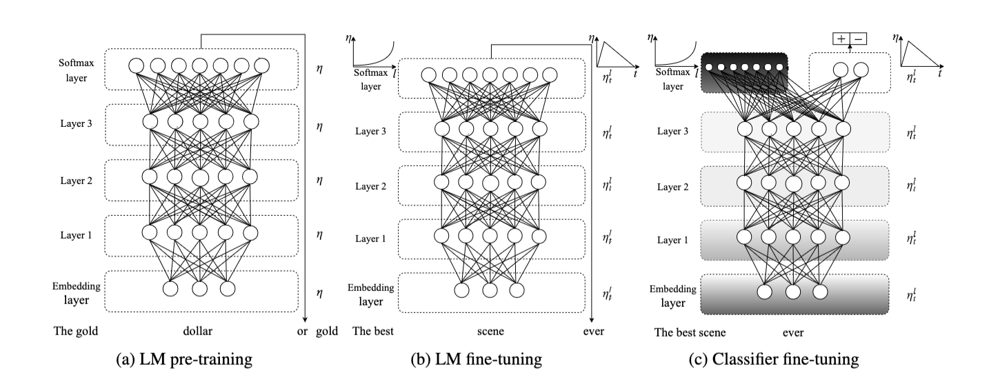

- ULMFiT
	- Universal Language Model Fine-tuning for Text Classification
	- 
	- ULMFiT由三个阶段组成:
		- a)在通用域语料库上训练LM，以捕获语言在不同层的一般特征。
		- b)使用判别微调(’ Discr’)和倾斜三角学习率(STLR)对目标任务数据进行微调，以学习任务
		  特定的特征。
		- c)分类器在目标任务上进行微调，使用gradual unfreezing, ‘Discr’, and STLR来保留low-level 表示，并适应high-level表示
			- "gradual unfreezing" 指的是模型在fine-tuning过程中，逐渐解冻模型的层，以允许更多的参数更新
			- “Discriminative fine-tuning” 是指在 fine-tuning 过程中针对不同层使用不同的学习率来更新模型的参数。
			- "STLR" 是一种学习率调度程序，用于控制模型参数更新的速度