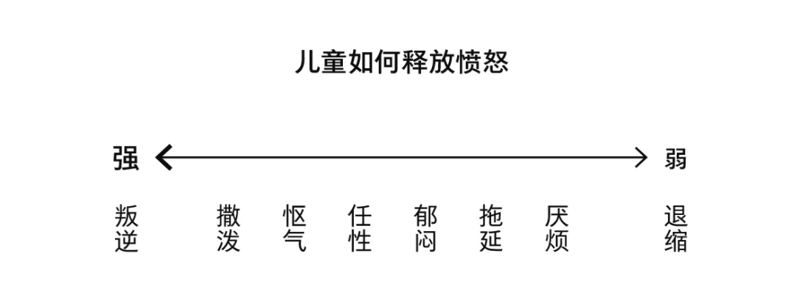

- 心理咨询向来是一个自发的过程，咨询师和来访者双方都得出于自愿。
	- 咨询师用了“合作”一词，这意味着不管咨询中发生什么，蛤蟆都是主动的参与者。
- 咨询师的承诺
	- “蛤蟆先生，如果我不相信每个人都有能力变得更好，我就不会做这份工作了。我无法保证事情一定会变好，但我可以承诺的是，我会对你倾注我全身心的关注，我也希望你对咨询是全心投入的。假如我们都能像这样一同努力，就能预见积极的结果。但归根结底，这一切都取决于你。”
- 感觉怎么样
	- 用有1～10刻度的温度计作为测量方式
		- 假设我们有一种温度计，可以用来测量你现在的感受。温度计有10个刻度，最低为1，代表你感觉非常糟糕，可能还有自杀的想法。中间是5，代表你感觉还不算太糟。最高为10，表示你非常愉悦
- 儿童自我状态
	- 当我说一个人处在‘儿童自我状态’时，我是指他的行为和感受都像一个孩子。这不同于‘幼稚’，而是‘像孩子一样’。
	- ‘儿童自我状态’，是由我们童年残留的遗迹搭建而成，包含我们小时候体验过的所有情感。
		- 你一定知道在刚出生时，我们只具备几种最基本的情感。
		- 幼年时，这些基本情感逐渐发展演变成更微妙、更复杂的行为模式，这些行为模式成为自我的核心，融为我们自身的一部分，定义了我们一生的行为。
		- 正因为这样，某些特定的情形和场景会激发我们的基本行为模式，让我们自动做出反应，所以我们会和小时候一样去行动和感受。具体的情形和场景因人而异。
	- 儿童的基本情感
		- 快乐和深情
		- 愤怒
		- 悲伤
		- 恐惧
	- 两种儿童自我状态
		- 自然型儿童
		- 适应性儿童
			- 学着调整自己的行为来适应这个特定的情形
			- 从呱呱落地起，我们的生命里只有两个人陪伴，有时候甚至只有一个人。和我们相比，他们是那么的强大，而我们则全然依靠着他们。因为无处可逃，我们唯一能做的就是去适应他们每一次的喜怒无常
- 成长的本质
	- 可对大多数人而言，成长的本质就是要减少并最终打破这样的依赖关系，这样才能成为一个独立自主的人。很少有人能完全达成这点，有些人能部分达成，而很多人则会依赖一辈子。
- 愤怒
	- 儿童如何释放愤怒
		- 
- 共谋
	- 意思是达成一种秘密协议。我用‘共谋’是想说，你偷偷地或无意识地配合对方，来给自己制造不快，这就是在玩心理游戏，而且在游戏里输的人才算是赢家。
- 父母自我状态
	- 处于‘父母自我状态’时，我们表现得正如自己的父母。记住，他们是我们最早接触的人，因此对我们的影响是不可估量的。
	- 自我谴责也可能是处于父母自我状态
- 成人自我状态
	- ‘成人自我状态’指我们用理性而不是情绪化的方式来行事。它让我们能应对此时此地正在发生的现实状况。
		- 意思是，在这个状态下，我们能计划、考虑、决定、行动，我们能理性而合理地行事。
		- 处于这个状态时，我们所有的知识和技能都能为自己所用，而不再被脑子里父母过去的声音所驱使，也不会被童年的情绪所围困。
		- 相反，我们能思考当下的状况，基于事实来决定要怎么做。
	- 在成功的人生里，这三种状态都是必需的。它们已经演化了千百年，所以每一种状态肯定都很重要，都对生存有价值。不过，我们可以说的是，‘成人状态’有它的特殊重要性。
		- 在‘儿童状态’时，你会体验到童年的感受，好的坏的都有。你会再现过去的情形，再次体验过去的情绪，可你学不到任何新的东西。
		- 你处在‘父母状态’时，基本上你不是在挑剔就是在教育别人。
			- 不管是哪种，你都在用言行重复从父母那里学来的观念和价值观，你会想证明给别人看，让别人接受你的观念和价值观。
			- 这种确信无疑的状态，就没法给新知识和新理念留出一席之地。旧的思想主宰着你，这就是为什么单靠争论不能改变一个人的想法，只会让人更固执己见。
	- 如何进入成人自我状态
		- 其一，没人能强迫别人进入他们的‘成人状态’。你只能鼓励他们
		- 其二，我不‘知道’你应该怎么做。咨询的主要目标是让你能自己找到答案。我会在这个过程中协助你，但只有你自己能做决定。
- 对世界的看法
	- 第一个问题是：‘我是怎么看自己的？我好吗？’第二个问题是：‘我是怎么看别人的？他们好吗？‘
	-
	-