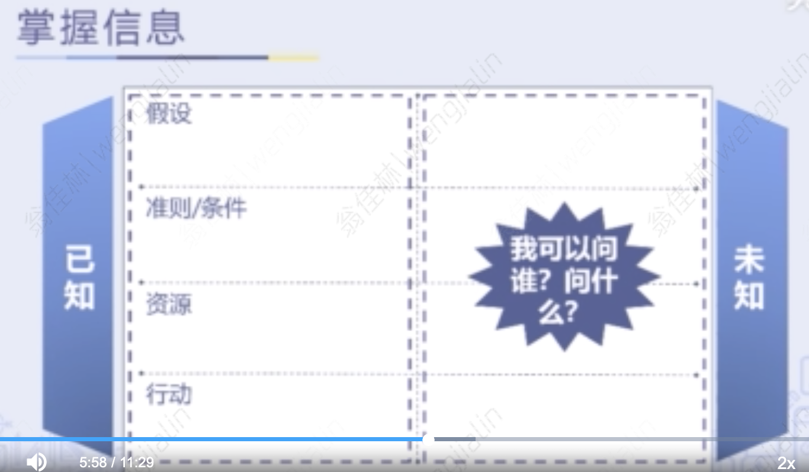

- 摆脱“忙于救火”，优雅地应对各种工作
	- 时间运用的先后顺序至关重要
	- 决定优先级
		- 重要、紧急四象限
		- 工作内容平衡，才能有计划投入更合理的时间和资源
		  collapsed:: true
			- 
		- 重要不紧急的事情
			- 有计划地预留足够时间，且不被打断
		- 紧急不重要的事情
			- 授权、拜托他人，不要追求完美
		- 划重点
			- 关键：找出工作中的重中之重
- 两个马步助你做好高效计划
	- 厘清目的
		- 解决什么问题
	- 掌握信息
		- 建立信息基础
			- 假设
				- 计划能成功执行的前提
			- 准则、条件
				- 计划必须遵循的限制条件
			- 资源
				- 计划可以调动的人力&物力&财力
			- 行动
				- 厘清关键行动步骤
		- 已知与未知
		  collapsed:: true
			- 
				-
	- 个性&能力
		- Objective 客观
		  collapsed:: true
			- 
			-
		- Vision 远见
		  collapsed:: true
			- 
			-
		- Initiative 主动
		  collapsed:: true
			- 
- 如何从无到有来制定一个行动计划
	- 任务：希望达到的目标，由一个一个的行动组成
	- 行动：可执行的操作步骤
	- 任务分解
	- 行动排序
		- 强依赖
		- 无依赖
	- 铺排时间&资源
		- 甘特图
	- 口诀
		- Who do What by When and How
		  collapsed:: true
			- 
			-
- 善用资源，从此不再“没钱没人没时间”
	- 追求资源取得的广度 & 安排上的细致度
	- 资源分配小贴士
		- 整体把握现有资源
		- 预估出余量
		- 思考向谁寻求资源支持
		- 向有经验的人请教
	- 有助于善用资源的三项能力
		- 懂得建立人脉
		- 掌握伙伴合作关系
		- 有效授权
-
-
- 拓展小课堂
	- 结果导向真的对吗
	-