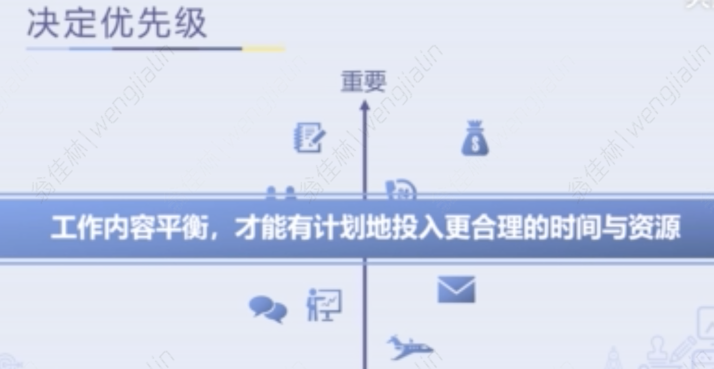

- 摆脱“忙于救火”，优雅地应对各种工作
	- 时间运用的先后顺序至关重要
	- 决定优先级
		- 重要、紧急四象限
		- 工作内容平衡，才能有计划投入更合理的时间和资源
		  collapsed:: true
			- 
		- 重要不紧急的事情
			- 有计划地预留足够时间，且不被打断
		- 紧急不重要的事情
			- 授权、拜托他人，不要追求完美
		- 划重点
			- 关键：找出工作中的重中之重
- 两个马步助你做好高效计划
	- 厘清目的
		- 解决什么问题
	- 掌握信息
		- 建立信息基础
			- 假设
				- 计划能成功执行的前提
			- 准则、条件
				- 计划必须遵循的限制条件
			- 资源
				- 计划可以调动的人力&物力&财力
			- 行动
				- 厘清关键行动步骤
		- 已知与未知
		  collapsed:: true
			- 
				-
	- 个性&能力
		- Objective 客观
		  collapsed:: true
			- 
			-
		- Vision 远见
			- 
			-
		- Initiative 主动
		  collapsed:: true
			- 
- 如何从无到有来制定一个行动计划
	- 任务：希望达到的目标，由一个一个的行动组成
	- 行动：可执行的操作步骤
	- 任务分解
	- 行动排序
		- 强依赖
		- 无依赖
	- 铺排时间&资源
		- 甘特图
	- 口诀
		- Who do What by When and How
		  collapsed:: true
			- 
			-
- 善用资源，从此不再“没钱没人没时间”
	- 追求资源取得的广度 & 安排上的细致度
	- 资源分配小贴士
		- 整体把握现有资源
		- 预估出余量
		- 思考向谁寻求资源支持
		- 向有经验的人请教
	- 有助于善用资源的三项能力
		- 懂得建立人脉
		- 掌握伙伴合作关系
		- 有效授权
-
-
- 拓展小课堂
	- 结果导向真的对吗
		- 过程指标、结果指标互为因果，只有你追踪了每个人的具体行为，差距在哪，并给予相应的指导，才能让大家的行为朝着最优秀的方向发展，最终促成整体业绩目标的达成。
		- 仔细想想你在工作和生活中有哪些只关注结果，却忽视了过程，导致目标最后反而没有达成的事
	-
	- 草稿
		- 一些材料
			- 契约经济学角度（末位淘汰制、二元考核体系 与 棘轮效应）
				- {{embed ((6135a4ec-d032-41cd-9bfc-c8c7567c0884))}}
				- {{embed ((6130c3b4-9c5a-40d5-a944-cefa080a360a))}}
				- {{embed ((617d138a-b2cc-42b7-a00d-4d2dcbd6b9b1))}}
			- 心学角度（价值论与价值判断）
			  collapsed:: true
				- {{embed ((62f52079-9901-4d82-ad1d-bc6096f0794b))}}
				-
			- 课程中的角度（Vision远见）
			  collapsed:: true
				- 高效计划中，个性&能力中的Vision（远见）
					- 时间上，考虑得更长远
					- 范围上，考虑范围的周延，广度更高
		- 文章思路
			- 结果指标中，短期结果指标与长期结果指标的关系
				- 过度关注短期绩效，有两个方面的问题
					- 一个是对于团队一部分成员不公平
						- 这里讲讲 末位淘汰制 的前提条件
					- 一个是鼓励了一些短期投机行为
						- 这里讲讲 棘轮效应
						- 可以结合加班的案例
				- 解法可以参考 二元考核体系
					- 可以简单点点课程中所讲的Vision远见
			- 过程指标 与 结果指标的关系
				- 过程指标关注人的行为，涉及到价值判断，也就是 你是怎么看待你的行为与我们要达到的结果的关系的，你需要对你的行为做一个价值判断
					- 同样二元考核体系涉及对行为的价值观
					- 这里除了结合公司的价值观外，一些没法很好对应上的部分需要自己的判断
		- 总结思考
			- 材料里讲到过度结果导向，忽略了过程，导致目标反而没有达成的问题。
				- 更具体地，是说，定期追踪团队业绩时，只关注结果指标的问题。
			- 那么就会是一个短期结果指标（例如季度指标）与长期结果指标（例如年度指标）的关系。
				- 过度关注短期结果指标，或者说短期绩效，会有两个方面的问题。
					- 第一个方面是，会对团队内一部分成员不公平。
						- 这个问题，与我们在讲“末位淘汰制”的适用范围，有一些关联。
							-
			-
	- 总结思考
		-
		-