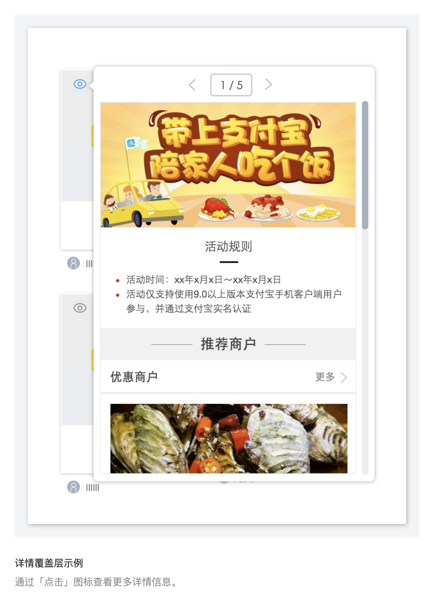

- Ant Design
	- https://ant.design/docs/spec/introduce-cn
	- 设计价值观
		- 用途
			- 
		- 内容
			- 自然
			  collapsed:: true
				- 感知自然
					- [[认知心理学]]所述，约 80% 外界信息通过视觉通道获取
					- 界面设计中最重要的视觉要素，包括布局、色彩、插画、图标等，应充分汲取自然界规律，从而降低用户认知成本，带来真实流畅的感受
					- 在一些场景下，适时加入听觉、触觉等其它感知通道，能创造更丰富自然的产品体验
				- 行为自然
					- 在与系统的互动中，设计者应充分理解用户、系统角色、任务目标间的关系，场景化组织系统功能和服务。
					- 同时辅以行为分析、人工智能、传感器、元数据等策略，提供主动式服务，帮助用户决策、减少操作，从而节约用户脑力和体力，让[[人机交互]]行为更自然。
			- 确定性
			  collapsed:: true
				- 高确定性、低合作熵
					- 设计者确定
						- 通过探索设计规律、模块化设计思路，来为设计者提供足够精简的设计规则、组件、模式等，赋能设计者、降低合作熵。
							- 保持克制
								- 能做，但想清楚了不做。
									- 设计者应当聚焦在最有价值产品功能打磨，并用尽可能少的设计元素将其表达。
							- 面向对象的方法
								- 探索设计规律，并将其抽象成「对象」，增强界面设计的灵活性和可维护性，同时也减少「设计者」的主观干扰，从而降低系统的不确定性。
								- 例如：色值换算、间距排版
							- [[模块化]]设计
								- 将复杂或者重复出现的局部封装成模块，提供有限接口与其他模块互动，最终全面减少系统的复杂度，进而增进可靠性以及可维护性。
								- 设计者可运用现有的组件/模板或者自行抽象可复用的组件/模板，节约无谓的设计且保持系统一致性，让「设计者」把创造力专注在最需要的地方。
					- 用户确定
						- 用户日常工作是通过诸多企业级产品的协同来完成的，除了考虑单一产品的设计一致性，更应当在跨产品、跨终端、跨系统间保持良好的确定性。
						- 一致的外观和交互，保持面向用户的熟悉感，能提升易学性，降低认知和操作成本，提升工作效率。
			- 意义感
			  collapsed:: true
				- 一个产品或功能被设计者创造出来不只是用户的需要，而更多是承载用户的某个工作使命。
					- 结果的意义
						- 明确目标，即时反馈
							- 洞悉工作目标，根据使用流程拆解明确的子目标，让每个交互行为都围绕着主目标的达成；
							- 为每个行为，辅以恰当、即时的反馈，让用户对操作结果了然于胸。
							- 此外，可通过情感化设计，适度安抚用户负面情感，强化用户正面情感。
					- 过程的意义
						- 挑战适中，全情投入
							- 调整不同场景下的工作难度，让功能适时适地触发，以匹配用户能力；
							- 如无必要，勿增实体，不分散用户注意力，让用户专注于任务达成，而非界面。
			- 生长性
			  collapsed:: true
				- 用发展的眼光做设计，充分考虑人、机两端的共同生长。
					- 价值连接
						- 产品的增长依赖于用户的群体扩大和深度使用，而用户的成长又依赖于产品功能的壮大。
						- 设计者应建立系统设计思维，洞悉产品功能的价值，探索用户在不同场景下的需求，在价值和需求间建立连接。
						- 让产品价值被发现，帮助用户建立更有效、更高效的工作方式。
					- 人机共生
						- 产品功能和用户需求的更多连接，让人机互动更加紧密，用户和系统共生。
						- 产品设计时，不应将用户和系统独立开来，应作为一个动态发展的共同体来思考，确保其足够的灵活、包容，充满生命力。
	- 设计模式
		- 针对企业级产品反复出现的设计问题，设计模式给出一般性的解决方案，实现跨应用交互一致性的有效融合。
		- 设计模式包含以下内容：
			- 原则
				- 基于价值观衍生出的一般设计技巧，包括如何高效组织信息、帮助建立用户与界面的互动等原则性要求。
				- 内容：
					- 亲密性
					  collapsed:: true
						- 亲密性的根本目的是实现组织性，让用户对页面结构和信息层次一目了然。
							- 如果信息之间关联性越高，它们之间的距离就应该越接近，也越像一个视觉单元；
							- 反之，则它们的距离就应该越远，也越像多个视觉单元。
						- 纵向间距关系
							- 通过「小号间距」、「中号间距」、「大号间距」这三种规格来划分信息层次结构。
							- 
							- 在这三种规格不适用的情况下，可以通过加减「基础间距」的倍数，或者增加元素来拉开信息层次。
						- 横向间距关系
							- 
							- 为了适用不同尺寸的屏幕，在横向采用栅格布局来排布组件，从而保证布局的灵活性。
							- 
							- 在一个组件内部，元素的横向间距也应该有所不同。
					- 对齐
					  collapsed:: true
						- 在界面设计中，将元素进行对齐，既符合用户的认知特性，也能引导视觉流向，让用户更流畅地接收信息。
							- 正如「格式塔学派」中的连续律（Law of Continuity）所描述的，在知觉过程中人们往往倾向于使知觉对象的直线继续成为直线，使曲线继续成为曲线。
						- 文案类对齐
							- 
							- 如果页面的字段或段落较短、较散时，需要确定一个统一的视觉起点。
						- 表单类对齐
							- 
							- 冒号对齐（右对齐）能让内容锁定在一定范围内，让用户眼球顺着冒号的视觉流，就能找到所有填写项，从而提高填写效率。
						- 数字类对齐
							- 
							- 为了快速对比数值大小，建议所有数值取相同有效位数，并且右对齐。
							-
					- 对比
					  collapsed:: true
						- 对比是增加视觉效果最有效方法之一，同时也能在不同元素之间建立一种有组织的层次结构，让用户快速识别关键信息。
							- 注：要实现有效的对比，对比就必须强烈，切不可畏畏缩缩。
						- 主次关系对比
							- 
							- 为了让用户能在操作上（类似表单、弹出框等场景）快速做出判断， 来突出其中一项相对更重要或者更高频的操作。
								- 注意：突出的方法，不局限于强化重点项，也可以是弱化其他项。
							- 
							- 在一些需要用户慎重决策的场景中，系统应该保持中立，不能替用户或者诱导用户做出判断。
						- 总分关系对比
							- 
							- 通过调整排版、字体、大小等方式来突出层次感，区分总分关系，使得页面更具张力和节奏感。
						- 状态关系对比
							- 
							- 
							- 通过改变颜色、增加辅助形状等方法来实现状态关系的对比，以便用户更好的区分信息。
								- 常见类型有「静态对比」、「动态对比」。
						-
					- 重复
					  collapsed:: true
						- 相同的元素在整个界面中不断重复，不仅可以有效降低用户的学习成本，也可以帮助用户识别出这些元素之间的关联性。
						- 重复元素
							- 
							- 
							- 
							- 重复元素可以是一条粗线、一种线框，某种相同的颜色、设计要素、设计风格，某种格式、空间关系等。
						-
					- 直截了当
					  collapsed:: true
						- 正如 Alan Cooper 所言：「需要在哪里输出，就要允许在哪里输入」。这就是直接操作的原理。
							- eg：不要为了编辑内容而打开另一个页面，应该直接在上下文中实现编辑。
						- 页内编辑
							- 
							- 单字段行内编辑
							- 当「易读性」远比「易编辑性」重要时，可以使用「单击编辑」。
							- 
							- 当「易读性」为主，同时又要突出操作行的「易编辑性」时，可使用「文字链/图标编辑」。
							- 
						-
						- 足不出户
					- 足不出户
					  collapsed:: true
						- 能在这个页面解决的问题，就不要去其它页面解决，因为任何页面刷新和跳转都会引起变化盲视（Change Blindness），导致用户心流（Flow）被打断。频繁的页面刷新和跳转，就像在看戏时，演员说完一行台词就安排一次谢幕一样。
							- 变化盲视（Change Blindness）：
								- 指视觉场景中的某些变化并未被观察者注意到的心理现象。
								- 产生这种现象的原因包括场景中的障碍物，眼球运动、地点的变化，或者是缺乏注意力等。
							- 心流（Flow）：
								- 也有别名以化境 (Zone) 表示，亦有人翻译为神驰状态，定义是一种将个人精神力完全投注在某种活动上的感觉；心流产生时同时会有高度的兴奋及充实感。
						- 覆盖层
						  collapsed:: true
							- 二次确认覆盖层：
								- 避免滥用 Modal 进行二次确认，应该勇敢的让用户去尝试，给用户机会「撤销」即可。
								- 
								- 
								- 
							- 详情覆盖层：
								- 一般在列表中，通过用户「悬停」/「点击」某个区块，在当前页加载该条列表项的更多详情信息。
									- 注：使用「悬停」激活时，当鼠标移入时，需要设置 0.5 秒左右的延迟触发；当鼠标移出时，立刻关闭覆盖层
								- 
							- 输入覆盖层
								- 在覆盖层上，让用户直接进行少量字段的输入。
								- 
						- 嵌入层
						  collapsed:: true
							- 列表嵌入层
								- 在列表中，显示某条列表项的详情信息，保持上下文不中断。
								- 
							- 标签页
								- 将多个平级的信息进行整理和分类了，一次只显示一组信息。
								- 
							- 虚拟页面
								- 在交互过程中，「覆盖层」可以在当前页面上方显示附加内容和交互链接；「嵌入层」可以在页面内部实现同样效果；而「虚拟页面」不局限机械时代的「页面」，可以利用信息时代的特点构建一种新型「页面」。
							- 流程处理
								- 对于某些「流程处理」而言，让用户始终待在同一个页面上则更有必要。
									- 长期以来，Web 实现流程的方式就是把每个步骤放在一个单独的页面上。
									- 虽然这种做法是分解问题最简单的方式，但并不是最佳解决方案。
								- 渐进式展现
									- 基于用户的操作/某种特定规则，渐进式展现不同的操作选项。
									- 
								- 配置程序
									- 通过提供一系列的配置项，帮助用户完成任务或者产品组装。
									- 
								- 弹出框覆盖层
									- 虽然弹出框的出现会打断用户的心流，但是有时候在弹出框中使用「步骤条」来管理复杂流程也是可行的。
									- 
								-
							-
							-
					- 简化交互
						- 通过运用上下文工具（即：放在内容中的操作工具），使内容和操作融合，从而简化交互。
							- 根据费茨法则（Fitts's Law）所描述的，如果用户鼠标移动距离越少、对象相对目标越大，那么用户越容易操作。
								- 费茨法则
									- 到达目标的时间是到达目标的距离与目标大小的函数
									- 
						- 实时可见工具
							- 如果某个操作非常重要，就应该把它放在界面中，并实时可见。
								- 
						- 悬停即现工具
							- 如果某个操作不那么重要，或者使用「实时可见工具」过于啰嗦会影响用户阅读时，可以在悬停在该对象上时展示操作项。
								- 
						- 开关显示工具
							- 如果某些操作只需要在特定模式时显示，可以通过开关来实现。
								- 
						- 可视区域 ≠ 可点击区域
							- 在使用 Table 时，文字链的点击范围受到文字长短影响，可以设置整个单元格为热区，以便用户触发。
								- 
							- 当需要增强按钮的响应性时，可以通过增加用户点击热区的范围，而不是增大按钮形状，从而增强响应性，又不缺失美感。
								- 注：在移动端尤其适用。
								- 
								-
			- 全局规则
				- 通过规范常见的互动行为，包括导航、数据录入、数据展示、反馈、操作、帮助等，呈现组件元素的标准用法和弹性空间，并了解如何将他们组织在一起来创建良好的体验。
			- 模板文档
				- 总结了表单、列表、数据可视化、详情页、工作台、异常、结果、编辑器几类页面的典型解决方案，介绍每类页面的设计目标、设计技巧以及典型页面内容等，帮助广大设计者可以快速开始构建界面。
		-
		-
		-
		-