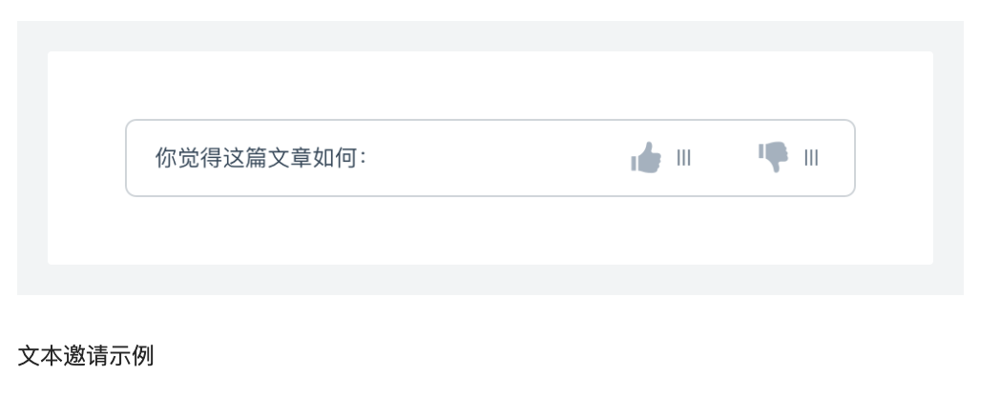
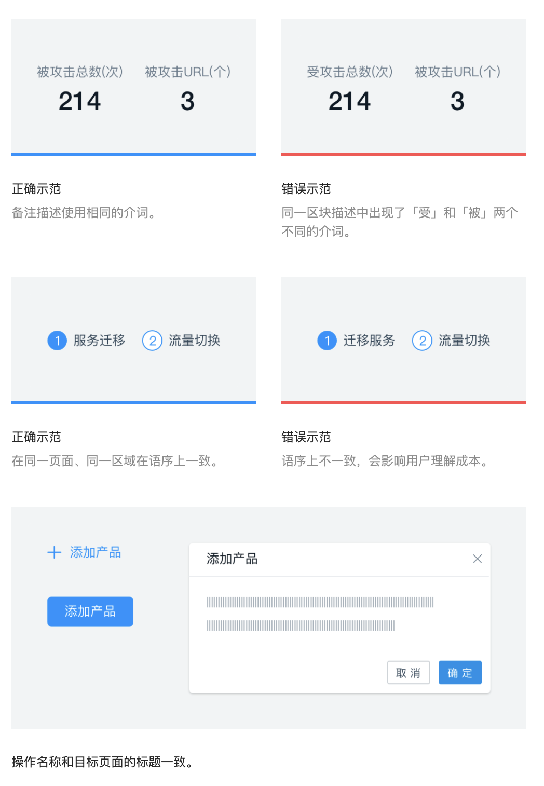

- Ant Design
	- https://ant.design/docs/spec/introduce-cn
	- 设计价值观
		- 用途
			- 
		- 内容
			- 自然
			  collapsed:: true
				- 感知自然
					- [[认知心理学]]所述，约 80% 外界信息通过视觉通道获取
					- 界面设计中最重要的视觉要素，包括布局、色彩、插画、图标等，应充分汲取自然界规律，从而降低用户认知成本，带来真实流畅的感受
					- 在一些场景下，适时加入听觉、触觉等其它感知通道，能创造更丰富自然的产品体验
				- 行为自然
					- 在与系统的互动中，设计者应充分理解用户、系统角色、任务目标间的关系，场景化组织系统功能和服务。
					- 同时辅以行为分析、人工智能、传感器、元数据等策略，提供主动式服务，帮助用户决策、减少操作，从而节约用户脑力和体力，让[[人机交互]]行为更自然。
			- 确定性
			  collapsed:: true
				- 高确定性、低合作熵
					- 设计者确定
						- 通过探索设计规律、模块化设计思路，来为设计者提供足够精简的设计规则、组件、模式等，赋能设计者、降低合作熵。
							- 保持克制
								- 能做，但想清楚了不做。
									- 设计者应当聚焦在最有价值产品功能打磨，并用尽可能少的设计元素将其表达。
							- 面向对象的方法
								- 探索设计规律，并将其抽象成「对象」，增强界面设计的灵活性和可维护性，同时也减少「设计者」的主观干扰，从而降低系统的不确定性。
								- 例如：色值换算、间距排版
							- [[模块化]]设计
								- 将复杂或者重复出现的局部封装成模块，提供有限接口与其他模块互动，最终全面减少系统的复杂度，进而增进可靠性以及可维护性。
								- 设计者可运用现有的组件/模板或者自行抽象可复用的组件/模板，节约无谓的设计且保持系统一致性，让「设计者」把创造力专注在最需要的地方。
					- 用户确定
						- 用户日常工作是通过诸多企业级产品的协同来完成的，除了考虑单一产品的设计一致性，更应当在跨产品、跨终端、跨系统间保持良好的确定性。
						- 一致的外观和交互，保持面向用户的熟悉感，能提升易学性，降低认知和操作成本，提升工作效率。
			- 意义感
			  collapsed:: true
				- 一个产品或功能被设计者创造出来不只是用户的需要，而更多是承载用户的某个工作使命。
					- 结果的意义
						- 明确目标，即时反馈
							- 洞悉工作目标，根据使用流程拆解明确的子目标，让每个交互行为都围绕着主目标的达成；
							- 为每个行为，辅以恰当、即时的反馈，让用户对操作结果了然于胸。
							- 此外，可通过情感化设计，适度安抚用户负面情感，强化用户正面情感。
					- 过程的意义
						- 挑战适中，全情投入
							- 调整不同场景下的工作难度，让功能适时适地触发，以匹配用户能力；
							- 如无必要，勿增实体，不分散用户注意力，让用户专注于任务达成，而非界面。
			- 生长性
			  collapsed:: true
				- 用发展的眼光做设计，充分考虑人、机两端的共同生长。
					- 价值连接
						- 产品的增长依赖于用户的群体扩大和深度使用，而用户的成长又依赖于产品功能的壮大。
						- 设计者应建立系统设计思维，洞悉产品功能的价值，探索用户在不同场景下的需求，在价值和需求间建立连接。
						- 让产品价值被发现，帮助用户建立更有效、更高效的工作方式。
					- 人机共生
						- 产品功能和用户需求的更多连接，让人机互动更加紧密，用户和系统共生。
						- 产品设计时，不应将用户和系统独立开来，应作为一个动态发展的共同体来思考，确保其足够的灵活、包容，充满生命力。
	- 设计模式
		- 针对企业级产品反复出现的设计问题，设计模式给出一般性的解决方案，实现跨应用交互一致性的有效融合。
		- 设计模式包含以下内容：
			- 原则
				- 基于价值观衍生出的一般设计技巧，包括如何高效组织信息、帮助建立用户与界面的互动等原则性要求。
				- 内容：
					- 亲密性
					  collapsed:: true
						- 亲密性的根本目的是实现组织性，让用户对页面结构和信息层次一目了然。
							- 如果信息之间关联性越高，它们之间的距离就应该越接近，也越像一个视觉单元；
							- 反之，则它们的距离就应该越远，也越像多个视觉单元。
						- 纵向间距关系
							- 通过「小号间距」、「中号间距」、「大号间距」这三种规格来划分信息层次结构。
							- 
							- 在这三种规格不适用的情况下，可以通过加减「基础间距」的倍数，或者增加元素来拉开信息层次。
						- 横向间距关系
							- 
							- 为了适用不同尺寸的屏幕，在横向采用栅格布局来排布组件，从而保证布局的灵活性。
							- 
							- 在一个组件内部，元素的横向间距也应该有所不同。
					- 对齐
					  collapsed:: true
						- 在界面设计中，将元素进行对齐，既符合用户的认知特性，也能引导视觉流向，让用户更流畅地接收信息。
							- 正如「格式塔学派」中的连续律（Law of Continuity）所描述的，在知觉过程中人们往往倾向于使知觉对象的直线继续成为直线，使曲线继续成为曲线。
						- 文案类对齐
							- 
							- 如果页面的字段或段落较短、较散时，需要确定一个统一的视觉起点。
						- 表单类对齐
							- 
							- 冒号对齐（右对齐）能让内容锁定在一定范围内，让用户眼球顺着冒号的视觉流，就能找到所有填写项，从而提高填写效率。
						- 数字类对齐
							- 
							- 为了快速对比数值大小，建议所有数值取相同有效位数，并且右对齐。
							-
					- 对比
					  collapsed:: true
						- 对比是增加视觉效果最有效方法之一，同时也能在不同元素之间建立一种有组织的层次结构，让用户快速识别关键信息。
							- 注：要实现有效的对比，对比就必须强烈，切不可畏畏缩缩。
						- 主次关系对比
							- 
							- 为了让用户能在操作上（类似表单、弹出框等场景）快速做出判断， 来突出其中一项相对更重要或者更高频的操作。
								- 注意：突出的方法，不局限于强化重点项，也可以是弱化其他项。
							- 
							- 在一些需要用户慎重决策的场景中，系统应该保持中立，不能替用户或者诱导用户做出判断。
						- 总分关系对比
							- 
							- 通过调整排版、字体、大小等方式来突出层次感，区分总分关系，使得页面更具张力和节奏感。
						- 状态关系对比
							- 
							- 
							- 通过改变颜色、增加辅助形状等方法来实现状态关系的对比，以便用户更好的区分信息。
								- 常见类型有「静态对比」、「动态对比」。
						-
					- 重复
					  collapsed:: true
						- 相同的元素在整个界面中不断重复，不仅可以有效降低用户的学习成本，也可以帮助用户识别出这些元素之间的关联性。
						- 重复元素
							- 
							- 
							- 
							- 重复元素可以是一条粗线、一种线框，某种相同的颜色、设计要素、设计风格，某种格式、空间关系等。
						-
					- 直截了当
					  collapsed:: true
						- 正如 Alan Cooper 所言：「需要在哪里输出，就要允许在哪里输入」。这就是直接操作的原理。
							- eg：不要为了编辑内容而打开另一个页面，应该直接在上下文中实现编辑。
						- 页内编辑
							- 
							- 单字段行内编辑
							- 当「易读性」远比「易编辑性」重要时，可以使用「单击编辑」。
							- 
							- 当「易读性」为主，同时又要突出操作行的「易编辑性」时，可使用「文字链/图标编辑」。
							- 
						-
						- 足不出户
					- 足不出户
					  collapsed:: true
						- 能在这个页面解决的问题，就不要去其它页面解决，因为任何页面刷新和跳转都会引起变化盲视（Change Blindness），导致用户心流（Flow）被打断。频繁的页面刷新和跳转，就像在看戏时，演员说完一行台词就安排一次谢幕一样。
							- 变化盲视（Change Blindness）：
								- 指视觉场景中的某些变化并未被观察者注意到的心理现象。
								- 产生这种现象的原因包括场景中的障碍物，眼球运动、地点的变化，或者是缺乏注意力等。
							- 心流（Flow）：
								- 也有别名以化境 (Zone) 表示，亦有人翻译为神驰状态，定义是一种将个人精神力完全投注在某种活动上的感觉；心流产生时同时会有高度的兴奋及充实感。
						- 覆盖层
						  collapsed:: true
							- 二次确认覆盖层：
								- 避免滥用 Modal 进行二次确认，应该勇敢的让用户去尝试，给用户机会「撤销」即可。
									- 
									- 
									- 
							- 详情覆盖层：
								- 一般在列表中，通过用户「悬停」/「点击」某个区块，在当前页加载该条列表项的更多详情信息。
									- 注：使用「悬停」激活时，当鼠标移入时，需要设置 0.5 秒左右的延迟触发；当鼠标移出时，立刻关闭覆盖层
									- 
							- 输入覆盖层
								- 在覆盖层上，让用户直接进行少量字段的输入。
									- 
						- 嵌入层
						  collapsed:: true
							- 列表嵌入层
								- 在列表中，显示某条列表项的详情信息，保持上下文不中断。
								- 
							- 标签页
								- 将多个平级的信息进行整理和分类了，一次只显示一组信息。
								- 
							- 虚拟页面
								- 在交互过程中，「覆盖层」可以在当前页面上方显示附加内容和交互链接；「嵌入层」可以在页面内部实现同样效果；而「虚拟页面」不局限机械时代的「页面」，可以利用信息时代的特点构建一种新型「页面」。
							- 流程处理
								- 对于某些「流程处理」而言，让用户始终待在同一个页面上则更有必要。
									- 长期以来，Web 实现流程的方式就是把每个步骤放在一个单独的页面上。
									- 虽然这种做法是分解问题最简单的方式，但并不是最佳解决方案。
								- 渐进式展现
									- 基于用户的操作/某种特定规则，渐进式展现不同的操作选项。
									- 
								- 配置程序
									- 通过提供一系列的配置项，帮助用户完成任务或者产品组装。
									- 
								- 弹出框覆盖层
									- 虽然弹出框的出现会打断用户的心流，但是有时候在弹出框中使用「步骤条」来管理复杂流程也是可行的。
									- 
								-
							-
							-
					- 简化交互
					  collapsed:: true
						- 通过运用上下文工具（即：放在内容中的操作工具），使内容和操作融合，从而简化交互。
							- 根据费茨法则（Fitts's Law）所描述的，如果用户鼠标移动距离越少、对象相对目标越大，那么用户越容易操作。
								- 费茨法则
									- 到达目标的时间是到达目标的距离与目标大小的函数
									- 
						- 实时可见工具
							- 如果某个操作非常重要，就应该把它放在界面中，并实时可见。
								- 
						- 悬停即现工具
							- 如果某个操作不那么重要，或者使用「实时可见工具」过于啰嗦会影响用户阅读时，可以在悬停在该对象上时展示操作项。
								- 
						- 开关显示工具
							- 如果某些操作只需要在特定模式时显示，可以通过开关来实现。
								- 
						- 可视区域 ≠ 可点击区域
							- 在使用 Table 时，文字链的点击范围受到文字长短影响，可以设置整个单元格为热区，以便用户触发。
								- 
							- 当需要增强按钮的响应性时，可以通过增加用户点击热区的范围，而不是增大按钮形状，从而增强响应性，又不缺失美感。
								- 注：在移动端尤其适用。
								- 
								-
					- 提供邀请
					  collapsed:: true
						- 「提供邀请」是成功完成人机交互的关键所在
						  collapsed:: true
							- 很多富交互模式（eg：「拖放」、「行内编辑」、「上下文工具」）都有一个共同问题，就是缺少易发现性
							- 邀请就是引导用户进入下一个交互层次的提醒和暗示，通常包括意符（eg：实时的提示信息）和可供性，以表明在下一个界面可以做什么。
								- 意符（Signifiers）
									- 一种额外的提示，告诉用户可以采取什么行为，以及应该怎么操作；必须是可感知（eg：视觉、听觉、触觉等）。——摘自《设计心理学 1 》
								- 可供性（Affordance）
									- 也被翻译成「示能」，由 James J. Gibson 提出，定义为物品的特性与决定物品用途的主体能力之间的关系；其中部分可感知（此部分定义为 Perceived Affordance），部分不可感知。——摘自《设计心理学 1 》
							- 当可供性中可感知的部分（Perceived Affordance）表现为意符时，人机交互的过程往往更加自然、顺畅。
						- 静态邀请
							- 指通过可视化技术在页面上提供引导交互的邀请。
							- 引导操作邀请
							  collapsed:: true
								- 一般以静态说明形式出现在页面上，不过它们在视觉上也可以表现出多种不同样式。常见类型：「文本邀请」、「白板式邀请」、「未完成邀请」。
								- 
								- 
								- 
							- 漫游探索邀请
							  collapsed:: true
								- 是向用户介绍新功能的好方法，尤其是对于那些设计优良的界面。但是它不是「创口贴」，仅通过它不能解决界面交互的真正问题。
									- 注：保持漫游过程简单，让用户容易退出和重新启动；保持内容简明扼要，与功能密切相关。
								- 
							- 动态邀请
							  collapsed:: true
								- 指以响应用户在特定位置执行特定操作的方式，提供特定的邀请。
								- 悬停邀请
									- 在鼠标悬停期间提供邀请。
									  collapsed:: true
										- 
										- 
								- 推论邀请
									- 用于交互期间，合理推断用户可能产生的需求。
										- 
								- 更多内容邀请
									- 用于邀请用户查看更多内容。
										- 
								-
							- 巧用过渡
							  collapsed:: true
								- 人脑灰质（Gray Matter）会对动态的事物（eg：移动、形变、色变等）保持敏感。在界面中，适当的加入一些过渡效果，能让界面保持生动，同时也能增强用户和界面的沟通。
									- Adding: 新加入的信息元素应被告知如何使用，从页面转变的信息元素需被重新识别。
									- Receding:  与当前页无关的信息元素应采用适当方式移除。
									- Normal: 指那些从转场开始到结束都没有发生变化的信息元素。
								- 在视图变化时保持上下文
									- 滑入与滑出：
										- 可以有效构建虚拟空间。
									- 传送带：
										- 可极大地扩展虚拟空间。
									- 折叠窗口：
										- 在视图切换时，有助于保持上下文，同时也能拓展虚拟空间。
								- 解释刚刚发生了什么
								  collapsed:: true
									- 对象增加：
										- 在列表/表格中，新增了一个对象。
											- 
									- 对象删除：
										- 在列表/表格中，删除了一个对象。
									- 对象更改：
										- 在列表/表格中，更改了一个对象。
											- 
									- 对象呼出：
										- 点击页面中元素，呼出一个新对象。
									-
								- 改善感知性能
									- 当无法有效提升「实际性能」时，可以考虑适当转移用户的注意力，来缩短某项操作的感知时间，改善感知性能。
								- 自然运动
									- 参见 Ant Motion 动画语言
										- https://motion.ant.design/language/basic-cn
								-
									-
							- 即时反应
								- 什么是即时反应
									- 「提供邀请」、「巧用过渡」、「即时反应」的关系
										- 「提供邀请」的强大体现在 交互之前 给出反馈，解决易发现性问题
										- 「巧用过渡」的有用体现在它能够在 交互期间 为用户提供视觉反馈
										- 「即时反应」的重要性体现在 交互之后 立即给出反馈
									- 就像「牛顿第三定律」所描述作用力和反作用一样，用户进行了操作或者内部数据发生了变化，系统就应该立即有一个对应的反馈，同时输入量级越大、重要性越高，那么反馈量级越大、重要性越高。
										- 牛顿第三定律 ：
											- 当两个物体互相作用时，彼此施加于对方的力，其大小相等、方向相反。——摘自《维基百科》
									- 虽然反馈太多（准确的说，错误的反馈太多）是一个问题，但是反馈太少甚至没有反馈的系统，则让人感觉迟钝和笨拙，用户体验更差。
								- 查询模式
									- 自动完成
									  collapsed:: true
										- 用户输入时，下拉列表会随着输入的关键词显示匹配项。根据查询结果分类的多少，可以分为「确定类目」、「不确定类目」两种类型。
											- 
											- 
										-
										-
									- 反馈模式
										- 实时预览：
											- 在用户提交输入之前，让他先行了解系统将如何处理他的输入。
												- 注：解决错误最好的办法，就是不让错误发生。而「实时预览」就是有效避免错误的好设计。
												- 
										- 渐进式展现：
											- 在必要的时候提供必要的提示，而不是一股脑儿显示所有提示，导致界面混乱，增加认知负担。
												- 案例详见「足不出户／渐进式展现」
										- 进度指示：
											- 当一个操作需要一定时间完成时，就需要即时告知进度，保持与用户的沟通。
												- 常见的进度指示：「按钮加载」、「表格加载」、「富列表加载」、「页面加载」。
												- 可根据操作的量级和重要性，展示不同类型的进度指示。
										- 点击刷新：
											- 告知用户有新内容，并提供按钮等工具帮助用户查看新内容。
											- 
										- 定时刷新：
											- 无需用户介入，定时展示新内容。
											-
			- 全局规则
				- 通过规范常见的互动行为，包括导航、数据录入、数据展示、反馈、操作、帮助等，呈现组件元素的标准用法和弹性空间，并了解如何将他们组织在一起来创建良好的体验。
				- 内容：
					- 数据录入
					  collapsed:: true
						- 数据录入是获取对象信息的重要交互方式，用户会频繁的增加、修改或删除信息。多种多样的文本录入和选择录入方式帮助用户更加清晰和高效的完成这项体验。
						  collapsed:: true
							- 注意点
								- 为初级用户／偶尔访问的用户提供简单易懂的文案作为「标签（Label） 」；为领域专家提供专业术语作为「标签（Label） 」。当需要用户提供敏感信息时，通过「暗提示」来说明系统为什么要这么做，例如：需要获取身份证号码、手机号码时；
								- 让用户能在上下文中获取信息，帮助他完成输入。使用「良好的默认值」、「结构化的格式」、「暗提示」、「输入提醒」等方式，避免让用户在空白中猜测输入。
						- 文本录入
						  collapsed:: true
							- 文本框（Input）
							- 文本域（Textarea）
							- 提示与帮助
								- 为提升数据录入效率，通常可以在输入框内增加暗提示以帮助提醒用户。
									- 注：输入框通常与标签（label）搭配使用，标签（label）默认放于输入区域的左侧，当文案过长或英文环境下也可放于输入区域的上方，但在同系统中需保持统一。
									- 
							- 搜索（Search）
								- 搜索可以让用户在巨大的信息池中缩小目标范围，并快速获取需要的信息。
						- 选择录入
						  collapsed:: true
							- 让用户在一个预定的范围中进行选择
							- 单选框（Radio Button）
							- 复选框（Checkbox）
							- 开关（Switch）
								- 用于切换单个选项的状态。「开关」的内联标签应该显示清楚，例如：禁用/启用，不允许/允许等。
								- 
							- 选择列表（Dropdown）
								- 选择列表（通常称为下拉菜单）允许用户从列表中选择一个选项或多个选项，为用户在选项的数量上提供了更多的灵活性。
							- 滑块选择（Slider）
								- 滑块选择可以在连续或间断的区间内，通过滑动锚点来选择一个合适的数值。这种交互特性使得它在设置诸如音量，亮度，色彩饱和度等需要反映强度等级的选项时是一种极好的选择。
								- 
							- 穿梭框（Transfer）
								- 穿梭框用直观的方式在两栏中移动元素，完成选择行为。
								- 
							- 日期选择器（DatePicker）
							- 文件上传（Upload）
								- 简单点击上传
								- 显示缩略图上传
								- 拖拽上传
							-
					- 数据展示
					  collapsed:: true
						- 合适的数据展示方式可以帮助用户快速地定位和浏览数据，以及更高效得协同工作。
							- 注意点
								- 依据信息的重要等级、操作频率和关联程度来编排展示的顺序。
								- 注意极端情况下的引导。如数据信息过长，内容为空的初始化状态等。
						- 表格（Table）
							- 表格被公认为是展现数据最为清晰、高效的形式之一。
								- 它常和排序、搜索、筛选、分页等其他界面元素一起协同，适用于信息的收集和展示、数据的分析和归纳整理、以及操作结构化数据。
								- 它结构简单，分隔归纳明确，使信息之间更易于对比，大大提升了用户对信息的接收效率和理解程度。
							- 注：
								- 表格中的时间、状态、操作栏需保持词语完整不过行。
								- 当单元格数据为空时，可使用 - 来表示暂无数据。
						- 折叠面板（Collapse）
							- 折叠面板通过对信息的分组和收纳，指引用户递进式的获取信息，使界面保持整洁的同时增加空间的有效利用率。
							- 这类组件在导航中大量使用，同时也适合冗长的、无规则的内容管理。
							- 注：若折叠内容彼此之间关联度较低时，可使用更为节省空间的『手风琴』模式
								- 『手风琴』是一种特殊的折叠面板，只允许单项内容区域展开。
						- 卡片（Card）
							- 卡片是一种承载信息的容器，对可承载的内容类型无过多限制，它让一类信息集中化，增强区块感的同时更易于操作；卡片通常以网格或矩阵的方式排列，传达相互之间的层级关系。适合较为轻量级和个性化较强的信息区块展示。
							- 注：
								- 卡片通常根据栅格进行排列，建议一行最多不超过四个
								- 在有限的卡片空间内需注意信息之间的间距，若信息过长可做截断处理。例如『Ant Design 适用于中台…』
						- 走马灯（Carousel）
							- 作为一组平级内容的并列展示模式，常用于图片或卡片轮播，可由用户主动触发或者系统自动轮播。适合用于官网首页、产品介绍页等展示型区块。
							- 注：
								- 轮播的数量不宜过多以免造成用户厌烦，控制在 3~5 个之间为最佳
								- 建议在设计上提供暗示，让用户对轮播的数量和方向保持清晰的认知
						- 树形控件（Tree）
							- 『树形控件』通过逐级大纲的形式来展现信息的层级关系，高效且具有极佳的视觉可视性，使得整体信息框架一目了然。
							- 用户可同时浏览与处理多个树状层级的内容。适用于任何需要通过层级组织的信息场景，如文件夹、组织架构、生物分类、国家地区等等。
						- 时间轴（Timeline）
							- 垂直展示的时间流信息，一般按照时间倒叙记录事件，追踪用户当下以及过去做了什么。
							- 每一条信息以时间为主轴，内容可涵盖主题、类型、相关的附加内容等等。适用于包括事件、任务、日历标注以及其他相关的数据展示。
						-
					- 数据格式
					  collapsed:: true
						- 设计目标
							- 规范数据表达，保证直观准确一致地理解数据。
						- 类型
							- 数值
							  collapsed:: true
								- 数值用来表示计量大小，可单独出现或搭配数字符号进行使用。
								- 
								- 位置排列：
									- 便于用户直观而又准确地读取数据，要做到一眼观定、简洁明了。
										- 在表格中，诸如金额、数量等数值分布排列时，通常采用“右对齐”方式，既方便用户快捷读取数据，还可以使用户进行纵向数据对比。
								- 计量单位：
								  collapsed:: true
									- 在表格中，计量单位默认放在表头，并默认右对齐。
									- 
									- 
								-
							- 金额
								- 小写金额：
									- 规范格式为「货币符号+数字」的格式，例如“CNY1,123.00"。 货币符号：表示货币种类的符号代码（货币符号表），分为字母和字符两种：
									- 
								- 大写金额：
									- 一般用于银行、公司或个人的重要结算凭证和各种交易票据，需要使用大写数字以确保数据无法涂改，规范格式为「货币名称+金额数字」。
								- 大额计量：
									- 如果一个金额很大，那么数值中的“万”“亿”单位可采用汉字。如果一个数值很大，那么数值中的“万”“亿”单位可采用汉字。
							- 日期时间
								- 绝对时间
									- 针对时间精确度要求较高的用户，强调信息发布的精确时间点，有回顾过去内容并通过绝对时间用来检索信息的诉求。
								- 相对时间
									- 时间的精确度对于用户并不十分重要，重要的是信息的即时性。在中后台中，相对时间一般用于消息、通知类功能，用户往往更关注于书面形式的时间单位，而不必去往前推算出发布的具体时间点。
							- 数字脱敏
								- 数据脱敏是指对某些敏感信息通过脱敏规则进行数据变形，实现敏感隐私数据的可靠保护。此处给出的脱敏规则为通用产品规范，遇到数据安全性较强的业务场景，可根据业务场景自行调整。
								- 全部脱敏
									- 一般用于金额、时间等特别重要敏感的信息，需要对所有数字进行脱敏。数据用一个 *** 代替。
								- 部分脱敏
									- 一般用于需要部分信息进行识别的状况，只需要对部分信息进行脱敏处理，但数字真实位数保留。数据脱敏部分用 * 代替。
							- 数据状态
								- 无数据
									- 无数据用 -- 表述。
								- 数据加载
									- 数据加载用「骨架屏」表示。
									- 
								-
					- 文案
					  collapsed:: true
						- 在界面中，我们需要通过对话的方式与用户产生共鸣。精准、清晰的语言会更容易让用户理解，合适的语气更容易让用户建立信任感。因此在界面设计时，文案也应当被重视。
							- 在使用和书写文案时有以下几点需要注意：
								- 从用户角度出发
								- 表述一致
								- 重要的信息放在显著位置
								- 专业、精准、完整
								- 精简、友好、正面
							- 语言
							  collapsed:: true
								- 明确表述立足点
									- 在表述内容时，关注点应该是用户和他们能用你的产品做什么，而不是你和你的产品在为他们做什么，所以内容表述的立足点很重要。
									- 既然以用户为中心，文案就应该尽量以用户为主体来写作。
										- 注：当用户向后台反馈问题、提出建议或申诉时，使用「我们」是合理的语境，例如「我们将会审核你的申诉」。
									- 
								- 精简语句
									- 省略无用词汇，不重复用户已知事实；在绝大多数交互场景下，都无需界面描述出全部的细节。
									- 尽量提供简短、易于快速获取的内容。
									- 
								- 使用用户熟悉的语言
									- 使用简单、直接、易于理解的词汇，让内容和指示更容易被用户接受和理解。
									- 间接、暧昧模糊的说法，生僻和过于「文雅」的用词，会增加用户的认知负荷，所以应当尽量避免使用这类用户无法识别的词汇。
									- 
								- 表述一致
								  collapsed:: true
									- 描述同一个事物的词汇要保持统一;
									- 上下文的语法、语种、语序要保持统一;
									- 操作的名称和目标页面标题的名称保持一致。
									- 
								- 重要的信息放在显著位置
								  collapsed:: true
									- 让用户第一眼看到最重要的内容，不用到段落中寻找。
										- 注：如考虑安全性问题时，隐私信息也可调整为「点击后可见」的方式。
									- 
								- 完整、直接地阐述信息
									- 当我们希望用户进行一个操作时，要专注于用户能得到什么，以及用户的感受。在操作前引导告知用户操作的目的或重要性，能促进用户更愿意去执行。
										- 
									- 报错是 UI 中常见的功能，它同样是用户体验中不可小视的组成部分。当用户填写的内容出错的时候，你的报错信息应当符合用户的认知，用易于理解的方式表述出来。
										- 
								- 用词精准完整
									- 通用基本用词要规范，不要写错字，词语表达要完整。
										- 
									- 专业用语要精准，并是所属行业认可通用用词；时间的表述必须明确。
								-
							- 语气
							  collapsed:: true
								- 语言定义的是内容，而情绪和气氛更多的是通过语气来表达，并且同样的内容面对不同的用户我们可以使用不同的语气来表达；
									- 例如，我们对应专业的运维人员和小白用户应有不同的表达方式。
								- 拉近彼此的距离
									- 直接使用「你」、「我」来和用户对话，与用户建立亲密感。避免使用「您」，让用户感觉太过疏远。
										- 注：不要在同一个句式中混用「你」和「我」，交互中指代混乱会让用户相当纠结。
								- 友好、尊重用户
									- 多给用户支持与鼓励，不要命令和强迫用户。
									- 如果你想留住你的用户，当出错的时候就不要责怪用户。专注于解决问题，而不是指责。
									- 
								- 表述不应过于极端
									- 不要使用过于绝对的表述，这样会让用户觉得不适。
									- 
								-
							- 大小写和标点符号
								- 英文名词大小写规范
									- 产品名称全称，首字母大写。产品名称缩写需要全部大写，如：ESC、SLB 等；
									- 正确使用专有名词的大小写规范。
									- 全英文的标题，标签，菜单项等等都要遵循英文句式中首字母大写的规范。
										- 
									- 统计数据使用阿拉伯数字
									- 省略不必要的标点
										- 为了帮助用户更加高效得扫视文本内容，可以省略不必要的断句点。
									- 谨慎使用感叹号
										- 感叹号会让文案显得过于激动，容易让气氛变得过于紧张。
										- 注：当向用户表达问候或祝贺时，使用「！」是合理的语境，例如「欢迎回到社区！」。
									- 基本标点规范
										- 正确得使用标点符号会让句子看起来更清晰和具有可读性。
										- 具体使用请参考 1995 年中国标准出版社出版的《标点符号用法》，下图为重点列出的在设计中需要注意的部分。
										- 
					- 按钮
					  collapsed:: true
						- 设计目标
							- 指导用户采取你希望他们采取的行动。
							- 帮助用户避免犯错。
						- 类型
						  collapsed:: true
							- 常规按钮
								- 次按钮
									- 常规按钮，用于非主要动作。如果不确定选择哪种按钮，次按钮永远是最安全的选择。
								- 主按钮
									- 突出“完成”、“推荐”类操作；一个按钮区最多使用一个主按钮。
								- 文字按钮
									- 弱化的按钮，采用更轻量的按钮样式，可用于需大面积展示按钮场景，例如表格组件中的操作列。
								- 图标按钮
									- 图标提供视觉线索，避免逐字阅读按钮文案，更高效地使用界面。
										- 需要在较小的空间内展示尽量多的按钮。
										- 使用纯图标按钮必须有 Tooltip 提示按钮含义。
								- 在按钮中添加图标
									- 用于对按钮含义补充解释，提高按钮识别效率。
							- 按钮强调
								- 常规按钮类型呈现出不同的强调程度，使用者可以据此变化出合适的按钮类型：
							- Do&Don't
								- 
							- 特殊按钮
								- 虚线按钮  Dashed button
									- 用于引导用户在一个区域中添加内容。
								- 危险按钮 Danger button
								  collapsed:: true
									- 警示用户该操作存在风险。
									- 
								- 幽灵按钮 Ghost button
									- 置于复杂或较深的背景中，避免按钮突兀地破坏背景的整体性。该场景下可灵活定制样式。
								- 行动号召按钮 Call to action
									- 经常独立出现，行动号召按钮就像是电脑在对用户大声说“跟我来吧”，有点命令用户点击的意味，通常出现于 landing page 或者 一些引导性场景。最大可以将按钮放宽到与父区域等宽。一个屏幕空间中，建议只有一个行动号召按钮。
								-
						- 位置
						  collapsed:: true
							- 按钮区
								- 按钮区是用于放置按钮的区域，一个按钮区内可以有多个按钮。
							- 跟随内容的按钮区
								- 按钮区跟随受控内容。将按钮区放置于用户浏览路径中，便于被用户发现。
								- 
							- 工具栏中的按钮区
								- 工具栏中的按钮区，靠右放置。控制工具栏控制的内容范围。
								- 
							- 如何确定按钮区的放置位置？
								- 页面/卡片/一组信息都能够呈现一个主题，主题的描述可以抽象为三个区域：
									- Header：主题的标题和摘要信息内容区的导航等
									- Body：具体内容
									- Footer：主题的补充信息和工具栏等
								- 将按钮区放置在不同的区域，有不同的含义：见下图。
									- 
								- 也存在一些特殊情况，将“完成”主题类的动作放在 Header 区。例如，编辑器中为了最大化编辑空间，将“完成”类动作放到了右上角。
							- 什么时候需要在 Footer 中放置按钮区？
								- 为避免页脚工具栏滥用，我们不推荐使用页脚工具栏，仅建议以下两种场景使用：
									- 1）对象详情页，「推进」对象的进展，例如审批流「通过」「驳回」。
									- 2）异常复杂的表单页，表单的内容复杂到需要切分为多张卡片。
								- 
							-
						- 按钮顺序
							- 按钮顺序
								- 推荐操作是阅读的起点，折叠内容始终在最右侧。
								- 如何确定按钮顺序？
									- 对话习惯：按钮放置顺序类似于电脑和用户的对话，优先询问用户可能需要执行的操作，或你希望用户执行的操作，最后向用户提供存在风险的操作。
									- 方向性含义：例如，具有返回意义的按钮，应该放在左侧，暗示其方向是回到之前，例如上一步。
							- 按钮组
								- 多个按钮形成一组时，将按钮排列在一起即可。
							- 有很多按钮组，如何确定顺序
								- 工具栏中的操作类型很多，我们会倾向于将变化较少的内容位置固化。以表格工具栏举例，排列逻辑如下：
									- 业务逻辑：「推进」进程的操作。例如：编辑、新建、发布、保存、取消、撤回等；
									- 视图控制：控制内容展示的形式。例如：全屏、表格密度、放大缩小、布局控制等；
									- 其他：刷新、分享、设置等；
									- 溢出：被折叠的操作，若进行响应式设计，从右往左折叠至溢出操作。
								- 
							- 按钮分组
								- 当需要布置的按钮数量过多，可以把相关的动作组成一组，并采用相似的视觉设计。当某一个按钮是首要动作时仍可使用主按钮强调。
								- 按主次折叠部分按钮
									- 
								- 平铺每个按钮：
									- 优先推荐通过间距来区隔分组，也可以使用分割线来区隔视觉相似的按钮组。
									- 
							- 文案
								- 文案需清楚传达用户按下按钮时系统将执行的操作。
									- 必须使用动词。（下拉按钮除外）
									- 与语境紧密关联，用语简练。
								- Ant Design 组件中默认使用 “确定 / 取消”文案 ，但你仍然可以通过以下方式优化按钮文案：
									- 描述任务结果。
										- 发布、登录、注册
									- 主要操作也为否定含义时，强调后果。
										- 你确定要删除它吗？删除 / 取消
								- 
			- 模板文档
				- 总结了表单、列表、数据可视化、详情页、工作台、异常、结果、编辑器几类页面的典型解决方案，介绍每类页面的设计目标、设计技巧以及典型页面内容等，帮助广大设计者可以快速开始构建界面。
				-
-
	-
	-