- 课程
	- 小心，避开四种决策盲点
		- 仓促决策
		  collapsed:: true
			- 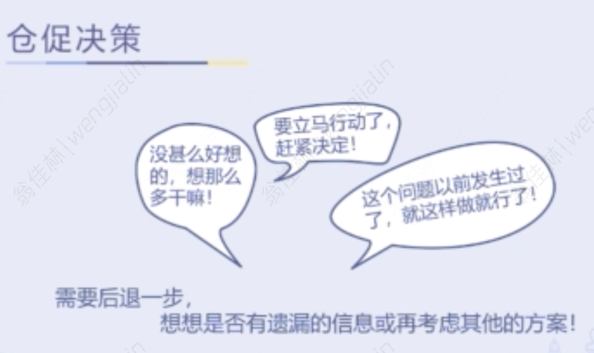
		- 独断独行
		  collapsed:: true
			- 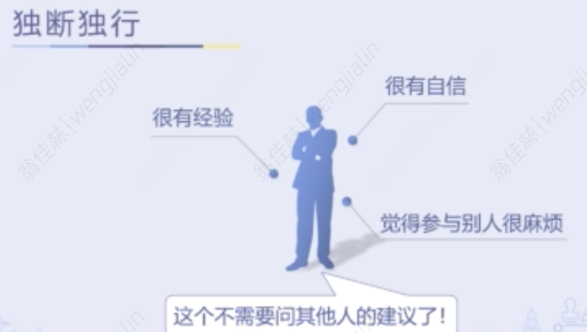
			- 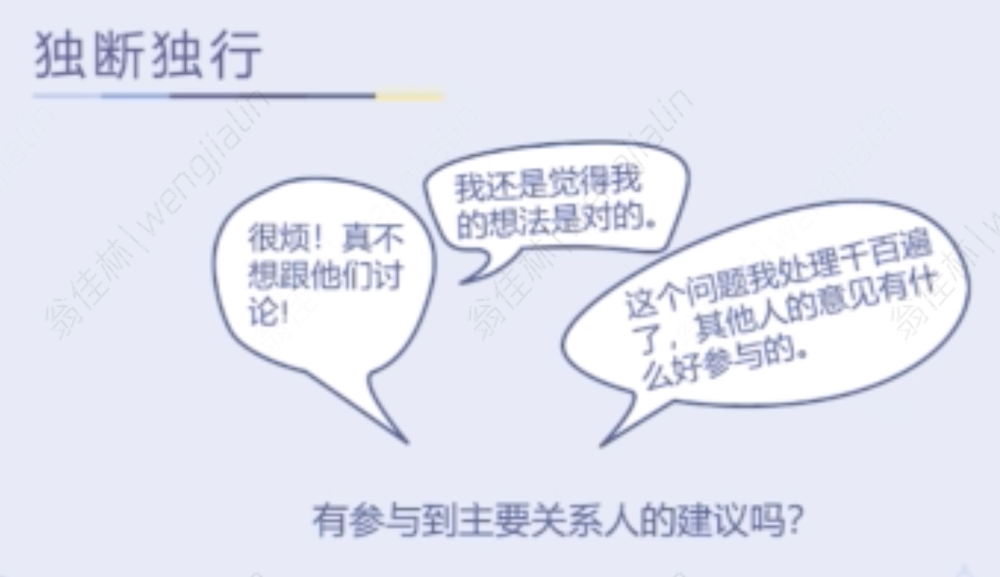
		- 逃避决策
		  collapsed:: true
			- 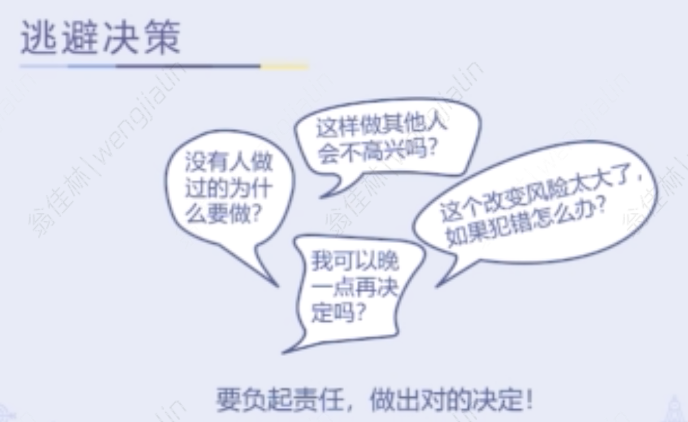
		- 分析瘫痪
		  collapsed:: true
			- 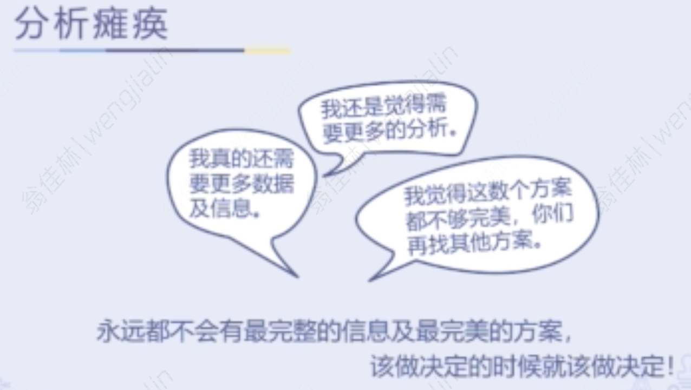
		- 陷阱场景
		  collapsed:: true
			- 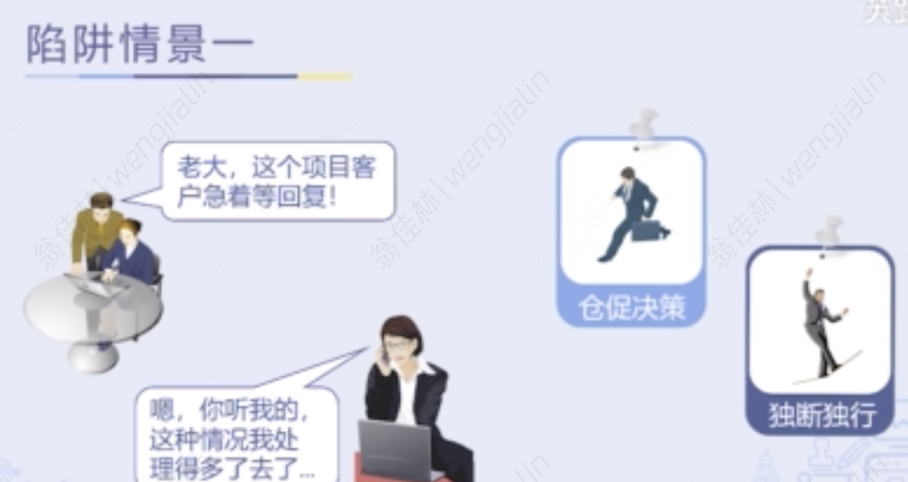
			- 
	- 做好优良决策，踏出关键的第一步
		- 优良决策五步骤
			- 界定期望结果、决策内容及标准
			- 收集并解读信息
			- 拟定多个可选方案
			- 选择合适的方案
			- 沟通及实施
		- 界定期望结果、决策内容及标准
			- 何谓界定结果
				- 解决这个问题的时候，希望达成的效果
			- 决策内容
				- Yes/ No
					- 要不要做
				- How
					- 怎样做
				- Which
					- 选哪个
			- 决策标准
				- 成本
				- 质量
				- 时间
			- 划重点
				- 先定义要达到的结果，帮助思考决策内容及标准
				- 思考现在这个当下，要先做什么决定，后做什么决定。每一个决策内容，都要重新思考它的决策标准
				- 从质量、成本、时间及企业的价值观四个方面去思考决策标准
				- 参与相关人员
	- 集思广益，拟定可选方案
		- 收集并解读信息
			- 收集信息的误区
				- 误区一：先有一个结论，再去收集信息来支持自己的主张
				- 误区二：倾向跟某一个特定的来源收集信息
				- 误区三：收集太多的信息，落入分析瘫痪这个陷阱
			- 收集及解读信息的要点
				- 列下要收集什么信息，不要依照自己的偏好去收集信息
				- 列下信息要跟谁或去哪收集
				- 检核一下信息来源，是否有偏颇或跟你有利益关系
		- 拟定多个可选方案
			- 拟定方案的误区
				- 只想到一到两个方案，就做决定
				- 过早否决想法，扼杀创意
				- 只跟自己意见相同的人讨论
			- 如何拟定多个可选方案
				- 建议一：头脑风暴
					- 10-20分钟的时间限制让大家把方案写出来，越多越好
					- 不要在这个阶段评论，扼杀创意
				- 建议二：在讨论方案的时候，以提问代替否定
				  collapsed:: true
					- 
					- 
					-
	- 万里挑一，找到最佳解决方案
		- 选择方案的误区
			- 根据自己的感觉做决定
		- 选择方案的方法
			- 方法一：基于决策标准的评估法
			  collapsed:: true
				- 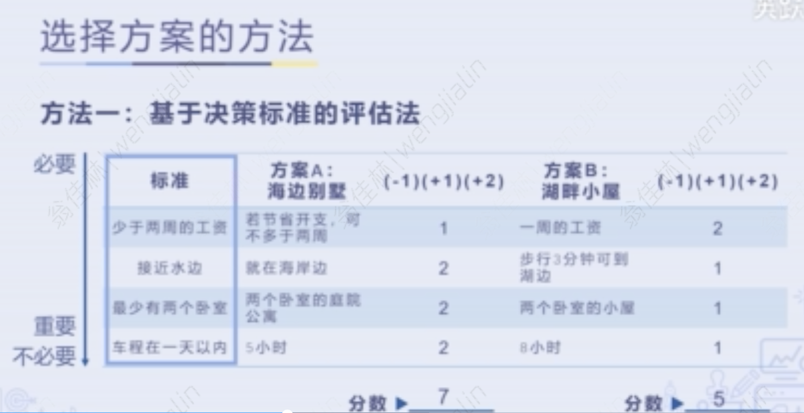
				- 如果两个方案得分一致，在必要标准上得分高的方案，就是首选
					- 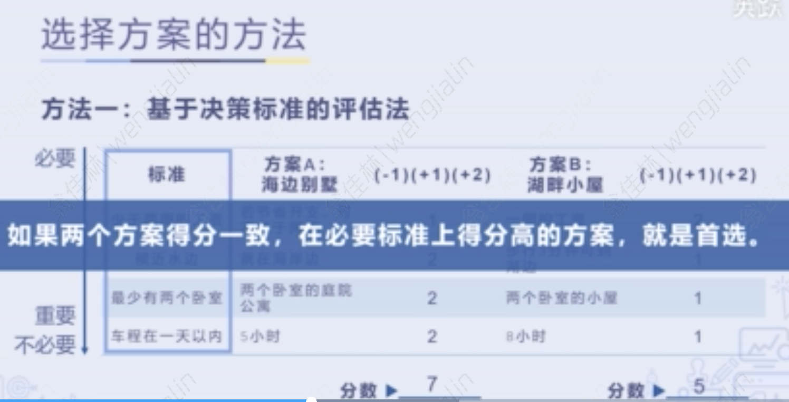
				- 优选点比较法
					- 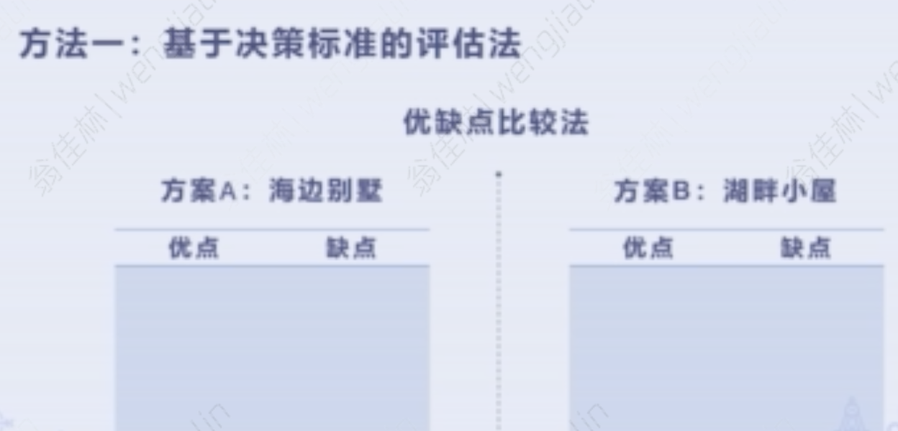
				- 决策标准权重法
					- 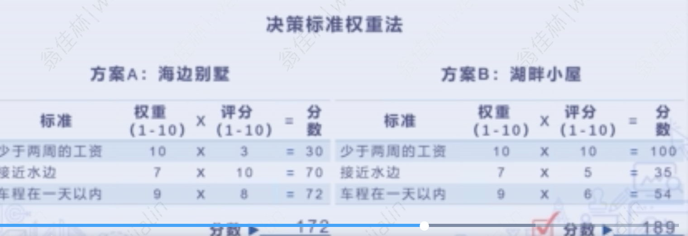
				-
			- 方法二：风险评估法
			  collapsed:: true
				- 在所做决定影响层面很大时使用
				- 要点
					- 可选方案
						- 通过决策标准评估法找出一到两个方案
					- 可能发生的错误
					- 发生错误的概率：高、中、低
					- 避免或降低错误风险可采取的措施
					- 这个可选方案的风险是否可以接受
					- 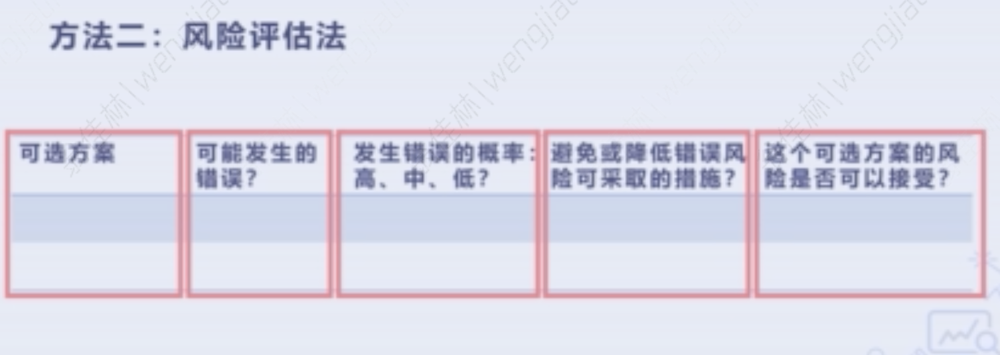
					- 没有方案是完美的，该做决定的时候，就该做出选择
						- 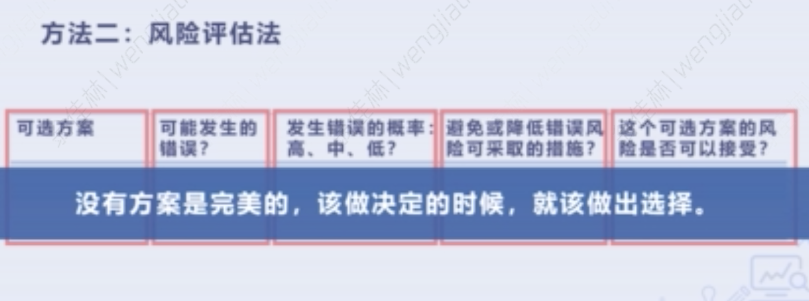
				-
	- 技术与艺术的平衡，7大关键行动
		- 决策能力的关键行动
			- 找出问题或机会
				- 对应五步骤的“界定期望结果、决策内容及标准 ”
				- 找出问题或机会，决定是否有需要采取行动
			- 收集资料
				- 对应五步骤的“收集并解读信息”
				- 收集资料以更了解所面对的议题或机会
			- 解读信息
				- 对应五步骤的“收集并解读信息”
				- 整合不同来源的资料，从中发现趋势性、关联性及因果关系
			- 发展可行方案
				- 对应五步骤的“发展可行方案”
				- 针对找出的问题或机会，发展多重可行方案，以达期望之结果
			- 选择适当的行动
				- 对应五步骤的“选择合适的方案”
				- 订定明确的决策标准，包括成本及利益
				- 根据决策标准，考虑决策方案可能产生的影响或结果，以选择最有效的方案
			- 付诸行动
				- 对应五步骤的“沟通及实施”
				- 在合适的时间内做出决策并施行
			- 邀请他人参与
				- 邀请相关人等参与决策过程，一起作出最佳决策，确保大家认同并了解最后决定
		-
		-
		-