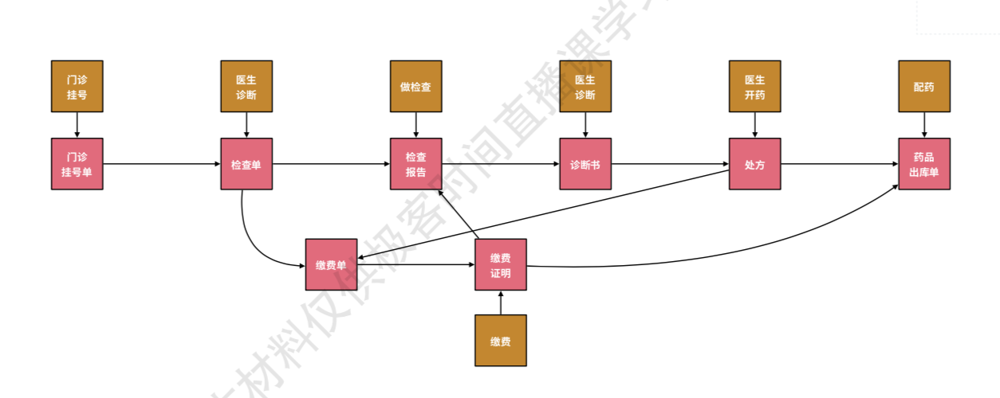
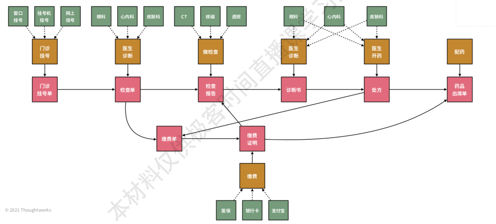
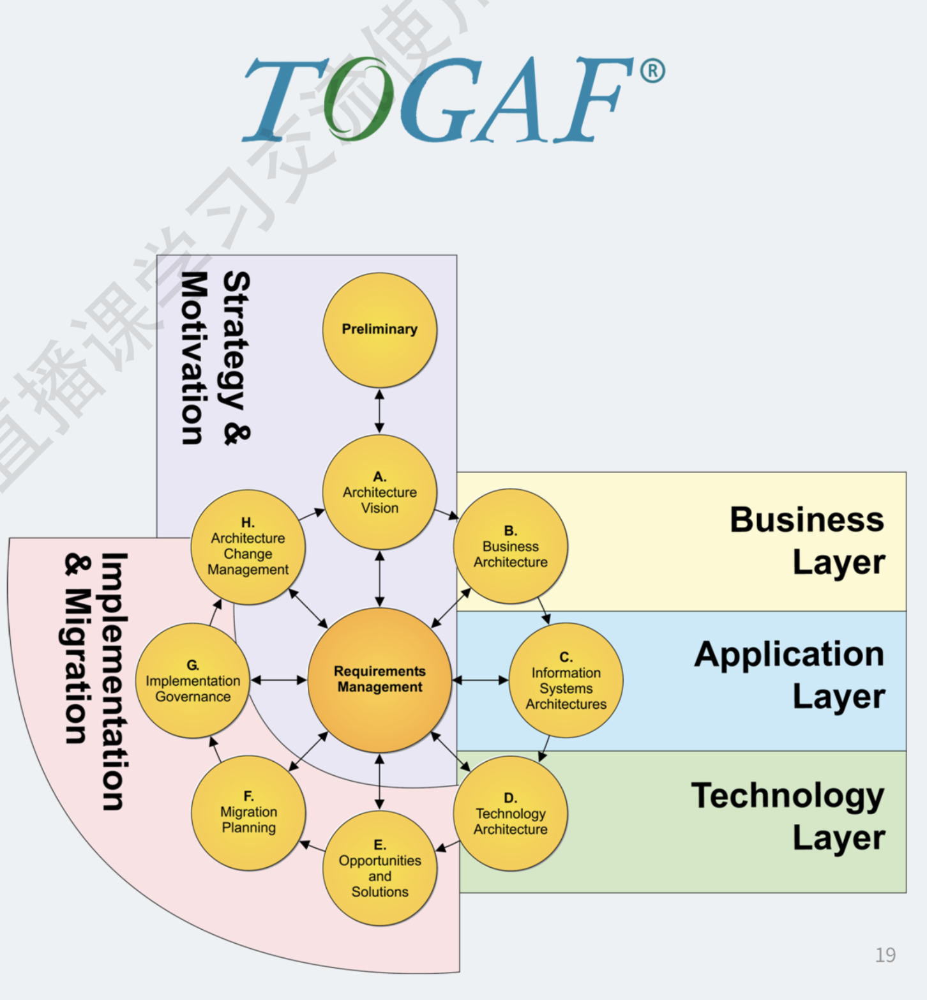
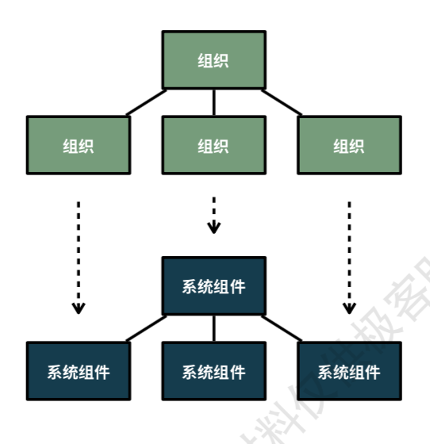
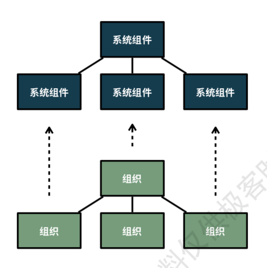

- 业务与领域
  id:: 61a1a5eb-f405-4636-9ff7-c530df7e07d8
	- 领域（Domain）
		- 是一个知识、影响或活动的范围
			- 过于抽象，边界不清，不利于沟通和统一语言
	- 业务（Business）
		- 是买卖人商品或服务的活动
	- 业务逻辑与领域逻辑
		- 业务逻辑支撑了业务运营的流程，领域逻辑实现了盈利的能力
			- 业务逻辑
				- 源自业务运营的逻辑，领域中立且运营特定的
					- 业务凭证的追溯过程构成了业务逻辑，且领域中立
						- 
				- 复杂度来自于流程本身
				- 关注如何盈利和成本结构
					- 或者可以理解为对外体现为利润或现金，对内体现为成本和绩效承诺
				- 常见于：合同、法务、会计、审计等
			- 领域逻辑
				- 源自问题域的逻辑，领域特定而运营中立的
					- 领域知识的复杂度决定了领域逻辑，且运营中立，领域对业务来说是潜在的变化点
						- 
				- 复杂度来自于问题本身
				- 关注的是如何解决问题
					- 通常这些问题的解决方法源于专家经验、研究成果，或参考已有的解决方案
				- 常见于：算法、计划、统计、优化等
		- 从复用方式来说
			- 业务逻辑的复用往往通过复制运营团队来实现
			- 领域逻辑的复用往往通过包装并被业务集成来实现
		- 两者需要区分
			- 因为业务逻辑与领域逻辑天然具有不同的变化原因和复用方法，而隔离变化是架构设计的核心。
- 业务系统
	- 以业务逻辑支撑业务运营，利用领域逻辑实现盈利的系统，叫做业务系统
	- 代表
		- 企业架构（例TOGAF）
			- {:height 323, :width 293}
			-
- 面向业务设计（Business-Oriented Design）
	- 传统的软件设计和交付活动建立在组织传统的行政驱动管理方法之上
		- {:height 100, :width 533}
	- 康威定律
		- （Melvin Edward Conway, Computer Scientist, 1967）
		- 任何组织在设计一个系统（广义）时，都会产出一个与该组织的沟通结构一样的设计副本
			- {:height 298, :width 292}
			-
	- 架构
		- 架构，是系统在其所处**环境**中的基本概念或属性，体现为它的**元素**、**关系**，及其设计和演进的**原则**
			- （ISO/IES/IEEE 42010:2011（国际标准化组织/国际电工协会/电气和电子工程师协会））
			- {:height 372, :width 351}
			- 对于架构设计而言，如何正确的理解并匹配环境的变化，是重中之重
	- 逆康威定律
		- （James Lewis, Thoughtworks Director, 2015）
		- 应不断演进组织或团队结构，从而匹配并促进所期望得到的架构。这样，在理想情况下，你的技术架构将于业务架构显示出同构性
			- {:height 302, :width 293}
	- 在软件工程最佳实践的基础上，我们所期望的好的设计的原则
		- {:height 270, :width 507}
	- 什么是面向业务设计（简称：BOD）
		- 是一种以**业务**为核心，通过促进业务架构、系统架构、组织架构三者的同构性，从而解决**业务系统**设计和开发复杂性问题的软件系统架构**设计思想**
		- 目的：促进业务架构、系统架构、组织架构三者的同构性
			- {:height 108, :width 525}
			- 核心关注1：通过权责关系理解业务与领域
				- 使用职业经理人、会计和法务人员理解业务的视角，通过权责关系追溯，理解并分离业务和领域的上下文
			- 核心关注2：通过业务模型指导设计与实现
				- 以业务
			- 核心关注3：通过逆康威定律调整组织架构