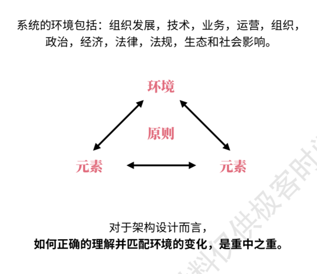
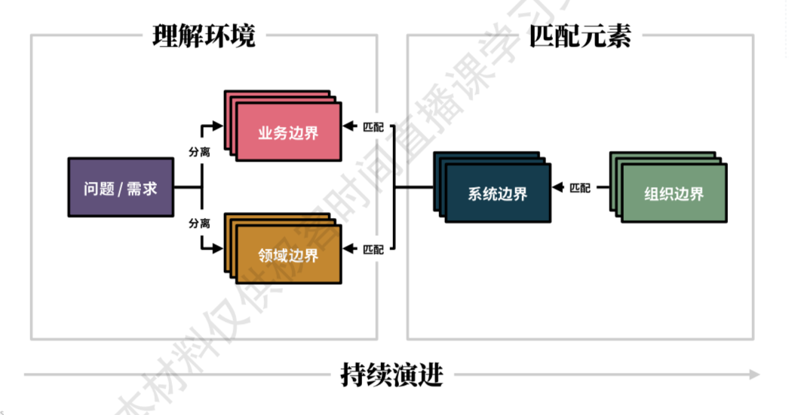

- 业务与领域
  id:: 61a1a5eb-f405-4636-9ff7-c530df7e07d8
	- 领域（Domain）
		- 是一个知识、影响或活动的范围
			- 过于抽象，边界不清，不利于沟通和统一语言
	- 业务（Business）
		- 是买卖人商品或服务的活动
	- 业务逻辑与领域逻辑
		- 业务逻辑支撑了业务运营的流程，领域逻辑实现了盈利的能力
			- 业务逻辑
				- 源自业务运营的逻辑，领域中立且运营特定的
					- 业务凭证的追溯过程构成了业务逻辑，且领域中立
						- 
				- 复杂度来自于流程本身
				- 关注如何盈利和成本结构
					- 或者可以理解为对外体现为利润或现金，对内体现为成本和绩效承诺
				- 常见于：合同、法务、会计、审计等
			- 领域逻辑
				- 源自问题域的逻辑，领域特定而运营中立的
					- 领域知识的复杂度决定了领域逻辑，且运营中立，领域对业务来说是潜在的变化点
						- 
				- 复杂度来自于问题本身
				- 关注的是如何解决问题
					- 通常这些问题的解决方法源于专家经验、研究成果，或参考已有的解决方案
				- 常见于：算法、计划、统计、优化等
		- 从复用方式来说
			- 业务逻辑的复用往往通过复制运营团队来实现
			- 领域逻辑的复用往往通过包装并被业务集成来实现
		- 两者需要区分
			- 因为业务逻辑与领域逻辑天然具有不同的变化原因和复用方法，而隔离变化是架构设计的核心。
- 业务系统
	- 以业务逻辑支撑业务运营，利用领域逻辑实现盈利的系统，叫做业务系统
	- 代表
		- 企业架构（例TOGAF）
			- {:height 323, :width 293}
			-
- 面向业务设计（Business-Oriented Design）
	- 传统的软件设计和交付活动建立在组织传统的行政驱动管理方法之上
		- {:height 100, :width 533}
	- 康威定律
		- （Melvin Edward Conway, Computer Scientist, 1967）
		- 任何组织在设计一个系统（广义）时，都会产出一个与该组织的沟通结构一样的设计副本
			- {:height 298, :width 292}
			-
	- 架构
		- 架构，是系统在其所处**环境**中的基本概念或属性，体现为它的**元素**、**关系**，及其设计和演进的**原则**
			- （ISO/IES/IEEE 42010:2011（国际标准化组织/国际电工协会/电气和电子工程师协会））
			- {:height 372, :width 351}
			- 对于架构设计而言，如何正确的理解并匹配环境的变化，是重中之重
	- 逆康威定律
		- （James Lewis, Thoughtworks Director, 2015）
		- 应不断演进组织或团队结构，从而匹配并促进所期望得到的架构。这样，在理想情况下，你的技术架构将于业务架构显示出同构性
			- {:height 302, :width 293}
	- 在软件工程最佳实践的基础上，我们所期望的好的设计的原则
		- {:height 270, :width 507}
	- 什么是面向业务设计（简称：BOD）
		- 是一种以**业务**为核心，通过促进业务架构、系统架构、组织架构三者的同构性，从而解决**业务系统**设计和开发复杂性问题的软件系统架构**设计思想**
		- 目的：促进业务架构、系统架构、组织架构三者的同构性
			- {:height 108, :width 525}
			- 核心关注1：通过权责关系理解业务与领域
				- 使用职业经理人、会计和法务人员理解业务的视角，通过权责关系追溯，理解并分离业务和领域的上下文
			- 核心关注2：通过业务模型指导设计与实现
				- 以业务为核心，通过明确的逻辑推导过程实施业务建模，利用业务模型支撑业务运营，进而指导系统架构的设计与实现
			- 核心关注3：通过逆康威定律调整组织架构
				- 拥护并遵从逆康威定律，促进组织架构与系统架构相匹配，为架构设计提供基于沟通边界和认知负载的反馈和审视依据
		- 所聚焦的阶段
			- 聚焦在 业务架构明确后，理解并抽取业务模式，分离业务与领域上下文。以应用架构作为系统架构的牵引，联系业务架构与组织架构，促进同构性
				- 换句话说，虽然会有间接促进作用，但面向业务设计不直接影响业务架构，也不直接影响系统实现。
				- {:height 312, :width 318}
		- 主要受众
			- “企业架构/业务中台负责人”（具有长期对方案“兜底”的经验和责任）
			- 。。。
- 业务建模与领域建模
	- 模型（Model）
		- 客观事物或规律的物理或抽象的形式化表达方式
		- {:height 238, :width 230}
	- 建模（Modeling）
		- 就是通过可视化抽象，将客观事物或规律转化为模型表达，从而便于进一步研究和分析的过程
		- 通常建模法都拥有三个关键要素：
			- 目标
			- 变量
			- 关系
		- {:height 237, :width 260}
	- 业务模型（Business Model）
		- 是对业务运营流程或模式的可视化抽象表达
		- {:height 166, :width 306}
	- 领域模型（Domain Model）
		- 领域过于抽象，所以“领域模型”难以统一概念
		- 分类
			- 概念或分析模型
				- （面向对象分析，早于1995）
				- 是对领域内的概念类或现实世界中对象的可视化表示
			- 对象模型
				- （分析模式，Martin Fowler, 1995）
				- 是实现时位于领域层的，包含行为和数据的对象模型，即充血模型
			- 统一语言模型
				- （领域驱动设计，Eric Evans, 2003）
				- 将概念模型、分析模型、领域对象模型以聚合模式统一为一个模型，并用作统一语言以期望让业务人员和技术人员围绕同一套模型进行交流
		- 当下的理解和使用中，领域模型的概念和用途往往更靠近系统实现阶段（面向对象设计），而非业务设计阶段，其使用者通常为技术人员
	- 需要区分业务建模与领域建模
		- 因为历史上、概念上、使用者天然不同，需要被明确区分。
	- 什么是业务建模与领域建模
		- （对于业务系统而言，业务建模在前，领域建模在后）
		- 业务建模（Business Modeling）
			- 是对业务运营流程的可视化抽象和分析过程
			- 在面向业务设计中，用于对业务输入进行分析和抽象，从而识别并分离业务上下文与领域上下文
			- 侧重于：理解业务，划分边界，分析业务模式
		- 领域建模（Domain Modeling）
			- 是对领域问题的可视化抽象和分析过程
			- 在面向业务设计中，用于在划分业务上下文与领域上下文后，对领域上下文进行进一步探索，或指导对象模型设计
			- 侧重于：理解领域，补充领域问题解决方法，指导实现
- 履约建模法（Fulfillment Modeling）
	- 诞生过程
	  collapsed:: true
		- 
	- 是一种以业务履约关系为视角，通过提取业务模式并引入变化点构建可复用业务模型的，云原生时代的业务建模方法
	- 模式（Pattern）
		- 是某种存在于现实事物、人类设计或抽象概念中的规律性，该规律性可被复用
	- 业务凭证
		- 业务流程的本质即业务凭证的追溯过程
			- 如果没有软件系统，一个公对公的商品交易是靠双方的活动过程和纸质单据完成的
				- {:height 180, :width 517}
			- 形成决定的过程往往都是复杂的领域问题，是产生纸质凭证的关键输入
				- {:height 182, :width 500}
			- 当交易结束后，交易过程将会遗忘，当事双方通过留存的纸质凭证进行过程追溯
				- {:height 207, :width 467}
			- {:height 207, :width 484}
			-
			- 线下过程逐步被搬到了线上，大家会被在线操作的众多过程记录数据模糊了“业务凭证”的概念和边界
		- 业务凭证具有不可变性和不可抛弃性
			- 正因为凭证不可变且不可抛弃，所以凭证可被追溯
				- 换句话说，作为业务凭证，只存在创建，不存在修改和删除
		- 业务凭证追溯所体现的是当事双方的权责与履约关系
			- 
			- 权责与履约关系在现实中被合约所描述
				- 合约（Contract）中的关键信息
					- 当事人（Partis）
					- 条款（Clauses）
						- 描述了双方的权责关系和履约方式，还有一些履约所需要的关键信息。
						- 条款所涉及的履约过程和活动，都应通过凭证（Evidences）进行证明、留存和追溯
					- 违约（Breach of Contract）
				- 合约通常分为协议（Agreement）和合同（Contract）两种形式，其中合同是一种可被法院强制执行的协议
				- 为了便于沟通，我们在行文中使用“合约（Contract）”一词来统一称呼具有相同约束效力的业务凭证
	- 基于合约进行分析能够快速了解业务上下文
		- 依据权责定义，分析了解业务上下文，相对“发散-收敛”式的碰撞、探索和归纳过程更为快速、清晰和准确
		  collapsed:: true
			- 
		- 用合约来描述业务的做法天然存在，并且是职业经理人、法务、会计等专业人士一直以来快速理解业务和审视业务合理性的依据
			- 这也是我们刻意区分业务与领域的另一个关键依据
	- 合约可被视为一种能够反映业务流程的有效业务模式（规律性）
		- 
	- 合约上下文由不同阶段的业务凭证所体现
		- 通过一个完整的业务过程都存在5个关键阶段，以及每个阶段的业务凭证（Evidence），其中履约（fulfillment）由履约请求（Request）和履约确认（Confirmation）两种凭证来组成，履约请求代表的是一个“时段”，履约确认代表的是一个“时刻”
		- 
	- 合约上下文能够充分的分离业务与领域
		- 
		- 因为合同签订和业务履约过程天然是“异步”的，所以为云原生的弹性边界识别提供了关键依据
			- 
	- 与“事件建模法”的关系
		- 由于业务凭证是履约过程的结果（事件），所以履约建模法的本质其实是一种以合约视角为核心的“事件建模法”
- 面向业务设计与领域驱动设计
	- 领域驱动设计（Domain Driven Design）（DDD）
		- DDD作为一种强调问题驱动而非技术驱动的设计思想，深远的影响了软件架构设计，并在进入微服务时代后大放光彩
		- DDD聚焦以下三个核心关注，以领域模型为载体，以解决“软件核心复杂性”问题：
			- 分解领域问题为不同的问题子域，并聚焦核心域
			- 在领域从业者和软件从业者的创造性协作中探索模型（领域模型）
			- 在有明确边界的上下文（限界上下文）中说一种统一语言
	- 事件风暴建模法（EventStorming）
		- 2013年，Alberto Brandolini在DDD的背景下，创造了旨在通过工作坊的形式，以领域事件为核心，协作探索复杂业务领域的建模方法
		- 在事件风暴诞生之后，由于是少有的符合DDD设计思想的有效建模方法，所以在当下已经成为实施DDD时所使用的默认的建模方法
		- 因为领域事件是领域活动的结果，所以事件风暴建模法的本质也是一种“事件建模法”
	- 领域驱动设计的想法
		- 由于复杂的领域问题通常缺乏现有的逻辑推理办法（业务问题除外），所以领域驱动设计思想及其建模方法强调依赖人们的通力协作，通过持续“发散-收敛”的探索和归纳过程来提升人们的认知，只要投入足够多的时间，总能形成某种解决方案
		-