- 课程
	- 无往不胜的沟通心法
		- 沟通的目的
			- 谈话有具体结论
		- 互动流程
			- 开启讨论
			- 澄清资料
			- 发展方案
			- 达成共识
			- 总结讨论
		- 五大人际基本原则
			- 维护自尊、加强自信
			- 仔细聆听、表示同理
			- 谋求协助、促进参与
			- 分享观点、传情达理
			- 给予支持、鼓励承担
		- 两个推进讨论的技巧
			- 确认理解一致
			- 提出程序建议
		- 促成一次“人事并重”的沟通
		  collapsed:: true
			- 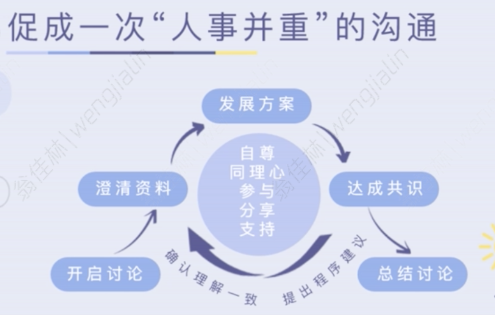
			-
	- 帮你实现“人见人爱，花见花开”的开挂人生
		- 加强自信
			- 通过“夸”来实现
		- 夸人的两个关键技巧
			- 态度语气真诚
			- 内容具体
		- 划重点
			- 唯有对方能清楚地描绘出对自己的观察和了解，我们才会有种被理解和认可的满足感
		- 夸人的三个时机
			- 1 肯定想法
				- 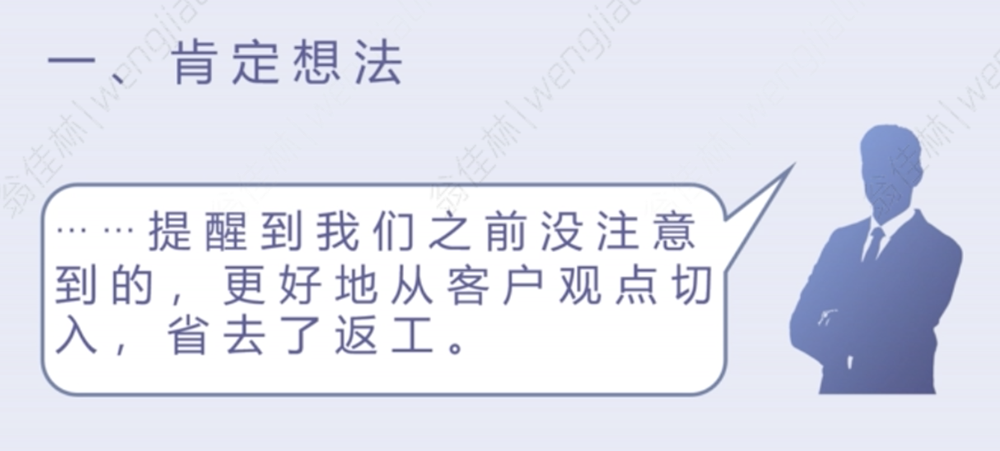{:height 194, :width 425}
			- 2 肯定行为/ 成就
				- 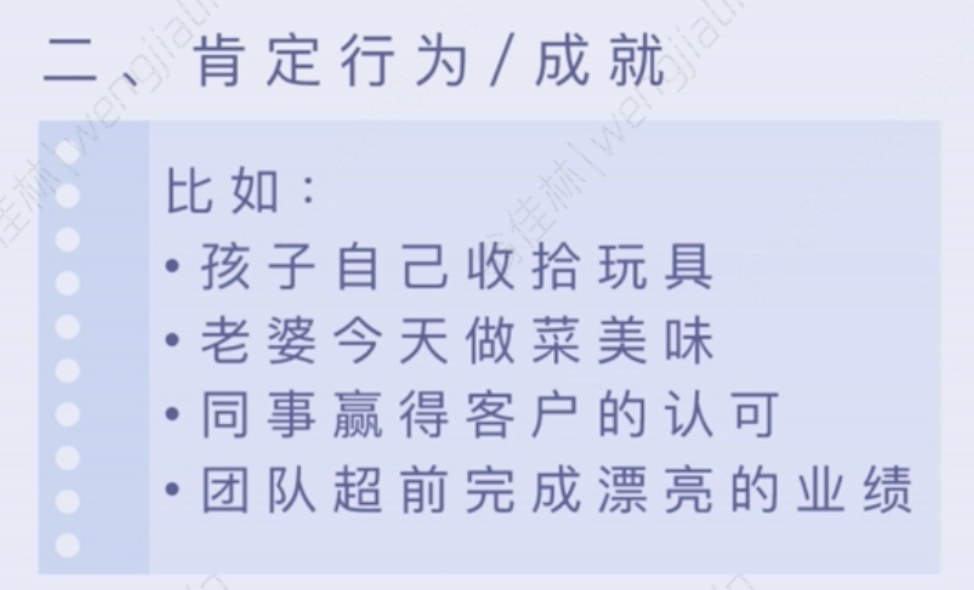{:height 255, :width 421}
			- 3 对未来表示信心
				- 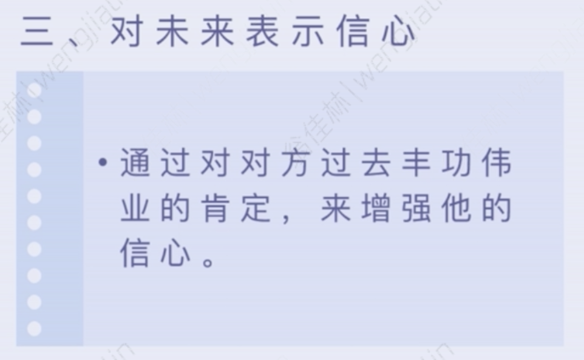{:height 259, :width 421}
		- 划重点
			- 要夸到心里去，不走过场式的套路
			- 必须通过观察，真心地认同
			- 用真诚的语气，具体的描述来呈现
	- 如何让对方知错，又不伤感情
		- 有理有节说清楚
		- 维护自尊三个要点
			- 1 就事论事，不贴标签，对事不对人
			- 2 保持尊重
				- 看到了努力 + 对此表达感谢
			- 3 了解澄清原因
				- 不如人意、不可抗力
				- 多澄清，了解真相
	- 如何让对方视你为知音，从此爱死你
		- 有效灭火
			- 同理心灭火
			- 仔细聆听，表示同理，顺利安抚对方情绪
		- 人如何被说服
			- 内在需求
				- 期待被理解的内在需求
			- 外部反映
				- 通过情绪反映自己的感受
			- 同理心关联 内在需求 与 外部反映
		- 运用同理心的时机
			- 心有灵犀
		- 核心技巧——倾听
			- 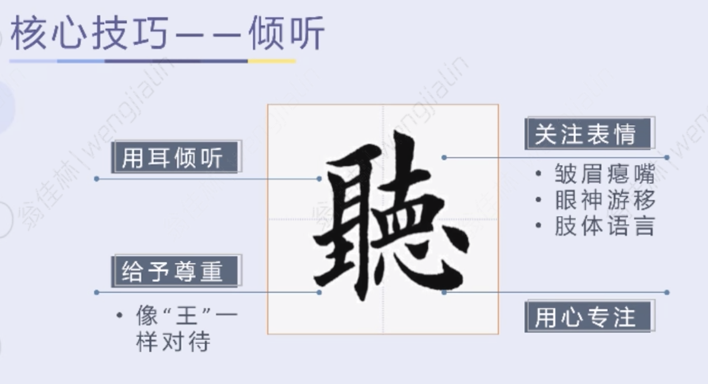
		- 同理心的要点
			- 1 说出产生情绪的原因
			- 2 点出当下的感受
		- 误区
			- 误区一：自我中心
			  collapsed:: true
				- 如何改正自我中心
					- 把“我”换成“你”
			- 误区二：同理 不等于 同意
			  collapsed:: true
				- 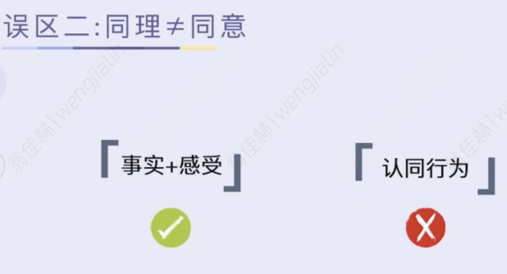{:height 238, :width 439}
				-
	- 如何让对方对我“心服口服”
		- 表达三层次
			- 一、观点、立场、想法
			- 二、理由、原因
				- 与当事人有关
			- 三、感受
			- 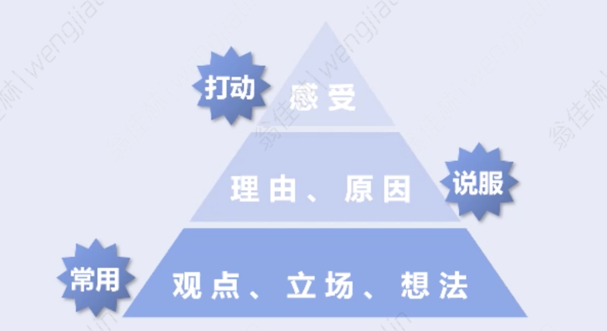{:height 219, :width 385}
		- 划重点
			- 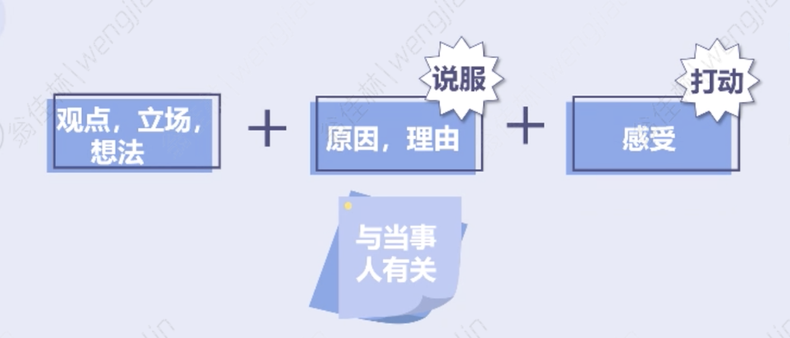{:height 214, :width 474}
	- 如何让对方担起责任
		- 谋求协助，促进参与的关键
			- 让对方觉得你是真心地想了解他的看法，通过提问来邀请对方提出意见
				- 如何问？——5W1H
					- 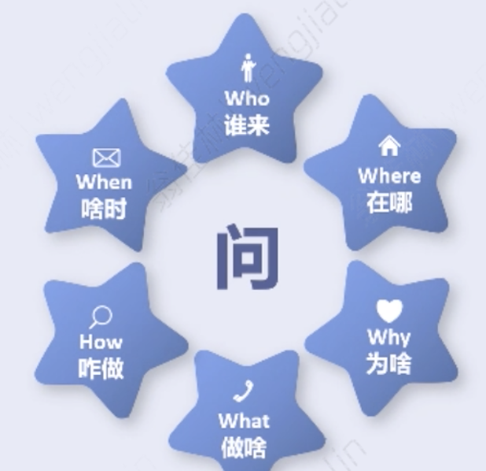{:height 267, :width 267}
		- 给予支持，鼓励承担
			- “给予支持”如何使用
				- 帮他，但不能 以己度人
			- “鼓励承担”如何使用
				- 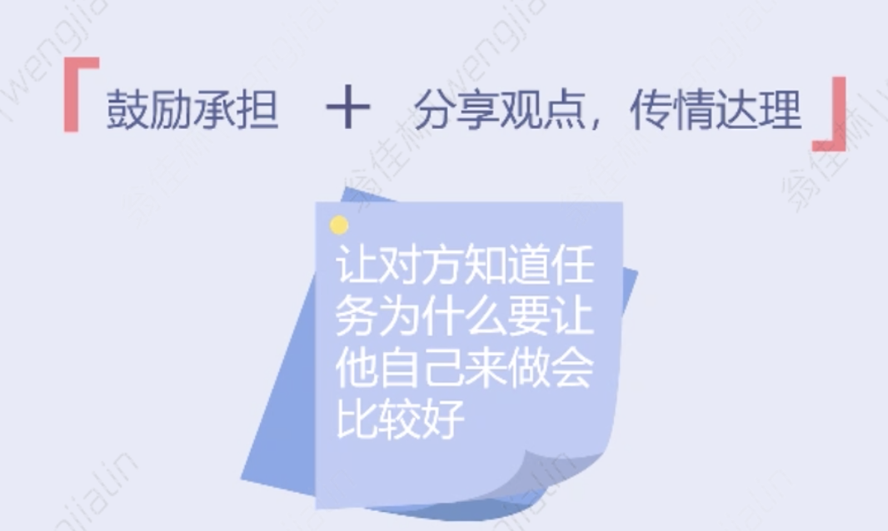{:height 278, :width 440}
				- 用观点，理由，让其理解承担责任的重要性
	- 经典回顾
		- 绝对优先级
			- 但对方有情绪时，及时灭火
		- 人见人爱花见花开的必杀技
			- 在一开始建立关系时：肯定对方的行为、点子
		- 组合用法
			- 一、建立信任
				- 分享观点、传情达理
				- 仔细聆听、表示同理
			- 二、顺利解决问题
				- 谋求协助、促进参与
				- 给予支持、鼓励承担
				- 双方都有贡献和付出，确保都有主人公的意识
	- 如何让沟通更有效果
		- 一、开启讨论
			- 说明这次讨论的目的+重要性
			- 常见问题：模糊
		- 二、澄清资料
			- 交换信息、确保同一频道
			- 需要了解
				- 什么情况、哪些资料、多少资源、成本预算、顾虑挑战
			- 常见问题：想当然
		- 三、发展方案
			- 讨论如何解决问题 + 审视是否可行
			- 谋求协助、促进参与
				- 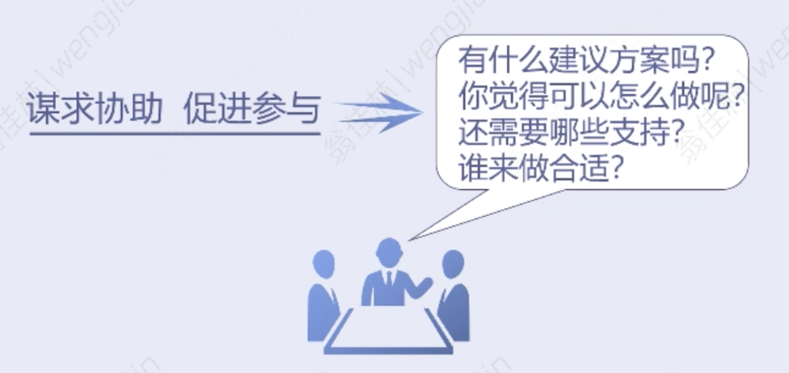{:height 185, :width 378}
		- 四、达成共识
			- 澄清具体行动计划
				- 谁在什么时候做什么事以及怎么做
					- Who do What by When and How
		- 五、总结讨论
			- 总结 + 打鸡血
	- 让沟通不跑偏
		- 提出程序建议
			- 让大家休息、提醒回归主题、或是中止谈话
		- 确认理解一致
			- 形象化呈现
				- 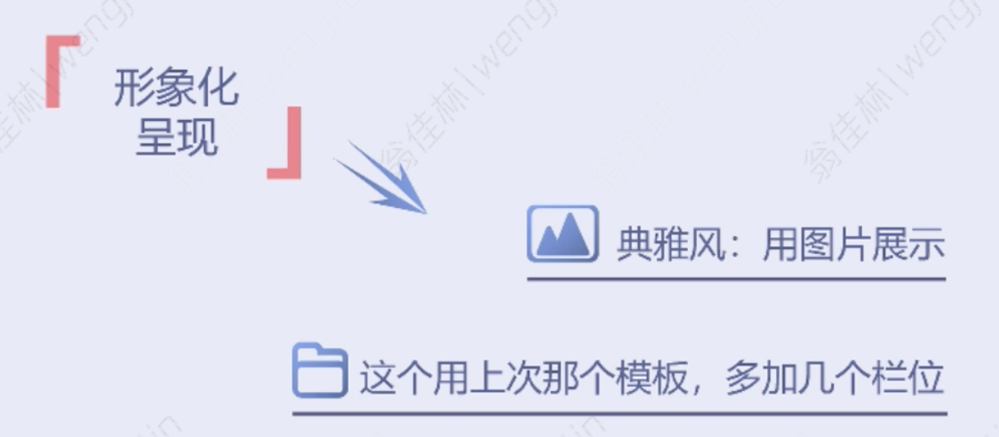{:height 233, :width 517}
-
- 拓展小课堂
	- 为什么要做性格测验，性格测验对与能力发展的价值是什么
		- 美国著名心理学家麦克利兰于1973年提出了一个著名的模型，所谓“冰山模型”
			- 就是将人员个体素质的不同表现表式划分为表面的“冰山以上部分”和深藏的"冰山以下部分”。
				- 其中，“冰山以上部分”包括基本知识、基本技能，是外在表现，是容易了解与测量的部分，相对而言也比较容易通过培训来改变和发展。
				- 而“冰山以下部分”包括社会角色、自我形象、特质和动机，是人内在的、难以测量的部分。它们不太容易通过外界的影响而得到改变，但却对人员的行为与表现起着关键性的作用。
				- DDI研究表明，个性特质和领导力是密切相关的，甚至决定了领导力的发展方向和速度。
					- 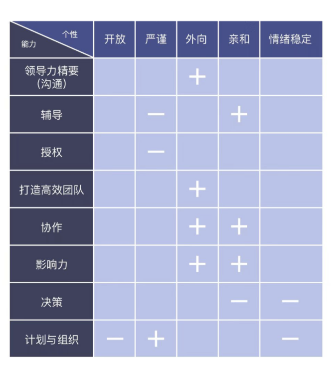{:height 445, :width 385}
					-
	- 草稿
		- 性格 与 领导力 的关系
			- 性格 与 决策相关的盲点 的关系
				- {{embed ((6300d6bc-b004-47fa-9649-0a2b8e5cef87))}}
			- 性格 与 领导力精要（沟通） 的关系
			- 了解自己的个性特质，能够在锻炼领导力时，有侧重点，以实现均衡发展
		- 思考捷径
			- {{embed ((630acb78-4356-412a-a037-a63729607e39))}}
		- 性相近习相远
		- 心学
			- 修行的心态
			- 领导力的锻炼是一种修行，需要与自己的习性做斗争
				- {{embed ((62a1e8b1-f423-4a53-a71c-fc679e11960c))}}
				- 问：“圣人应变不穷，莫亦是预先讲求否？”先生曰：“如何讲求得许多？圣人之心如明镜，只是一个明，则随感而应，无物不照；未有已往之形尚在，未照之形先具者。"
					- 不断匡正自己的内心，把控自己的习性，去因地制宜地处理客观事物。
	- 文章思路
		- 性格 一定程度上影响了 领导力的发挥
			- 除了材料里的图表中展示的5点个性与领导力对应能力的关系外，领导力课程里还讲到 我们需要避开一些决策盲点
				- 例如 仓促决策、独断专行、逃避决策、分析瘫痪等。这些决策盲点其实也反映了常进入这些盲点的同学的一些个性特质。
			- 所以个性特质 一定程度上影响了 领导力的发挥。
			- 如果我们了解自己的个性特质，那么能够在锻炼领导力时，可以有侧重点，以实现均衡发展
		- 个人的个性特质如果对领导力有负面的效果，那么有可能是进入了“思考捷径”
			- “很多人认为自己在思考，而实际上他们只是在重新整理自己的偏见。”
			- 按认知心理学家的说法，我们是依靠两种心理过程来做决策的
				- 系统1是本能性的和联想性的；基本是我们的个性特质的投射
				- 系统2要复杂得多：它可以告诉你今天的日期，单词“serendipity”中字母的个数；它无法直观地知道这些事情，但可以计算出来。
					- 系统2的思考速度比系统1要慢很多，要正常运行，还需要投入更多精力和注意力，但是它提供的结果通常非常有价值。这基本是反映的就是我们的领导力发挥情况。
					- 不幸的是，系统2有一个严重问题：我们的大脑是懒惰的，因为懒，它往往会转向系统1寻求答案。
						- 但如果能意识到认知偏差和思维模式对理性决策的威胁，我们就可以有效防范它们。
							- 例如我们了解了自己的个性特质，我们可以意识到自己比较容易会落入的一些陷阱，规避它们，我们就能发挥更好的领导力。
		- 领导力的训练，比较像是一种修行，我们需要与自己的个性特质做斗争，与自己的习性做斗争。
			- 我们需要“知止定静安虑得”，进行心理上的调整、修复、提升。
			- 正如阳明先生所说：“圣人之心如明镜，只是一个明，则随感而应，无物不照；未有已往之形尚在，未照之形先具者。”，我们要不断匡正自己的内心，把控自己的习性，去因地制宜地处理客观事物。