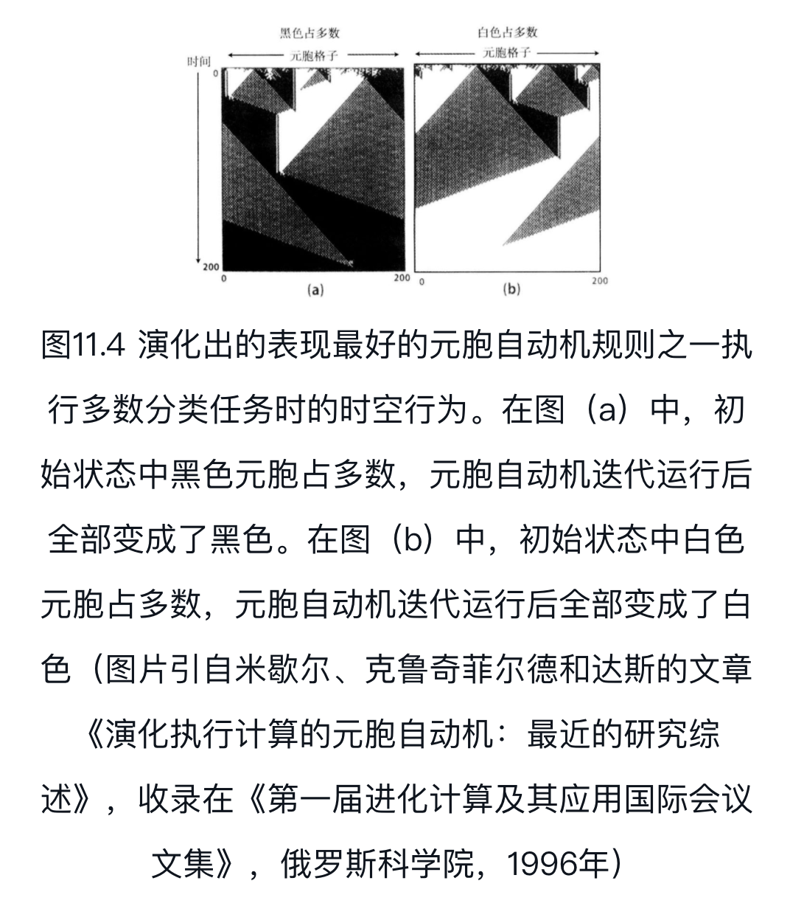

- #literature-note #book

- **Author:** [[Melanie Mitchell]]
- **Source:**
  id:: 60ca1ba4-2dc3-4e69-8b82-25734fcc7faa
- **Tag:** [[复杂系统]] [[Complexity]] [[复杂性]]
- **Related:**
- **Permanent:**
- **Highlight:**
  collapsed:: false
	- **[[复杂性]]是什么? **
	  id:: 60ca129f-2f3f-4a89-954c-320f651618dd
	  collapsed:: false
		- [[复杂系统]]试图解释，在不存在中央控制的情况下，大量简单个体如何自行组织成能够产生模式、处理信息甚至进化和学习的整体。
		- 例子：昆虫部落、大脑、免疫系统、经济、万维网
		- [[复杂系统]] 的共性：
			-
			  1. 复杂的集体行为
				- 个体一般遵循相对简单的规则，不存在中央控制或领导者
			-
			  2. 信号与信息处理
			-
			  3. 适应性
		- [[复杂系统]] 定义
			- [[复杂系统]] 是由大量组分组成的网络，不存在中央控制，通过简单运作规则产生出复杂的集体行为和复杂的信息处理，并通过学习和进化产生适应性。
			- 有时候会对复杂适应系统（在其中适应性扮演重要角色）和复杂非适应系统（例如飓风）加以区分。
			- 如果系统有组织的行为不存在内部和外部的控制者或领导者，则称之为[[自组织]]（[[self-organizing]]）
			- 由于简单规则以难以预测的方式产生出复杂行为，这种系统的宏观行为有时也称为[[涌现]]（[[emergent]]）
			- [[复杂系统]]另一个定义：具有[[涌现]]和[[自组织]]行为的系统
			- [[复杂性]]科学的核心问题：涌现和自组织行为是如何产生的
	- 动力学、混沌和预测
	  collapsed:: false
		- [[动力系统]]理论
		  collapsed:: false
			- 动力系统理论（动力学，dynamics）关注的是对系统的描述和预测，其所关注的系统通过许多相互作用的组分的集体行为涌现出宏观层面的复杂变化。
			- 动力一词意味着变化。而动力系统则是以某种方式随时间变化的系统。
			- 例子：太阳系（行星位置随时间变化）、心脏（周期性跳动）
		- [[混沌]]系统
		  collapsed:: false
			- [[混沌]]指的是一些系统——混沌系统——对于其初始位置和动量的测量如果有极其微小的不精确，也会导致对其的长期预测产生巨大的误差。也就是常说的“[[对初始条件的敏感依赖性]]”。
				- 庞加莱发现了对初始条件的敏感依赖性
				  collapsed:: true
					- ”如果我们能知道自然界的定律和宇宙在初始时刻的精确位置，我们就能精确预测宇宙在此后的情况。但是即便我们弄清了自然界的定律，我们也还是只能近似地知道初始状态。如果我们能同样近似地预测以后的状态，这也够了，我们也就能说现象是可以预测的，而且受到定律的约束。但并不总是这样，初始条件的细微差别有可能会导致最终现象的极大不同。前者的微小误差会导致后者的巨大误差。预测变得不可能……
					- 即便我们完全知道了运动定律，两组不同的初始条件（在这里是物体的初始位置、质量和速度），即使差别很小，有时候也会导致系统随后的运动极为不同。
				- 气象学家洛伦兹（Edward Lorenz）发现，即使是很简单的计算机气象模型，也会有对初始条件的敏感依赖性。
				  collapsed:: true
					- 现在虽然有了高度复杂的气象计算模型，天气预报也最多只能做到大致准确预测一个星期。
					- 目前还不清楚这个局限是否是天气的混沌本质导致的，也不知道通过收集更多数据和构造更好的模型，可以将这个局限推进多远。
			- 线性系统与非线性系统
			  collapsed:: true
				- 线性系统：整体等于部分之和
				  collapsed:: false
					- {:height 300, :width 400}
					- {:height 234, :width 300}
				- 对于非线性系统，整体则不等于部分之和。
					- 逻辑斯蒂模型（logistic model）
				- 还原论者喜欢线性，而非线性则是还原论者的梦魇。
				- [[逻辑斯蒂映射]]（[[logistic map]]）
				  collapsed:: false
					- 逻辑斯蒂模型的一个简化形式
					- 也许是动力系统理论和混沌研究中最著名的方程
					- {:height 65, :width 200}
					- 事实上，它是能抓住混沌本质—— [[对初始条件的敏感依赖性]] ——的最简单的系统之一
					- 有三种不同的最终状态（吸引子）：不动点、周期和混沌（混沌吸引子有时候也称为“奇怪吸引子”）。吸引子的类型是动力系统理论刻画系统行为的一种方式。
					- 逻辑斯蒂映射极为简单，并且完全是确定性的：每个xt值都有且仅有一个映射值xt+1。然而得到的混沌轨道看上去却非常随机——事实上逻辑斯蒂映射还被用来在计算机中生成伪随机数
					- 表面上的随机可以来自非常简单的确定性系统
					- 数学生物学家梅对这些惊人的特性进行了总结，与庞加莱遥相呼应
					  collapsed:: false
						- "简单的确定性方程（1）（即逻辑斯蒂映射）能产生类似于随机噪声的确定性轨道，这个事实有着让人困扰的实际含义。例如，这就意味着种群调查数据中那种明显的不稳定波动不一定表明环境的变化莫测或是采样有错误：它们有可能就是像方程（1）这样完全确定性的种群数量变化关系所导致的……另外，还可以看到，在混沌中，不管初始条件有多接近，在足够长的时间之后，它们的轨道还是会相互分开。这意味着，即使我们的模型很简单，所有的参数也都完全确定，长期预测也仍然是不可能的。"
					- 逻辑斯蒂映射是种群数量增长的简化模型，但是对其以及类似模型的详细研究却带来了对秩序、随机和可预测性的重新认识。
						- 这证明了理想模型（ideamodels）的力量——这些模型很简单，用数学或计算机就足以进行研究，但是又抓住了自然界复杂系统的本质。
			- [[混沌]]的共性
			  collapsed:: false
				- 第一条普适性质：通往混沌的倍周期之路
				  collapsed:: true
					- {:height 200, :width 400}
					- 倍周期之路并不是只有逻辑斯蒂映射才有，事实上任何抛物线形状的映射都有类似现象。
					- 这里“抛物线形状”意指映射的图形有一个隆起——用数学术语说就是“单峰（unimodal）”
				- 第二条普适性质：费根鲍姆常数
				  collapsed:: true
					- 费根鲍姆计算正弦映射的倍周期分叉点的R值，然后计算这些值的收敛速度。他发现收敛速度为4.6692016
					- 费根鲍姆接着又从理论上解释了为何常数4.6692016具有普适性——对所有单峰映射都成立。
					- 常数的理论解释使用了一种复杂的数学技巧——重正化（renormalization）。
					- 重正化最初是从量子力学中发展出来，后来又被应用到另一个物理学领域：相变和其他“临界现象”的研究。费根鲍姆将其引入了动力系统理论，并成为理解混沌的基石。
			- [[混沌]]思想总结
			  collapsed:: true
				- 看似混沌的行为有可能来自确定性系统，无须外部的随机源
				- 一些简单的确定性系统的长期变化，由于对初始条件的敏感依赖性，即使在原则上也无法预测
				- 虽然混沌系统的具体变化无法预测，在大量混沌系统的普适共性中却有一些“混沌中的秩序”，例如通往混沌的倍周期之路，以及费根鲍姆常数。因此虽然在细节上“预测变得不可能”，在更高的层面上混沌系统却是可以预测的。
	- [[信息]]
	  collapsed:: false
		- 讨论复杂系统时经常会说到“自组织”：例如，行军蚁搭建的桥；萤火虫的同步闪动；经济系统中相互维系的市场；干细胞发育成特定的器官——这些都是自组织的例子。
			- 与通常情形中的有序消退无序（熵）增长相反，这里是有序从无序中产生
			- 复杂系统科学最关注的问题就是这种逆熵的自组织系统是如何可能的。
				- 不过要着手这个问题，还要先了解一下什么是“有序”和“无序”，以及人们如何看待对这种抽象性质的度量
		- 许多复杂系统学家用[[信息]]的概念来刻画和度量有序和无序、复杂性和简单性
		- 对于[[信息]]的科学研究始自热力学，热力学描述能量以及其与物质的相互作用。
			- 热力学第二定律被认为是定义了“时间之箭”，因为它证明了存在时间上不可逆的过程（比如，热量自发地回到你的冰箱，并转化成电能进行制冷）。
				- 就像物理学家罗斯曼（Tony Rothman）所指出的，“为什么第二定律能区分过去和现在，而其他自然定律却不能？这也许是物理学中最大的谜团。”
		- 麦克斯韦的小妖
		  collapsed:: true
			- “热力学第二定律的局限”
			- {:height 65, :width 400}
			- 杰出的匈牙利物理学家西拉德（Leo Szilard）提出，做功的是小妖的“智能”，更精确地说，是通过测量获取[[信息]]的行为。
			  collapsed:: true
				- 西拉德是第一个将熵与信息联系起来的人，这个关联后来成了信息论的基础和复杂系统的关键思想。
				- 西拉德写了一篇题为“热力学系统在智能生物的干预下的熵的减少”的著名论文
					- 文中西拉德认为测量过程（小妖要通过测量获取“比特”信息，比如趋近的分子速度是慢是快）需要能量，因此必然会产生一定的熵，数量不少于分子变得有序而减少的熵。
					- 这样由箱子、分子和小妖组成的整个系统就仍然遵守热力学第二定律。
					- 西拉德在此过程中也顺便定义了信息比特的概念——通过回答是/否（对小妖是“快/慢”）获得的信息。
		- 统计力学
		  id:: 60cb3c92-f80c-4642-bf7a-f512249bea7a
			- “ [[熵]]”定义为对无法做功而只能转换成热的能量的测量。
			- 统计力学认为宏观尺度上的属性（例如热）是由微观属性产生（例如无数分子的运动）。
			- 简而言之，经典力学试图用牛顿定律分析所有的单个微观对象（例如分子）。而热力学则只给出了宏观现象——热、能量和熵——的定律，没有说明微观分子是这些宏观现象的源头。统计力学则在两个极端之间搭建了一座桥梁，解释了宏观现象是如何从对大量微观对象的整体上的统计产生。
		- 微观态与宏观态
		  id:: 60cb3ce3-4f38-4719-b653-ed2a1973ffb4
		- 香农[[信息]]
			- 香农对信息量的定义与玻尔兹曼对熵更一般化的定义几乎一样
			- 香农用信息源的熵定义信息量（这个熵的概念通常被称为香农熵，以区别于玻尔兹曼给出的熵的定义）
			- 人们有时候将香农的信息量定义描述为接收者在接收信息时体验到的“平均惊奇度”，其中“惊奇”意指接收者对于发送源将要传送的信息的“不确定度”。
			- 总体上，根据香农的理论，信息可以是通信的任何单位，可以是一个字母、一个词、一句话，甚至是一个比特（0或1）。发送源的熵（信息量）用信息的可能性定义，而与信息的“意义”无关。
	- 计算
	  collapsed:: false
		- 什么是计算？什么可以计算
			- 香农的信息定义关注的是消息源的可预测性。不过在现实世界中，信息是用来分析并产生意义的东西，信息被存储，并和其他信息结合，产生结果或行为。总之，信息是用来计算的。
		- 希尔伯特问题和哥德尔定理
		  collapsed:: false
			- 希尔伯特问题
				-
				  collapsed:: true
				  				  1. 数学是不是完备的？
					- 也就是说，是不是所有数学命题都可以用一组有限的公理证明或证否。
				-
				  collapsed:: true
				  				  2. 数学是不是一致的？
					- 换句话说，是不是可以证明的都是真命题？“真命题”是专业术语，但我在这里用的是直接意义。假如我们证出了假命题，例如1+1=3，数学就是不一致的，这样就会有大麻烦。
				-
				  collapsed:: true
				  				  3. 是不是所有命题都是数学可判定的？
					- 也就是说，是不是对所有命题都有明确程序（definiteprocedure）可以在有限时间内告诉我们命题是真是假？这样你就可以提出一个数学命题，比如“所有比2大的偶数都可以表示为两个素数之和”，然后将它交给计算机，计算机就会用“明确程序”在有限时间内得出命题是“真”还是“假”的结论。
					- Entscheidungsproblem（“判定问题”）
			- 不完备性定理
			  collapsed:: true
				- 不完备性定理说的是，如果上面的问题2的答案是“是”（即数学是一致的），那么问题1（数学是不是完备的）的答案就必须是“否”。
				  collapsed:: false
					- 哥德尔给出了一个数学命题，翻译成白话就是“这个命题是不可证的”。
						- 仔细思考一下。这个命题很奇怪，它居然谈论的是它自身——事实上，它说的是它不可证。我们姑且称它为“命题A”。现在假设命题A可证，那它就为假（因为它说它不可证），这就意味着证明了假命题——从而算术是不一致的。好了，那我们就假设命题A不可证，这就意味着命题A为真（因为它断言的就是自己不可证），但这样就存在不可证的真命题——算术是不完备的。因此，算术要么不一致，要么不完备。
		- [[图灵机]]和不可计算性
		  collapsed:: false
			- 图灵机概述
			  collapsed:: true
				- 图灵机由三部分组成
				  collapsed:: true
					-
					  1. 带子，被分成许多方格（或“地址”），符号可以被写入其中或从中读出。带子两头都有无限长。
					-
					  2. 可以移动的读写头，能从带子上读取符号或将符号写到带子上。在任何时候，读写头都处于一组状态中的一个。
					-
					  3. 指示读写头下一步如何做的一组规则。
				- {:height 65, :width 300}
				- 读写头开始处于特定的开始状态，并停在特定的格子上。每一步，读写头读取当前格子中的符号。然后读写头根据读取的符号和读写头的当前状态按照规则动作。规则决定读写头在当前格子中写入什么符号（替换当前符号）；读写头是向右还是向左移动或是停止不动；以及读写头的新状态是什么。如果读写头进入停机状态，机器就会停下来。
				- 图灵机的输入是机器启动之前写在带子上的符号集合。输出则是停机之后留在带子上的符号集。
			- 通用图灵机
			  collapsed:: true
				- 人们可以设计出一种通用图灵机（称之为U），它可以模拟任何图灵机的运作。
					- U在模拟图灵机M处理输入I时，U处理的带子上不仅包含编码输入I的序列，还包含编码图灵机M的序列。
			- 停机问题证明了判定问题的答案是“否”；不存在明确程序能判定任意数学命题是否为真。
			  id:: 60cb4104-bf0c-4838-88d8-a48c6e2d5922
				- 图灵命题：图灵机M对于给定输入I会在有限步后停机。
			- 图灵对停机问题不可计算性的证明，与哥德尔的不完备性定理具有同样的核心思想。
				- 哥德尔提出了可以编码数学命题的方法，从而让它们可以谈论自身。图灵则提出了编码图灵机的方法，让它们可以运行自身。
			- 改变了大多数人的观念——计算存在局限。
	- 进化
	- 遗传学概要
	- [[度量]][[复杂性]]
		- 物理学家劳埃德（Seth Lloyd）发表了一篇文章，提出了度量一个事物或过程的复杂性的三个维度：
		  collapsed:: true
			- 描述它有多困难？
			- 产生它有多困难？
			- 其组织程度如何？
		- 用大小度量复杂性
		  collapsed:: true
			- 复杂性的一个简单度量就是大小。根据这个度量，如果比较碱基对数量，人类比酵母复杂250倍，如果比较基因数量，人类则只比酵母复杂4倍。
			- 这就表明用基因组的规模来度量复杂性并不合适；我们的复杂性应该是某种比碱基对或基因的绝对数量更深刻的东西
		- 用熵度量复杂性
		  collapsed:: true
			- 用香农熵度量复杂性有一些问题。
				- 首先，所针对的对象或过程必须像上面一样转换成某种“消息”的形式。
				- 另外，随机消息的熵最高。
					- 最复杂的对象不是最有序的或最随机的，而是介于两者之间。
		- 用算法信息量度量复杂性
		  collapsed:: true
			- 与熵类似，随机对象的算法信息量也会比我们直观上认为复杂的事物的信息量更大。
			- 物理学家盖尔曼（Murray Gell-Mann）提出了一种称为“有效复杂性（effective complexity）”的相关度量
				- 为了计算有效复杂性，首先要给出事物规则性的最佳描述
				- 有效复杂性定义为包含在描述中的信息量或规则集合的算法信息量，两者等价
		- 用逻辑深度度量复杂性
		  collapsed:: true
			- 一个事物的逻辑深度是对构造这个事物的困难程度的度量
			- 逻辑深度具有很好的理论特征，符合我们的直觉，但是也没有具体给出度量实际事物复杂性的方法
		- 用热力学深度度量复杂性
		  collapsed:: true
			- 劳埃德和裴杰斯的思想与班尼特的思想很相似：越复杂的事物越难构造
			- 热力学深度首先是确定“产生出这个事物最科学合理的确定事件序列”，然后测量“物理构造过程所需的热力源和信息源的总量”。
			- 同逻辑深度一样，热力学深度也只是在理论上有意义，要真的用来度量复杂性也存在一些问题。
				- 首先，我们要能列出事物产生过程中的所有事件。
				- 另外，劳埃德和裴杰斯的定义中没有明确界定什么是“事件”。
					- 用更专业一点的话说，是不清楚如何将系统的状态“粗粒化”——也就是说，在列出事件时，如何确定哪些是相关的宏观状态
		- 用计算能力度量复杂性
		  collapsed:: true
			- 具有执行通用计算的能力并不意味着系统本身就是复杂的；我们应当测量的是系统处理输入时的行为的复杂性。
		- 统计复杂性
		  collapsed:: true
			- 度量用来预测系统将来的统计行为所需的系统过去行为的最小信息量。
			- 度量统计复杂性也不容易，除非面对的系统可以解读为信息源
				- 不过克鲁奇菲尔德、杨和他们的同事实际测量了一系列真实世界现象的统计复杂性，比如复杂晶体的原子结构和神经元的激发模式。
		- 用分形维度量复杂性
		  collapsed:: true
			- 分形指的是“在任何尺度上都有微细结构”的几何形状
			- 许多让人感兴趣的分形具有[[自相似]]特性
			- 分形维数一定程度上量化了细节的有趣程度与你观察的放大率之间的关系
		- 用层次性度量复杂性
		  collapsed:: true
			- 西蒙认为，复杂系统最重要的共性就是层次性和不可分解性。
			- 就像麦克西所指出的，嵌套仅仅描述了生物的结构，而不涉及其功能
	- 自我复制的计算机程序
	- 遗传算法
	- 元胞自动机、生命和宇宙
	  collapsed:: false
		- [[元胞自动机]]
			- 元胞自动机是由元胞组成的网格，每个元胞都根据邻域的状态来选择开或关。
				- （广义上，元胞的状态可以随便定多少种，但是这里我们只讨论开/关状态。）
			- 所有的元胞遵循同样的规则，也称为元胞的更新规则，规则根据各元胞邻域的当前状态决定元胞的下一步状态。
		- 生命游戏
		- 四类元胞机
		  collapsed:: true
			- {:height 65, :width 400}
			- 对沃尔夫勒姆来说，简单的规则涌现出如此的复杂性，这简直就是神迹。他后来说，“规则30自动机是我在科学中所遇到的最让人惊异的事物……[插图]我花了几年时间来理解它的重要性。
			- 沃尔夫勒姆将规则110的通用性视为“新的自然定律”——他提出的计算等价性原理（Principle of Computational Equivalence）
				-
				  1. 思考自然界中的过程的正确方法是将它们视为计算。
				-
				  2. 像规则110这样极为简单的规则（或“程序”）都能进行通用计算，这表明通用计算的能力在自然界中广泛存在。
				-
				  3. 通用计算是自然界中计算的复杂性的上限。也就是说，自然系统或过程不可能产生出“不可计算”的行为。
				-
				  4. 自然界中各种过程实现的计算在复杂程度上都几乎等价。
			- 在《一种新科学》中，沃尔夫勒姆探讨了量子力学、进化和发育生物学、经济等领域，他想说明这些领域都能描述为使用简单规则进行的计算。本质上，他的“新科学”指的是这样的思想，宇宙和其中的万事万物都能用这种简单的程序进行解释。这就是大写的计算，非常大。
	- [[粒子计算]]
	  collapsed:: false
		- 用遗传算法设计[[元胞自动机]]规则
		  collapsed:: true
			- {:width 300}
			- {:width 300}
			- {:width 300}
		- 克鲁奇菲尔德之前发明了一种方法可以研究动力系统行为中的“信息处理结构”，他建议我们用这种方法来分析遗传算法演化出的元胞自动机。
			- 克鲁奇菲尔德的思想是区域之间的界线（例如图11.5中的A、B、C线以及垂直界线）携带有信息，而界线发生碰撞就是对信息进行处理。
			  collapsed:: true
				- 克鲁奇菲尔德就把这些界线称为“粒子”
			- 粒子描述让我们看到了仅仅观察[[元胞自动机]]规则或是其时空图变化看不到的东西：它们让我们能从信息处理的角度来解释元胞自动机是如何执行计算的。
		- 有一种自然系统却可以用非常类似于粒子的语言解释：植物的气孔网络。
		  collapsed:: true
			- 犹他州立大学（Utah State University）的植物学家莫特（Keith Mott）、物理学家皮克（David Peak）和他们的同事长期观察叶子气孔的开合模式，他们认为气孔组成了一个有点类似于二维元胞自动机的网络。他们还发现气孔开合的时间模式很像二维形式的粒子相互作用。他们猜测植物通过气孔进行分布式计算——通过优化气孔的开合让二氧化碳的获取和水分流失达到最佳平衡——这种计算也许也能用粒子语言进行解释。
	- 生命系统中的信息处理
	  collapsed:: true
		- “信息”在这些系统中扮演了什么角色？
		- 信息是如何被传递和处理的？
			- 通过采样实现通讯
			- 行为的随机成分
			- 微粒化探测
			- 分散探测与集中行动之间的互动
		- 信息是如何获得意义的？又是对谁有意义？
	- 如何进行类比
	  collapsed:: false
		- 模仿者
		- “ [[并行级差扫描]]”
			- 根据这个方案，许多可能性被并行地进行探索，用获得的最新信息不断对各种可能性的收益进行估计，并根据反馈分配资源。
		- 模仿者程序
		  collapsed:: true
			- 在模仿者受生物启发的策略中，最初是信息很少，使得温度很高，也很随机，许多探索并行进行
			- 随着获得的信息越来越多，适当的概念被发现，温度降低，探索也变得越来越具有确定性，一系列特定概念开始占据主导。
			- 整体上使得系统从极为随机、并行和自底向上的处理模式逐渐转变成确定、连贯而且集中的模式，逐步发现对情形的一致性认知并渐渐让其“凝结”。
			- 意义与生存和自然选择密不可分，而模仿者还没有涉及这一些，只是在降低温度这一点上与“生存”本能有一点点关联。从这方面来说，模仿者（以及后来由侯世达的研究团队研发的一系列让人印象更加深刻的程序）与生物系统还有着很大的区别。
	- 计算机模型
	  collapsed:: false
		- 在科学中， [[模型]]是对某种“实在”现象的简化表示
			- 科学家们说是在研究自然，但实际上他们做的大部分事情都是在对自然进行建模，并对所建立的模型进行研究。
		- [[理想模型]]
		  collapsed:: false
			- 通过相对简单的模型来理解一般性的概念，而不用对具体系统进行详细的预测。
			- 在[[复杂系统]]研究中一个主要的方向就是研究理想模型
			- 例子：
			  collapsed:: true
				- 麦克斯韦妖：用来研究熵的概念的理想模型
				- 图灵机：用来对“明确程序”进行形式化定义以及研究计算概念的理想模型
				- 逻辑斯蒂模型和逻辑斯蒂映射：用来预测种群数量的极简模型；后来成为研究动力学和混沌一般性概念的理想模型
				- 冯·诺依曼自复制自动机：用来研究自复制“逻辑”的理想模型
				- [[遗传算法]]：用来研究适应性概念的理想模型。有时候也作为达尔文进化的极简模型
				- [[元胞自动机]]：用于研究一般性的复杂系统的理想模型。
				- 科赫曲线：用来研究海岸线、雪花等分形结构的理想模型
				- 模仿者：用来研究人类类比思维的理想模型。
			- [[理想模型]]有许多用途
			  collapsed:: true
				- 研究一些复杂现象背后的一般机制（例如，冯·诺依曼研究自复制的逻辑）
				- 证明解释某种现象的机制是不是合理（例如，种群数量的动力学）
				- 研究简单模型在变化后的效应（例如，研究遗传算法的变异率或逻辑斯蒂映射的控制参数R变化所带来的影响）
				- 或者更普遍是作为哲学家丹尼特（Daniel Dennett）所谓的“直觉泵（intuition pump）”——用来引导对复杂现象进行理解的思维实验或计算机仿真
				- 复杂系统的理想模型也能为新的技术和计算方法提供灵感
					- 例如，图灵机启发了可编程计算机；冯·诺依曼的自复制自动机启发了元胞自动机；达尔文进化、免疫系统和昆虫社会的极简模型分别启发了遗传算法、计算机免疫系统和“群体智能（swarmintelligence）”方法。
		- 对合作的进化进行模拟
		  collapsed:: false
			- [[囚徒困境]]
			  collapsed:: true
			  id:: 60cb70b7-03aa-4912-a779-4c89dd62fb2c
				- [[囚徒困境]]基本形式
					- 两个人（姑且称他们为爱丽丝和鲍勃）因为合伙犯罪被逮捕了，警察将他们分别关在不同的房间。
					- 爱丽丝和鲍勃必须各自决定是否指证对方。
					- 如果爱丽丝同意指证鲍勃，她就会被释放，而鲍勃则会被判处无期徒刑。
					- 但如果爱丽丝拒绝指证，而鲍勃同意指证爱丽丝，则他将被释放，爱丽丝则会被判无期徒刑。
					- 如果两人都指证对方，则两人都会被关入监狱，但是只判10年徒刑。
					- 而如果两人都不指证对方，则两人都会判得较轻，只需入狱5年。
					- 警察要求他们不许相互沟通，必须马上作出决定。
				- [[囚徒困境]]悖论
				  id:: 60cb7112-ecaf-4824-9bf1-8c59d3edadec
					- 用政治学家阿克塞尔罗德（Robert Axelrod）的话说，“每个人都追求自利，使得所有人的利益都受损。”
					- 这个悖论指的是群体中的个体由于只顾自身利益，整体上却使得群体所有个体都受损的情形（全球变暖就是典型的这种例子）
					- 经济学家哈丁（Garrett Hardin）有个著名的词描述这种情况——“公地悲剧”
				- 囚徒困境及其变体作为理想模型体现了合作问题的本质
				- 用计算机模拟 [[囚徒困境]]
					- 阿克塞尔罗德想知道，如果没有世界政府是不是也有可能产生合作。他认为通过研究多回合的 [[囚徒困境]]也许能有助于认识这个问题
						- 阿克塞尔罗德认为，“合作要能够产生”就意味着，不管对手的策略如何变化，从长期来看，合作策略必须比非合作策略的收益更高。
						- 而且，如果用达尔文选择对策略进行演化，则种群中的合作策略的比重应当会随时间增加。
					- 计算机模拟 [[囚徒困境]]竞赛
					  collapsed:: false
						- 针锋相对（TIT FOR TAT） 平均得分最高
							- 是计算机模拟竞赛所提交的策略中最简单的策略
							- 这个策略是数学家拉普波特（Anatol Rapoport）提交的
							- 策略详情
								- 第一个回合合作，然后在后面的回合中采取对手在前一回合中所使用的策略。
								- 也就是说针锋相对策略愿意合作，并且对愿意合作的对手以礼相待。
								- 但如果对方背叛，针锋相对策略就会回之以背叛，直到对手又开始合作为止。
						- 根据竞赛结果，阿克塞尔罗德得出了一些一般性结论
							- 他注意到所有成绩好的策略都有友善的特点——他们从不先背叛对方
								- 友善的策略中得分最低的是“绝不宽恕”策略：它开始时合作，但一旦对方背叛，它以后就会一直背叛
							- 阿克塞尔罗德还注意到，虽然大多数成功的策略既友善也能宽恕对手，但是它们也具有报复性——它们会在背叛发生后很快就进行惩罚。
							- 针锋相对策略不仅友善、宽恕和进行报复，它还有一个很重要的特性：行为明确，具有可预见性
								- 对手很容易就能知道针锋相对采取的策略，因此也就能预知它会如何对对手的行为作出反应
								- 这种可预见性对于促进合作很重要
							- 有趣的是，阿克塞尔罗德在竞赛之后又进行了一系列实验，用遗传算法演化囚徒困境的策略。
								- 策略的适应度就是它与种群中其他策略反复博弈之后的得分。
								- 遗传算法演化出的策略行为与针锋相对也是一样的
						-
					- [[囚徒困境]]的扩展
						- 加入社会规范
							- 结果是仅仅有规范并不足以保证产生合作
							- 阿克塞尔罗德又加入了元规范（metanorms），在其中有执法者来惩罚非执法者。
								- 用阿克塞尔罗德的话说，“元规范能促进并保持群体中的合作“
						- 加入空间结构
							- 诺瓦克猜测，如果参与者位于空间网格上，有严格的邻居概念，则会对合作的进化产生很强的影响
							- 诺瓦克和梅认为他们的结果表现了真实世界中的一个特性——即，空间相邻关系的存在会促进合作。
		- [[建模]]的好处
		  collapsed:: false
			- 对于囚徒困境这样的理想模型的计算机仿真，如果做得好的话，会是实验科学和数学理论的有力补充。
			- 对于大部分复杂系统来说，不可能对其进行真正的实验，用数学研究也非常困难，这个时候模型就是研究它们的唯一可行途径。
			- [[囚徒困境]]模型具备了前面列出的科学中理想模型的所有作用（其他复杂系统模型也可以列出类似的贡献）
			  collapsed:: true
				- 证明了解释某种现象的机制是不是合理。
					- 例如，霍布斯可能不会相信，在自私但具有适应性的个体组成的缺乏领袖的群体中会产生合作，而各种各样的囚徒困境模型则证明了这一点（虽然是以某种理想形式）。
				- 研究简单模型在改变后的效应，引导对复杂现象的认识。
					- 各种各样的囚徒困境变体揭示了合作得以产生的条件。
				- 为新技术带来灵感。
					- 囚徒困境的研究结果——例如，合作得以产生和维持的条件——就被用来帮助改进P2P网络和在电子商务中防止欺诈，类似的应用还有很多。
				- 引出数学理论。
					- 一些人利用囚徒困境的计算机仿真结果研究合作产生条件的通用数学理论。最近的一个例子就是诺瓦克在题为“合作进化的5条规则”的文章中所做的工作
			- 计算机[[建模]]注意事项
			  collapsed:: true
				- 所有模型都是错的，但是有一些有用——伯克斯（George Box）和德雷（NormanDraper）
				- 不过，对于这些模型结果的意义以及它们在真实世界中的应用，却存在着一些夸大其词。因此，科学家应当仔细审视这些模型，弄清楚所得到的结果的普遍性。最好的方法就是看看这些结果是不是可重复。
				- 计算机模型也必须是可重复的——也就是说，其他人重新构造所提出的模型要能得到同样的结果
					- 阿克塞尔罗德就极力拥护这种观点，他写道：“[[可重复性]]是科学积累的基石
					- 大部分研究者从内心接受这样的观点，尝试重复了许多著名的 [[囚徒困境]]仿真。这其中也产生了一些有趣甚至出人意料的结果
				- 最后借用一段物理学家安德森（PhillipAnderson）在1977年诺贝尔奖授奖仪式上讲的一段话（他也是建模的先驱）
					- 建模的艺术就是去除实在中与问题无关的部分，建模者和使用者都面临一定的风险。建模者有可能会遗漏至关重要的因素；使用者则有可能无视模型只是概略性的，意在揭示某种可能性，而太过生硬地理解和使用实验或计算的具体结果样本。
	- [[网络科学]]
	  collapsed:: false
		- 小世界
		  collapsed:: false
			- [[六度分隔]]（[[six degrees of separation]]）
			  collapsed:: true
				- 哈佛大学的心理学家米尔格兰姆（StanleyMilgram）想弄清在美国一个人平均要通过几个熟人关系才能到达另一个人
					- 他设计了一个实验，实验中一些普通人被要求将一封信寄给一位陌生人，他可以将信交给他认为最有可能将信送达的熟人，熟人又转交给熟人的熟人，直到信通过熟人关系形成的链条送到收信人手中。
					- 在这项著名的实验中，米尔格兰姆发现，在送达的信件中，从发信人平均经过5个熟人就送到了收信人。这个发现后来广为人知，被称为“[[六度分隔]]（[[six degrees of separation]]）”
				- 后来心理学家柯兰菲尔德（Judith Kleinfeld）研究发现，米尔格兰姆的发现被曲解了——事实上，大部分信件从没有到达收信人手中，而在米尔格兰姆的其他研究中，到达收信人的信件经过的平均熟人关系也不止5个。然而，六度分隔的小世界思想还是成了我们文化的传奇。
					- 正如柯兰菲尔德指出的：当人们发现出人意料的社会关系时，很有可能会印象深刻……在理解自然界的巧合时，我们的数学水平不高，直觉也不咋样。
		- 网络新科学
			- 近十年来，越来越多的应用数学家和物理学家开始着迷于研究一系列操控所有自然、社会和技术网络的普适原理。
				- 这股网络研究浪潮是由20世纪90年代末的两篇重要文章引发的
				  collapsed:: true
					- 邓肯·瓦特（Duncan Watts）和斯托加茨（Steven Strogatz）的“‘小世界网络’的集体动力学”
					- 以及巴拉巴西（Albert-László Barabási）和艾伯特（Réka Albert）的“随机网络中标度的涌现”。
			- 许多非常聪明的物理学家已经厌倦了越来越抽象的现代物理学，想要研究点别的东西。网络既包含数学和复杂系统动力学，又与现实世界相关，因此成为理想的研究对象。
				- 这些聪明人掌握了合适的数学工具，能够将复杂问题简单化，同时又不丢掉本质特征。
				- 一些从物理学家转型而来的网络科学家已经成为这个领域的领导者。
		- 网络思维
			- 网络思维意味着关注的不是事物本身，而是事物之间的关系。
		- 到底什么是“网络”
			- 用最简单的话说，网络是由边连接在一起的节点组成的集合。
			  collapsed:: true
				- 节点对应网络中的个体（例如神经元、网站、人），边则是个体之间的关联（例如突触、网页超链接、社会关系）。
			- 网络科学家创造了一些术语来描述各种类型的网络结构。
			  collapsed:: true
				- 网络中存在的内部联系紧密、外部较松散的群体被称为集群（clustering）
				- 进出一个节点的边的数量称为这个节点的度（degree）。
				- 高连接度的节点被称为中心节点（hub）
			- 网络科学家发现，他们研究过的自然、社会和技术网络中，大部分都具有这些特征
			  collapsed:: false
				- 高度的集群性
				- 不均衡的度分布
				- 中心节点结构
			- 为什么现实世界中的网络会具有这些特征呢？这是网络科学的主要问题，目前基本上已经通过建立网络的发展模型解决了。
			- 其中有两类模型被深入地进行了研究，分别是小世界网络（small-worldnetworks）和无尺度网络（scale-freenetworks）
		- [[小世界网络]]
		  collapsed:: false
			- 应用数学家和社会学家邓肯·瓦特与应用数学家斯托加茨率先从数学上定义了小世界网络的概念，并且研究了怎样的网络结构会具有这种特性。
			  collapsed:: true
				- 瓦特和斯托加茨从一个最简单的“规则”网络开始：由60个节点组成的一个环，如图15.8所示。
				- {:height 100 :width 300}
				- 每个节点与相邻的两个节点相连，像一个初等的元胞自动机。
				- 为了确定网络的“小世界”程度，瓦特和斯托加茨计算了网络的平均路径长度。
					- 两个节点之间的路径长度就是两个节点之间最短路径的边的数量。
					- 平均路径长度则是网络中所有节点对之间的路径长度的平均值。
				- 瓦特和斯托加茨想知道，如果我们对这样的规则网络稍加改动，将少量与相邻节点连接的边改成长距离连接，平均路径长度会受到怎样的影响呢？他们发现，影响相当剧烈。
					- 瓦特和斯托加茨发现，节点数量越多，这个效应越明显。
					- 瓦特说：“只需很少的随机连接就能产生很大的效应……不管网络的规模多大，前5个随机重连会将平均路径长度平均减少一半。”
			- 这解释了[[小世界]]性：一个网络如果只有少量的长程连接，相对于节点数量来说平均路径却很短，则为小世界网络。
			- 科学家们在现实世界中发现了越来越多的小世界网络，在下一章我们将介绍其中一部分。自然、社会和技术演化产生的许多生物、群体和产品似乎都具有这种结构。
				- 有假说认为至少有两种相互矛盾的选择压力导致了这种结果。
					- 在系统内快速传播信息的需要，以及产生和维持可靠的远程连接的高成本。
					- 小世界网络具有较短的平均路径长度，同时又只需相对较少的长程连接，从而解决了这两个问题。
		- [[无尺度网络]]
		  collapsed:: false
			- 这样的分布被称为是 [[自相似]]的，因为不管在哪种尺度上进行绘制，形状都是一样的。
			- 说得更专业一点，就是“在不同尺度下具有不变性”。
			- 无尺度分布和[[钟形曲线]]
			  collapsed:: true
				- [[钟形曲线]]
				  collapsed:: true
					- 假设我们绘制全世界成年人身高的分布，画出来的曲线像一座钟，钟形曲线也因此而得名。
					- 很多东西的分布都接近钟形曲线——身高、体重、考试成绩、篮球赛得分、各种物种的数量，等等。
					- 自然界中有许多量都遵循这种分布，因此[[钟形曲线]]也被称为[[正态分布]]。
					- 正态分布有特定的尺度——比如，身高是70~270cm，考试成绩是0~100分。
					- 大部分取值与平均值相差不大——分布相当单一。
				- 网页的度分布是无尺度而不是钟形曲线。
				- 无尺度网络有4个显著特征
					- 相对较少的节点具有很高的度（中心节点）；
					- 节点连接度的取值范围很大（度的取值多样）
					- 自相似性；
					- 小世界结构
				- 所有的无尺度网络同时也具有小世界特性，但不是所有具有小世界特性的网络都是无尺度网络。
				- 说得专业一点，无尺度网络一定遵循连接度幂律分布。
					- 网页的入度分布大致是：入度为k的网页数量正比于$$1 / k^2$$
					- 你可能还记得高中数学学过$$1/k^2$$也可以写成$$k^{-2}$$。即“指数为-2的幂律分布”
					- 幂律分布的形式一般为$$x^d$$，
						- 其中x是入度这一类的量。
						- 描述这种分布的关键是指数d；不同的指数会产生不同的分布
					- 无尺度网络=连接度幂律分布
		- 网络稳健性
			- [[无尺度网络]]有一个非常重要的特性，在节点被删除时具有稳健性。
			  collapsed:: true
				- 如果随机删除一些节点，不会改变网络的基本特性
					- 仍然会有多样的度分布、很短的平均路径以及很高的集群性
					- 即使删除的节点很多也不会有什么变化。
				- 原因很简单：如果随机删除节点，则极有可能删除的是低连接度的节点，因为网络中绝大部分节点都是低连接度节点。
					- 删除这种节点对总体的度分布和路径长度的影响很小。
				- 不过，这种稳健性是有代价的
					- 如果删除了中心节点，网络就有可能会失去无尺度特性，并且无法正常运转。
			- 总而言之，无尺度网络对节点的随机删除具有稳健性，但如果中心节点失效或是受到攻击就会非常脆弱。
	- 真实世界中的网络
	  collapsed:: false
		- [[网络思想]]的意义
			- 网络科学正是它自己所说的那种中心节点——它使得本来相隔遥远的学科变得很近
			- 在技术领域，网络思想为许多困难问题提供了新的思路
			  collapsed:: true
				- 以及在更高层面上，自然、社会和技术网络有怎样内在的稳健性和脆弱性，又应当如何利用和保护这种系统
		- 无尺度网络是如何产生的
		  collapsed:: false
			- 物理学家巴拉巴西和艾伯特提出了一种网络生长机制——偏好附连（preferential attachment），用来解释大部分真实世界网络的无尺度特性。
			  collapsed:: true
				- 其中的思想是，网络在增长时，连接度高的节点比连接度低的节点更有可能得到新连接。
				- 科技文献引用网络的增长是偏好附连效应的一个例子。
				- 偏好附连机制会导致作家格拉德威尔（Malcolm Gladwell）所说的[[引爆点]]（tipping points）——论文引用、时尚流行等过程通过正反馈循环开始剧烈增长的点。
					- 另外，[[引爆点]]也可以指系统中的某处失效引发系统全面加速溃败
		- 幂律以及对其的质疑
		  collapsed:: true
			-
			  1. 幂律和无尺度分布被滥用。
				- 对于真实世界中的网络，一般都很难得到好的数据。
			-
			  2. 即使网络确实是无尺度分布，也有很多可能会导致网络的连接度幂律分布；并不一定非得是偏好附连。
			-
			  3. 网络科学的模型过度简化，假设前提不现实。
				- 小世界和无尺度网络模型也仅仅是模型而已，模型中的简化假设在现实世界中的网络也许不成立。
				- 建立这些简化模型的目的是希望能抓住所研究的现象的某些方面。
		- 网络中的信息传播和连锁失效
		  collapsed:: true
			- 连锁失效是“引爆点”的又一个例子，小事件触发加速正反馈，结果小问题导致严重后果。
			- 对连锁失效及其应对策略的总体研究现在是网络科学最活跃的研究领域
				- 两个影响最大的理论分别是[[自组织临界性]]（Self-OrganizedCriticality，SOC）和[[高容错性]]（HighlyOptimized Tolerance，HOT）。
				- SOC和HOT理论也提出了不同于偏好附连的机制解释无尺度网络的产生。
				- 这两个理论各自提出了一组进化和工程系统连锁失效的普适机制。
	- [[比例]]之谜
	  collapsed:: false
		- [[比例]]描述的是一个属性改变时，其他相关的属性会如何改变。
		- 生物学的[[比例]]之谜关注的则是生物在休息时消耗的平均能量——基础代谢率——随着生物体重的变化会如何变化
		  collapsed:: true
			- “体积与半径的立方呈比例”而“表面积与半径的平方呈比例”。这里“呈比例”的意思也就是“正比于”——也就是说忽略常数
				- 随着半径增大，表面积的增长要比体积慢得多。因为表面积与半径平方呈比例，而体积与半径立方呈比例，因此我们说“表面积与体积的2/3次幂呈比例！”
					- 体积的2/3次幂的意思就是“体积平方，然后开3次方”。
			- 20世纪30年代，瑞典动物学家克莱伯（MaxKleiber）仔细测量了一系列动物的代谢率。他的数据表明代谢率与体重的3/4次幂呈比例。
				- 也就是说，代谢率正比于体重3/4。
				- 你肯定注意到了这就是一个指数为3/4的幂律
				- {:height 100 :width 300}
				- 图中两条轴都是以10次幂增长。在双对数图上幂律曲线表现为直线，而直线的斜率则等于幂律的指数
				- 这个幂律关系现在被称为 [[克莱伯定律]]（[[Kleiber's law]]）
					- 最近有研究发现，3/4次幂比例不仅对哺乳动物和鸟类成立，对鱼类、植物，甚至单细胞生物也成立
					- 克莱伯定律是建立在对代谢率和体重的测量的基础上，克莱伯没有解释这个定律为什么成立。
				- 生物学家们发现了大量的幂律关系，都是分母为4的分数指数。因此，这些关系也被称为[[四分幂比例律]]（quarter-power scaling laws）
					- 许多人怀疑，这些四分幂比例律意味着这些生物具有某种非常重要的共性。
		- [[代谢比例理论]]（Metabolic scaling theory，或简单代谢理论）
		  collapsed:: false
			- 代谢比例理论回答了两个问题
				- 到底为什么代谢比例遵循幂律
				- 为什么遵循指数为3/4的幂律
			- [[幂律]]与[[分形]]的关系
			  collapsed:: true
				- 在科赫曲线中，每一层的线段长度都是上一层的1/3，而每一层都是由上一层的4份拷贝组合而成。
				- 类似于维数的传统定义，我们这样定义科赫曲线的分形维：3^维数=4，得到维数=1.26。
				- 也就是说，如果每一层与上一层的比例系数是x，而又是由上一层的N个拷贝组合而成，那么x^维数=N
				- 你会意识到这就是幂律，维数就是幂律指数。
				- 幂律分布就是分形——它们在所有缩放尺度上都 [[自相似]]，而幂律指数则是相应的分形维，维数量化的正是分布的自相似与放大倍数的比例关系。
				- 分形结构是产生幂律分布的一种方式；如果你发现某种量（例如代谢率）遵循幂律分布，你就可以猜想这是某种自相似或分形系统导致的
			- 代谢比例理论
			  collapsed:: true
				- 布朗、恩奎斯特和韦斯特意识到，对于循环系统来说，起决定性作用的不仅是它的质量或长度，更重要的是它的[[网络结构]]
					- 正如韦斯特所说的，“你应当在两个不同的尺度上思考——表面的你和真正的你，而后者是由网络组成的。”
				- 在发展理论时，布朗、恩奎斯特和韦斯特假定进化过程已使得循环和营养输送系统能尽可能地填充身体空间，也就是说能将养分输送到身体所有部位的细胞。
				- 他们还假定进化出的网络能最小化向细胞输送养分时所花费的能量和时间
				- 最后，他们假定网络向身体组织提供燃料的“终端单元”大小不随体重变化。
					- 这个看法是有根据的，例如，大多数动物循环系统的毛细血管都是一样大的。只是越大的动物毛细血管越多。
				- 尽可能填充空间的几何对象其实就是[[分形]]分支结构
					- 在所有尺度上[[自相似]]意味着空间在所有尺度上都被同等填充。
					- 布朗、恩奎斯特和韦斯特那些日子在玻璃会议室发展的精巧数学模型正是将循环系统视为填充空间的分形
				- 他们融合了前面说的能量时间最小化和终端单位大小不变假设，然后问，当身体变大时，模型会发生什么变化呢？
				- 他们的计算表明，决定代谢率的养分输送速率与体重呈指数为3/4的比例关系。
				- 理解指数3/4的一种方式是将其视为表皮假说应用到四维生物的结果
					- 通过简单的维数类比就能明白这一点。圆这样的二维对象有周长和面积。如果是三维，就分别对应表面积和体积。如果是四维，表面积和体积则分别对应于“表面”体积和超体积——这个量很难想象，因为我们天生擅长思考三维，不擅长思考四维。
					- 表面积与体积呈指数为2/3的比例关系，通过类似的论证，就可以知道四维的表面体积与超体积呈指数为3/4的比例关系
				- 简而言之，布朗、恩奎斯特和韦斯特的观点就是，进化将我们的循环系统塑造成了接近于“四维的”[[分形]][[网络]]，从而使我们的新陈代谢更加高效。
					- 用他们自己的话说，“虽然生物是三维的，内部的生理结构和运作却表现为四维……分形几何给了生命一个额外的维度。”
			- 理论的应用
			  collapsed:: true
				- 代谢比例理论最初是用来解释各种动物的代谢比例
				- 不断有新的生物门类和现象被发现可以用这个理论解释。他们认为他们的理论也可以解释其他四分幂比例律，例如心率、生命期、妊娠期以及睡眠时间等。
				- 事实上，代谢对于生命系统的方方面面都很重要，几乎找不到这个理论没有触及的领域
			- 争议
			  collapsed:: true
				- [[四分幂比例律]]并不像理论说的那样具有普适性
					- 通常来说，任何关于生物系统的一般性属性都会有特例。（甚至规则本身都会有特例。）
					- 甚至有人认为克莱伯根本就是错的，一百多年前鲁伯纳提出的表皮假说才是对的，指数为2/3的幂律对数据的拟合最好。
						- 在大部分情形中，争议都在于对代谢比例的数据应该如何解读，以及“拟合”指的是什么。
				- 克莱伯的比例定律是对的，但代谢比例理论错了。
					- 有些人认为代谢比例理论过度简化，生命极为复杂多变，不可能被单一理论所涵盖，分形结构也不是解释幂律分布现象的唯一途径。
			- [[幂律]]的未解之谜
			  collapsed:: true
				- 我们已经看到，对于自然界中观察到的幂律有各种解释（例如，偏好附连、分形结构、自组织临界性、高度容错，等等）
				- [[齐普夫定律]]
				  collapsed:: true
					- 对于大规模文本，词频大致正比于其排名的倒数（也就是1/排名）。这是指数为-1的幂律。排名第二的词的频数大约是排第一的词的一半，第三大约是1/3，等等。
					- 对齐普夫定律有各种解释，齐普夫自己提出，一方面，人们一般都遵循“最省力原则（Principle ofLeast Effort）”：一旦用到了某个词，对类似的意思再用这个词就比换其他词要省力。
					- 另一方面，人们希望语言没有歧义，这又需要用不同的词来表示相似却又不完全一样的意思。
					- 齐普夫从数学上证明了这两种倾向在一起会产生观察到的幂律分布。
					- 因发现分形而闻名的曼德布罗特从信息量的角度提出了不同的解释
					  collapsed:: true
						- 借鉴香农的信息论（参见第3章），曼德布罗特将词视为“讯息”，发送者在将信息量最大化的同时尽量将发送信息的成本最小化。
						- 曼德布罗特证明，如果同时优化信息量和传送成本，就会导致齐普夫定律。
					- 西蒙（Herbert Simon）也提出了一种解释，可以说是偏好附连的前身
					  collapsed:: true
						- 西蒙设想一个人每次向文本中添加一个词。
						- 他认为，人们重用一个词的概率正比于这个词在文本中的当前频数
						- 没出现过的词具有同样的非零概率
						- 西蒙证明这个过程产生的文本会遵循齐普夫定律。
					- 心理学家乔治·米勒（George Miller）使用简单的[[概率论]]证明，让猴子在键盘上随意敲击，如果（偶然）敲到了空格键就断词，这样得出的文本同样遵循齐普夫定律。
	- 进化，复杂化
	  collapsed:: false
		- 在科学研究中，经常有一些新的技术会打开新发现的闸门，从而改变以前建立起来的对研究领域的认识。
		- 基因是什么
		  collapsed:: false
			- 下面来看看部分新近发现的许多现象，这些现象关注的是基因和遗传的运作机制。
			  collapsed:: true
				- 基因并不像“一根绳子上串着的豆子”。
				- 基因可以在染色体上移动，甚至移动到其他染色体。
				- 单个基因可以编码多个蛋白质。
				- 由于如此复杂，以至于最专业的生物学家也经常无法对“基因”的定义达成共识。
				- 生物系统的复杂性主要来自基因网络，而不是单个基因独立作用的简单加总。
				- 即使基因的DNA序列不发生变化，基因的功能也会发生可遗传的变化
					- 最近兴起的表观遗传学（epigenetics）研究的就是这种变化。
						- 一个例子就是所谓的DNA甲基化（methylation），细胞中的一种酶将特定的分子连接到DNA序列的某些部分，将这些部分“关闭”。
				- 一方面，这类表观遗传现象在所有细胞中都不断在发生，对生命活动的许多方面都很关键，因为它可以关闭不再需要的基因。另一方面，错误的甲基化，或者应当甲基化却没有甲基化，又会导致遗传紊乱和疾病。
				- 最近发现，在大部分生物中，DNA转录为RNA之后很大部分最终都没有被译码成蛋白质
			- 问题还不仅仅在于遗传学被迅速修改。生物技术工业一个潜藏的大问题是基因专利的归属。
				- 就像《纽约时报》指出的，“基因组网络化的证据实际上毁掉了对当今生物技术产品商业化进行的所有官方风险评估的科学基础，不管是转基因作物还是医药。”
		- [[进化发育生物学]]
		  collapsed:: false
			- 基因开关（genetic switch）
			  collapsed:: true
				- 根据进化发育生物学的观点，进化的主要力量正是这种——长期以来一直被视为“垃圾”的DNA的——变化，而不是新基因的出现。
				- 生物学家马蒂克就此评论说：“讽刺的是……一直被视为垃圾的[DNA]却藏有人类复杂性的秘密
			- 进化发育生物学的一个惊人例证就是燕雀鸟喙的进化。
			  collapsed:: true
				- 这样科学家就发现，无需几十上百种基因，只需这两种，就有可能让鸟喙变得或是厚重、或是短粗、或是细长。”
				- 结论是鸟喙（及其他特征）形态的巨大变化可以很快发生，而无须等待时间漫长的随机变异。
			- 趋同进化（convergent evolution）
			  collapsed:: true
				- 人类、章鱼、苍蝇等物种都具有名为PAX6的基因，这种基因能引导眼睛的发育。
				- 瑞士生物学家格林（Walter Gehring）做了一个古怪而富有启发的实验
					- 在不同实验中，PAX6被插入染色体的三个不同部位：这三个部位分别引导腿、翅膀和触须的发育。
					- 结果非常怪异：果蝇的腿、翅膀和触须上长出了类似眼的结构。这种结构像果蝇的眼，而不是老鼠的眼。
					- 格林得出结论：眼睛不是多次独立进化出来的，而是只有一次，有一个具有PAX6基因的共同祖先。
					- 这个结论在进化生物学家中仍然极具争议
			- 根据进化发育生物学的观点，“所有特性都能无限变化”的观念是错误的。
		- 基因调控和考夫曼的“秩序的起源”
		  collapsed:: false
			- [[随机布尔网络]]（Random Boolean Network，[[RBN]]）
			  collapsed:: true
				- 基因调控网络的简化计算机模型
				- 从[[元胞自动机]]扩展而来
				- 同其他网络一样，RBN也包含节点以及节点之间的边。
				- 类似于元胞自动机，RBN以离散时间步的形式更新节点状态。
				- 在每一步各节点可以处于开状态或关状态。
				- 状态只有开和关两种，这也是布尔一词的由来
				- 在 RBN中，边是有方向的：
					- 节点A有边指向节点B，节点B并不必然（但可能）有边指向节点A。
					- 各节点的入度（从其他节点指向这个节点的边的数量）都是一样的，记为数字K。
				- RBN类似于元胞自动机，但是有两个主要区别：
					- 节点不是与空间上相邻的节点相连，而是随机连接
					- 另外元胞自动机各节点的规则是一样的，而RBN的每个节点都有自己的规则。
				- 在考夫曼的研究中，RBN被作为基因调控网络的理想模型
					- 其中节点代表“基因”，节点A指向节点B的边则表示“基因A调控基因B”。
			- 混沌边缘的生命
			  collapsed:: true
				- 考夫曼和他的学生及同事用各种入度值K进行了大量RBN实验
					- 从随机初始状态开始，然后迭代许多步，节点状态一开始会以类似随机的方式变化，但最终要么停在不动点上（所有节点状态保持不变），要么进入周期振荡（整个网络的状态以较短的周期振荡），要么就根本不停下来，迭代了很久仍然像是随机变化。
					- 这种变化实际上是混沌，因为网络状态变化的轨迹敏感依赖于网络的初始状态。
					- 考夫曼发现最终的行为是由网络中的节点数量以及各节点的入度K决定的。
					- RBN的典型行为经历了3种类型（不动点、振荡、混沌）
						- 你可能注意到了这与[[逻辑斯蒂映射]]随着R增大时的行为变化类似
					- 在K=2时考夫曼发现了一个有趣的类型——既不是不动点、振荡，也不是完全混沌。
						- 类似于逻辑斯蒂映射的“混沌的发端”，他称之为“混沌边缘”。
					- 然后考夫曼对模型进行了大胆的解读。
						- 考夫曼认为确定具体细胞类型的就是细胞中的基因表达形式——前面我曾讲过不同细胞的基因表达形式可以差别很大。
						- 在RBN模型中，一种吸引子就对应一种“基因表达”形式。
						- 因此考夫曼提出他的网络中的吸引子就对应于生物体内的一种细胞类型，细胞类型的数量应当接近100000的平方根，大约316种。这与在人类身上发现的细胞种类数量——约为256种——相差不大。
						- 考夫曼很兴奋，他的模型很好地预测了人体中细胞种类的数量。
						- 在考夫曼进行这些计算的时候，普遍认为人类基因组包含大约100000个基因（因为人体中大约有100000种蛋白质）
							- 现在我们知道人类基因组只有25000个基因，因此根据考夫曼的模型得出的预测是大约158种。
					- 模型并不完美，但考夫曼相信它揭示了他对生命系统最重要的一般性观点：原则上[[自然选择]]对于复杂生物的产生并不是必需的。
				- 进化生物学家麦舒（Dan McShea）教了我一个思考这些问题的好办法。
					- 他将进化论者分为三类：
						- 适应主义者，认为自然选择才是主要的；
						- 历史主义者，相信历史偶然导致了许多进化变化；
						- 以及考夫曼这样的结构主义者，关注的是组织结构如何能没有自然选择也能产生。
					- 只有这三类人证明他们的研究能够成为一个整体时，进化论才能统一。
	- 复杂性科学的过去和未来
	  collapsed:: false
		- 统一理论和一般性原理
		- 复杂系统研究的根源
		- 复杂性的未来，等待卡诺
- **Note:**
	- 《复杂》这本书概述了一个年轻的学科其相关的历史、内容、作用。
	- 它给我比较大的启发包括
		- 不同学科之间的联系
		  collapsed:: true
			- 多种学科都同时得到了[[自相似]]的发现
		- 学科发展过程中可能会有颠覆性的发现
		  collapsed:: true
			- [[进化发育生物学]] 对达尔文进化论的颠覆，或者说补充
		- 计算机[[建模]]（或者不用计算机）能帮助得出一些结论，但同时模型并不能完全表现现实，需要辩证看待。
		  collapsed:: true
			- [[囚徒困境]]的计算机模拟、麦克斯韦妖等
		- [[代谢比例理论]] 综合了多种复杂系统的特征（自相似、网络），得出了有意思的结论，其思考方式可以借鉴。
		- 借用数学工具抽象能帮助我们理解一些现象
		  collapsed:: true
			- [[粒子计算]]利用“粒子”的概念来从信息处理的角度解释 [[元胞自动机]]是如何执行计算的
			-
		- 通过不同的方式都能从某种程度上 发现一个定律/证明一个理论，不一定需要严谨的数学。
		  collapsed:: true
			- 心理学家乔治·米勒（George Miller）让猴子在键盘上随机敲击，用[[概率论]]的方式发现了齐普夫定律
-